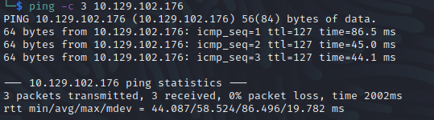

Name: Optimum
Date:  26/10/2022
Difficulty:  Easy
Goals:  OSCP Prep
Learnt:
- wesng might just be a privesc rabbit hole of doom

## Recon

Firstly reviewing nmap it found HFS 2.3 then quick `searchsploit HFS 2.3` found the below

## Exploit && Foothold

With some minor configurations the outcome of this script as show below, also it is not slow just requires an press of the  `[RETURN/ENTER]` key to drop into the shell

The kostas user has no token PrivEscs

      
## PrivEsc

[[Optimum-Systeminfo]]

WinPEAS found:

But it failed.