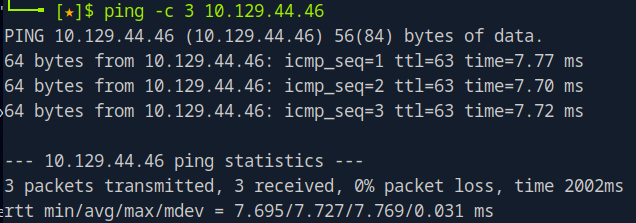

# Pandora Helped-Through

Name: Pandora
Date:  
Difficulty:  Easy
Goals:  
- Guided Mode and Helped Through
Learnt:
Beyond Root:
- 

- [[Pandora-Notes.md]]
- [[Pandora-CMD-by-CMDs.md]]


## Recon

The time to live(ttl) indicates its OS. It is a decrementation from each hop back to original ping sender. Linux is < 64, Windows is < 128.


Then scanned for TCP ports


And then using `nmap` to scan for UDP ports


The web page gives us a hostname panda.htb


Skimming through the snmp output I found a password


Logged in as daniel with the `HotelBabylon23` password


This does not lead to much. The relearning of the what components of machine are CTF. Why is there a website if I get user access as `daniel`? I decided to follow along on to an Ippsec video to ease back into everything. I am much more rusty and want to learn rather than struggle-bus my way through the next months of box. I understand I need to struggle-bus. I tried to run Linpeas and it failed. I learnt to use the .sh version from Ippsec.


Ippsec goes to `/etc/apache2/sites-enabled` for a pandora.conf that indicates that the pandora instance is running `localhost:80`
```
~C
-L 8000:127.0.0.1:8000
```
But my commandline is disabled even after resetting


Local Port forwarded without a command line:


Now we have access to this webpage


Then we dorked for an exploit


Ippsec shows good method by going for understanding first and not the exploit with:
https://www.sonarsource.com/blog/pandora-fms-742-critical-code-vulnerabilities-explained.

Now demonstrating the SQLi injection


and we still get the same screen


It does not say access not granted


I tried the exploit https://github.com/shyam0904a/Pandora_v7.0NG.742_exploit_unauthenticated, but it failed to run. And even though I should manually SQLi this machine I think that should be a the beyond root return if it is possibly OSCP exam level. Also I have not used SQLmap in along time.

```bash
sqlmap -r pandora.req --batch
sqlmap -r pandora.req --batch --dbs

sqlmap -r pandora.req --batch -D pandora 
```

Here is the `sqlmap` output


Here are the tables:


Pandora is in Spanish so `usuario` equals username
```bash
sqlmap -r pandora.req --batch -D pandora -T tusuario --dump
sqlmap -r pandora.req --batch -D pandora -T tsessions_php --dump
```
Next Ippsec does something I have never done, which is steal a session from a user


And we are now Matt in the Pandora FMS


Ippsec then takes this a step further beyond what I have ever done and uses the `union` SQLi to then become admin. [0xdf fuzzed for the sessions](https://0xdf.gitlab.io/2022/05/21/htb-pandora.html#box-info). This would be a terrible OSCP box. And although there is a split path from Guided mode and 0xdf I am going to follow along with Ippsec as it is early days. Also it is a nice practice demonstration of SQL at a basic return to hacking level in a interesting way.

```sql
/include/chart_generator.php?session_id=1'union select 1,2,'id_usuario|s:5:"admin";' -- -
```

Now we are admin and can upload a file to /images


Index of images so we need to go to the images directory.

And for a reverse shell on the box:


## Privilege Escalation

Running linpeas.sh instead of the binary there is a Unknown SUID Binary:


Attempting without ssh was fruitless


I then made an ssh public key and made an SSH connection, then I did relearnt what I previously knew about path traversal vulnerabilities on Linux.


## Post-Root-Reflection  

An early reminder of what components of the machine that make up the CTF that indicate that they are.

linpeas.sh is superior 

This was a overwelling box, but not OSCP type really and learnt a lot.
## Beyond Root

Looking into RHCSA exam course
