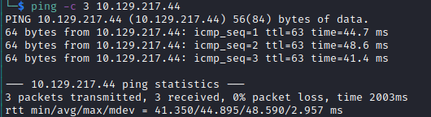

# PhotoBomb Writeup

Name: PhotoBomb
Date:  
Difficulty:  Easy
Goals:  
Learnt:
- Add parameters - I tried injecting into what was avaliable sometimes try the null space...
Beyond Root:

## Recon

The time to live(ttl) indicates its OS. It is a decrementation from each hop back to original ping sender. Linux is < 64, Windows is < 128.

## Exploit

## Foothold

## PrivEsc

## Beyond Root

