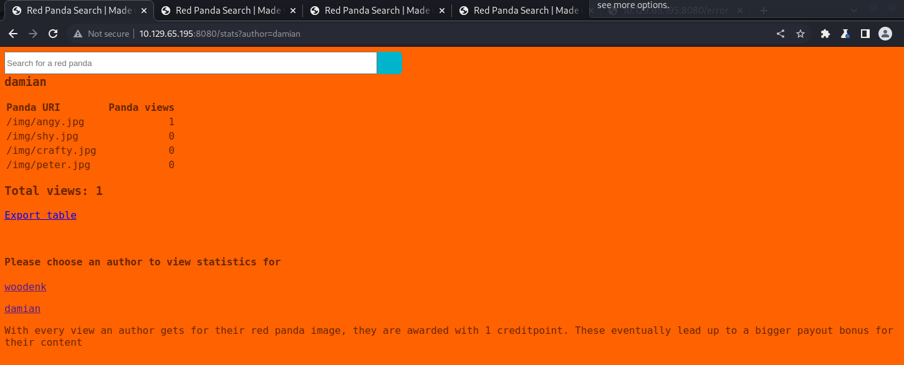

Name: RedPanda
Date:  
Difficulty:  
Description:  
Better Description:  
Goals:  
Learnt:

## Recon

The time to live(ttl) indicates its OS. It is a decrementation from each hop back to original ping sender. Linux is < 64, Windows is < 128.

Exportable xml stats of a red panda picture

 

Tried command injection, sql, ssti, lfi search, url, author?= for both stats and author

Brief research spring4shell a 2022 0day, came back to this box and jsut went to the forums as I had noted that easy box probably would not have this vulnerability. SSTI. Learnt that `#{7*7}` actually was not a mistake on the payloadforallthethings as i had thought. 

## Exploit

## Foothold

## PrivEsc

      
