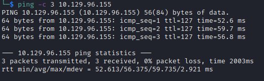

# Resolute Walkthrough

Name: Resolute
Date:  27/09/2022
Difficulty:  Medium
Goals:  
- OSCP Prep, Try again to do a more intense 20min recon 20mins footholding econ in background, just to test myself - not expecting anything.
- 2/5 Medium Boxes - Ippsec Handholding  
- Practice returning to notes and data.
Learnt:
- cme default user password smb enum
- cme no pwned means no shell, smbmap
- Some things can be destructive and not opsec safe, from an article on the web.

Recon went good from 12/09/2022, was doing Resourced from PG got to credentials and recurse through AD. I could not connect and missed something minor so I thought I might as well do a non-TJ Null as a walkthrough and this a AD box. So handholding through with [Ippsec Video](https://www.youtube.com/watch?v=8KJebvmd1Fk) to keep momentuum up for the rest of the day have similiar AD problems flare up some solution or place I forgot to look when I go back to Resourced PG box. 

## Recon

Ran masscan, - 6 mins, prepped notes and ttl test for ping asthe time to live(ttl) indicates its OS. It is a decrementation from each hop back to original ping sender. Linux is < 64, Windows is < 128.


LDAP -> DNS recon while nmap udp scan runs

```
dc=megabank,dc=local
ldapServiceName: megabank.local:resolute$@MEGABANK.LOCAL
```

```bash
ldapsearch -LLL -x -H ldap://megabank.local -b 'DC=megabank,DC=local' -s base '(objectClass=*)' | tee -a ldapsearch-allobjects

ldapsearch -x -H ldap://megabank.local -b 'DC=megabank,DC=local' '(objectClass=Person)' | tee -a ldapsearch-persons

cat ldapsearch-persons| grep "name: " | awk '{print $2" "$3}' > users.txt

```


`rcpclient -U "" -N $IP` allows for various queries NOT including:
```
srvinfo
createdomuser
lsaenumsid
samlookupnames $domian $user
lookupnames
lsaaddacctrights $SID SeCreateTokenPrivilege
```

No groups?


REAL users.txt 
```bash
mv users.txt namesofusers.txt
cat rcpclient-output-querydispinfo | awk '{print $8}' > users.txt
```

```bash
rpcclient $> dsroledominfo
Machine Role = [5]
Directory Service is running.
Domain is in native mode.
# but
dfsexist
command not found: dfsexist
```

Check rcpclient-\* files.

- Verdict: Very Happy - 33 minutes - 6 minutes waiting for masscan
- Reverdict - Happy, as I probably would have ran enumlinux seeing as there is no screenshots or fileoutputing it so


## Exploit & Foothold
`enum4linux` was missed so I missed the password disclosure 


marko : Welcome123!
melanie :  Welcome123!


To practice my time keeping and manual Win PrivEsc, I gvave myself 20 minutes to enumerate the box manually before going back to the video.


Instead of my own resource I decide to use others and assimlate into my own MORE and improve methodology! [Hacktricks](https://book.hacktricks.xyz/windows-hardening/checklist-windows-privilege-escalation) felt weird, but I learnt about WSUS and deepening my sePrivilege understand, which I need to improve.

## PrivEsc

The groups that are important are the Contractors group and Dnsadmins group


Ryan has a password in this script


`ryan : Serv3r4Admin4cc123!`


Evil-winrm on to the box as Ryan

 Ryan is a member of the DnsAdmin group


This is actual a design of the box to migitate the fact the articles are using the dll injection. 

To Dll inject properly you shoud do injection exactly on the function that is called.

With Dnsadmin this is both a PrivEsc and Lateral Movement; allow code execution on the DC!
`rundll32.exe .\dnsprivesc.dll,DnsPluginInitialize`

I did it the bad way


In my Archive github contains the opsec safe way and further DLL injection information.