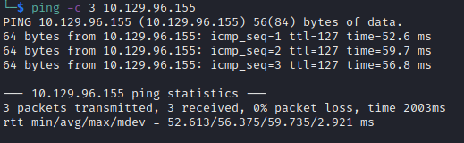

# Resolute

Name: Resolute
Date:  
Difficulty:  Medium
Description:  
Better Description:  
Goals:  OSCP Prep, Try again to do a more intense 20min recon 20mins footholding econ in background, just to test myself - not expecting anything.
Learnt:

## Recon

Ran masscan, - 6 mins, prepped notes and ttl test for ping asthe time to live(ttl) indicates its OS. It is a decrementation from each hop back to original ping sender. Linux is < 64, Windows is < 128.


LDAP -> DNS recon while nmap udp scan runs

```
dc=megabank,dc=local
ldapServiceName: megabank.local:resolute$@MEGABANK.LOCAL
```

```bash
ldapsearch -LLL -x -H ldap://megabank.local -b 'DC=megabank,DC=local' -s base '(objectClass=*)' | tee -a ldapsearch-allobjects

ldapsearch -x -H ldap://megabank.local -b 'DC=megabank,DC=local' '(objectClass=Person)' | tee -a ldapsearch-persons

cat ldapsearch-persons| grep "name: " | awk '{print $2" "$3}' > users.txt

```


`rcpclient -U "" -N $IP` allows for various queries NOT including:
```
srvinfo
createdomuser
lsaenumsid
samlookupnames $domian $user
lookupnames
lsaaddacctrights $SID SeCreateTokenPrivilege
```

No groups?


REAL users.txt 
```bash
mv users.txt namesofusers.txt
cat rcpclient-output-querydispinfo | awk '{print $8}' > users.txt
```

```bash
rpcclient $> dsroledominfo
Machine Role = [5]
Directory Service is running.
Domain is in native mode.
# but
dfsexist
command not found: dfsexist
```

Check rcpclient-\* files.

- Verdict: Very Happy - 33 minutes - 6 minutes waiting for masscan

## Exploit

## Foothold

## PrivEsc

      
