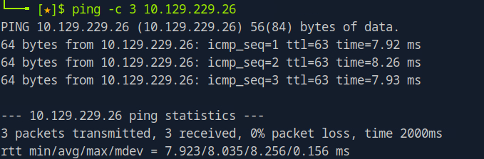

# Sau Writeup

Name: Sau
Date: 3/5/2026
Difficulty: Easy
Goals:  
- Use guided
- No AI
Learnt:
- Guided makes things very easy on Easy
Beyond Root:
- [[Snapped-Helped-Through]]

- [[Sau-Notes.md]]
- [[Sau-CMD-by-CMDs.md]]

## Recon

The time to live(ttl) indicates its OS. It is a decrementation from each hop back to original ping sender. Linux is < 64, Windows is < 128.

Due to how [[Dog-Helped-Through]] went and the over extension of recon I decided to play more fast and loose and go for the jugular. Instead of waiting for `nmap` to scan the box with `-sC` and `-sV` I went straight the web pages 80 is filtered so should not be able to access it. 

Port 55555 uses [request-baskets (GitHub link)](https://github.com/darklynx/request-baskets) at version 1.2.1

This Golang based web service to collect arbitrary HTTP requests and inspect them via RESTful API or simple web UI has a SSRF CVE-2023-27163 https://github.com/entr0pie/CVE-2023-27163

Exploiting this I had issue with viewing the reflected webpages from the SSRF 

Tried the 8338 filtered port and 127.0.0.1

Not sure what I a doing wrong. I added the /web unlike https://0xdf.gitlab.io/2024/01/06/htb-sau.html#. This is the only look up of a writeup. Due to recent return to Cyber Security I am giving myself the benefit of the doubt on this one.

## CMDi Exploit

This webserver on 127.0.0.1:80 uses MaltRail which has a CMDi where *the `username` parameter of the login page doesn't properly sanitize the input, allowing an attacker to inject OS commands* - https://github.com/spookier/Maltrail-v0.53-Exploit/blob/main/exploit.py

Using the exploit we get a shell as puma on Sau.htb

## Privilege Escalation

After stabilising the shell a bit I ran the primary check of what `sudo` permission does puma have. 

`systemctl` has a GTFOBins page: https://gtfobins.org/gtfobins/systemctl/

Typing `!/bin/sh` like for GTFObin `less` 

## Post-Root-Reflection  

Sometimes play with the exploit parameters if they do not work. The exploit has a `API_URL` that it goes to I just assumed without over-recon-ing the box that /api would sit /web/api

## Beyond Root

Finish [[Snapped-Helped-Through]]

