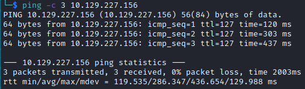

# Search Helped-Through


Name: Search
Date:  28/12/2022
Difficulty: Hard  
Goals:  
- Connect RBAC and AD for AZ104 
- Real-World-Like AD box
- Bring my total daily workload back to were it should follow winter ralted festivities
- Keep me headspace in a hackery-space to continue with everything for 2023 
- Test Windows decoding and piping a reverse shell and test way to do 
Windows
```powershell
$args = [string] '(& echo "$base64EncodedString" | certutil -decode)'
& powershell.exe $args

echo "$base64EncodedString" | certutil -decode | powershell.exe $input
echo "$base64EncodedString" | certutil -decode | pwsh -Command "$input"

```

Learnt:
Beyond Root:
- Harden the box with powershell
	- Research hardening, but do atleast (prior to research):
		- Lock down port connectivity per user - check connectivity group 
		- Harden and or implement AMSI with powershell
		- Configure the password policy 
		- Create an alert based on .exe and .ps1 from PowerUP, Winpeas 
		- Remote interaction with box that would no lead to compromise
		- Open RDP for a new user to use Sysmon, ProcMon
		- Get Sysinternals on box
	
[Funday Sunday: HacktheBox's Search and Active Directory Gone Wild!](https://www.youtube.com/watch?v=OEu3sXFUCP0)

## Recon

The time to live(ttl) indicates its OS. It is a decrementation from each hop back to original ping sender. Linux is < 64, Windows is < 128.


Ldapsearch for some Domain information
```bash
ldapsearch -LLL -x -H ldap://10.129.227.156 -b '' -s base '(objectClass=*)' | tee -a ldapsearch-allclass-noauth
```

```bash
rootDomainNamingContext: DC=search,DC=htb
ldapServiceName: search.htb:research$@SEARCH.HTB
...
dnsHostName: Research.search.htb
defaultNamingContext: DC=search,DC=htb
```


Employees listed on the site

And more employees


Guess the usernames and ASREP roasting; Al introduces me to [namemash.py](https://gist.githubusercontent.com/superkojiman/11076951/raw/74f3de7740acb197ecfa8340d07d3926a95e5d46/namemash.py) and return to `kerbrute`

```bash
kerbrute --dc $ip -d $domain users.txt
```


ASREP roasting attempt 


Gifforam190 points out to look at the pictures after Al tries ASREP roasting... 

I would have also been here for a very long time with this machine...

A face of a man that smells something bad.

`IsolationIsKey?` and hope.sharp


Alh4zr3d tells a story about helpdesk email compromising that contained an email with a default temporary password and compromised 40 accounts from that *"temporary password"*. People do not change there passwords.

I tried kerbrute I guessed it was the username listing was not correct. 

Al points out our timestamps are not synced to the kdc.
```bash
sudo apt install ntpdate
sudo ntpdate $dc_ip
```

Enumerating shares while enum4linux in the background


`-c DCOnly` Bloodhound is pretty quiet comparitively

We have read,write on `RedirectedFolders$` with `Hope.Sharp :  IsolationIsKey?`


Loot the entire share - user.txt indicating some spoilery CTF path
```bash
smb: \> prompt off 
smb: \> recurse on 
smb: \> mget * # Download everything instead of manually 
```


Next is the CertEnroll share


Al discusses impersonating the webpage with the stolen certificate as well as running bloodhound from a docker container for assessment to not get burnt by the update cycle of bloodhound missing crucial artifacts. I decided that best do that at some point... it is definately on the list as part of a hacktainer-of-pwn I kubenetes and docker files listing of spin up and bash machines from anywhere kind of setup with minimal compatiblity issues... considering that it will take alot of time to learn docker files and copy and paste or reading someone elses' dockerfiles for have your own RCE for me please scripting, I have not done CME bloodhound module
- https://www.infosecmatter.com/crackmapexec-module-library/?cmem=smb-bloodhound

```bash
crackmapexec smb -M bloodhound --options
crackmapexec smb $target -u $user -p $password -d $domain -M bloodhound  
crackmapexec smb 10.129.227.156 -u 'Hope.Sharp' -p 'IsolationIsKey?' -d search.htb -M bloodhound  
```
Presumable this was to because Bloodhound was not maintaining the python version.


[I stumbled back onto a previously used python bloudhound ingestor that is potentially the same containerized version Al uses.](https://github.com/fox-it/BloodHound.py)

- Pausing here to consider my options https://www.youtube.com/watch?v=OEu3sXFUCP0 - at 1:06

## Exploit


## Foothold

## PrivEsc

## Beyond Root

      
