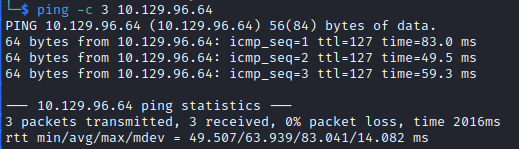

# Sharp Helped-Through

Name: Sharp
Date:  19/3/2023
Difficulty:  Hard
Goals:  
- Azure Revision 
- Follow along and push head were possible
- Less handholding 
Learnt:
- C\# - BinaryFormatter is insecure 
Beyond Root:
- Turn Sharp into a Azure AD setup for [[PhotoBomb-Helped-Through]] and [[Watcher-Helped-Through]]
	- Governance Contextualization
	- Azure AD
	- Hybrid Cloud
	- App Service Plan and Vnets expansions
	- Add a Application proxy (need to use it practically)
- Finish off some of the most relevant [[BeyondRoot-Todo]]s

Followed along live with [Alh4zr3d](https://www.twitch.tv/alh4zr3d) till I needed to fix my Windows VM for CTFs and 

[Ippsec](https://www.youtube.com/watch?v=lxjAZELJ96Q)

https://0xdf.gitlab.io/2021/05/01/htb-sharp.html#shell-as-system


[xct](https://www.youtube.com/watch?v=HBERg8jsx4U)
Instead of dnSpy use `grep`
```bash
grep -ira "Password" .
```
Then decrypts just using cyberchef after reading the [https://www.exploit-db.com/exploits/4...](https://www.exploit-db.com/exploits/49409)  Cyberchef continues to wow me as a application.

He need use dnSpy just for an overview of the code the directs us to [https://www.tiraniddo.dev/2014/11/stu...](https://www.tiraniddo.dev/2014/11/stupid-is-as-stupid-does-when-it-comes.html)


• • [https://labs.f-secure.com/advisories/...](https://labs.withsecure.com/advisories/milestone-xprotect-net-deserialization-vulnerability) 

I want to make something like this: [https://github.com/xct/xc](https://github.com/xct/xc)

## Recon

The time to live(ttl) indicates its OS. It is a decrementation from each hop back to original ping sender. Linux is < 64, Windows is < 128.


Nmap port 8888:
- 8888/tcp open  storagecraft-image StorageCraft Image Manager
- 8888/tcp open  sun-answerbook
- 8888/tcp open  msexchange-logcopier Microsoft Exchange 2010 log copier


Returning to this Ippsec knows that it is a C\# and does not explain, but here for my own learning experience I will explain:

[Kanban is a popular Lean workflow management method for defining, managing, and improving services that deliver knowledge work. It helps you visualize work, maximize efficiency, and improve continuously. Work is represented on Kanban boards, allowing you to optimize work delivery across multiple teams and handle even the most complex projects in a single environment.](https://kanbanize.com/kanban-resources/getting-started/what-is-kanban) 

Ippsec does some nice and dirty `impacket-smbserver` usage to trafer files between VMs as well as stating in the opening introduction that he will turn his Parrot VM into a Router for the Windows machine.

To do this with Virtual Box:
- Have 2 VMs
- Create a NAT Network or some combination one VM has internet access including VPN for HTB 
	- `Tools -> Network Manager -> Add -> Configure`
	- Ensure all VMs have unique MAC address
```bash
sudo impacket-smbserver -smb2support -user ippsec -password ippsec  share $(pwd)
# On Windows Host
start -> Search Run -> \\$ip\$share
# provide credentials
```

It is not obfuscated
```bash
grep -r -e 'Password'
# DES is not high entropy triple DES replaced it
# ent to check entropy
echo -n '$password' | ent 
```

[Alh4zr3d does for the quick exploit search engine dork](https://www.exploit-db.com/exploits/49409), the exploit being that it stores encrypted password a static key and for the exploit all we need is `des` for python3

```bash
pip3 install des
```


Fine additions to my collection
```
Administrator:G2@$btRSHJYTarg
lars:G123HHrth234gRG
```

Whereas Ippsec tries to break the application. Due to it be a configuration of a state containing a password that is backed-up, he replaces Adminstrator we Ippsec and removes the password so that when deleteing the non-.bak file the application will reload with the backup containing a black password for ippsec. Then the tool lets you hide passwords and view them! This prompted me to try another Application Pentest CTF challenge no HTB.

- Find an Application?
	- Recreate environment, observe how it runs
		- Does it store credentials?
		- Does it have configuration files?
		- How does it interact over a network?
	- Reverse / Deserialize 
		- General
			- Hardcode credentials
		- Deserialized Application
			- Vulnerable functions
		- Reversing 
			- Can you change the assemble to just give you credentials/keys/secrets before handling?

Ippsec the shows you DIY python scripting. I added more comments to explan it. [Single DES](https://pycryptodome.readthedocs.io/en/latest/src/cipher/des.html) and a [Implementation of DES in python](https://github.com/0x10001/des)
```python
#!/usr/bin/python3
# pip3 install des 
import sys
import des
from base64 import b64decode

# Uses sys.argv like bash 
passwd = b64decode(sys.argv[1])
# create a DesKey object 
c = des.DesKey(b'7ly6UznJ')
iv = b'XuVUm5fR'
# decrypt it - because I do not really do this as much and I think that I should be more confortable with banging out a python script.
# inital is the initial value
# padding is instructing python to perform padding before (de/en)cryption
print(c.decrypt(passwd, initial=iv, padding=True))
```

Back to crackmapexec


## Exploit

Lar is a hit and checking shares and then RID bruteforcing - Ala AL, but Ippsec also switchs it to winrm to checking encase `evil-winrm` could be used. Lars can also access the `/dev` share

For memorization purposes getting the contents of the dev share.
```bash
mkdir data/$sharename
smbclient \\\\$ip\\$share -U '$User' 
# provide password
prompt off
recurse on
mget *
```

Inside the haul:


`Strings` on client.exe 

Ippsec could have RID brute forced to find usernames has we can read IPC share.

Deserialization with  [dnSpy 6.1.8](https://github.com/dnSpy/dnSpy/releases)


[BinaryFormatter](https://learn.microsoft.com/en-us/dotnet/api/system.runtime.serialization.formatters.binary.binaryformatter?view=net-7.0) is [deprecated](https://learn.microsoft.com/en-us/dotnet/standard/serialization/binaryformatter-security-guide)! `.Deserialize` is to deserialize payload and execute it!

Continuous looking  got al lof us:


`debug : SharpApplicationDebugUserPassword123!` 

https://github.com/tyranid/ExploitRemotingService - did not work for Alh4zr3d, https://github.com/parteeksingh005/ExploitRemotingService_Compiled.

https://research.nccgroup.com/2019/03/19/finding-and-exploiting-net-remoting-over-http-using-deserialisation/


I want to test rpc commands as maybe how cube0x0 has set the box up allows for rpc related enumeration.

Al discussed live how to [Change the Powershell terminal color scheme](https://beebom.com/how-change-powershell-color-scheme-windows-10/), never blue again...:) and for whatever reason in 2023 uses VSCELicense git, but Microsoft has made the community version free. 

I paused at - 42:11 https://www.youtube.com/watch?v=lxjAZELJ96Q, because I want to try implement everything up to this point in Azure and provide explanations that would reflect questions in AZ-104, then finish wathcing xct root the box, before finishing with Ippsec. After that take a break and watch kris nova hack some linux kernel.

## Foothold

Exploit Application

## PrivEsc

Redo the C\# solo at a later point once I have my nice reversing box setup again... Will give myself an hour.

https://labs.withsecure.com/advisories/milestone-xprotect-net-deserialization-vulnerability

ysoserial.net - https://github.com/pwntester/ysoserial.net
0xTib3rious: `TypeConfuseDelegate`

Create a user

## Beyond Root

Write  C\# called Progam.exe that pops a message box and says 0day found with some funny GUI stuff.
https://stackoverflow.com/questions/31930452/are-cortana-apis-available-for-desktop-applications

Azure Recontextualization AD 

- Governance Contextualization

- Devs from Domain photobomb and watcher-blogs can not access each others domain or DevOps storage accounts, repositories, clusters
- All Dev compute is Azure K8 and moved off premises to centralize and control costing 
- Access to Azure Files strictly internal/external usage by seperate storage account with no connection
- Internal Files are only all readable if are Sharp.com wide information else by subdomain subscription RBAC
- All Dev workflow either from VPN from remote device to Azure no AD BYOD, or Workstations on-premise 
- No BYOD for Developers, either SAS 

- App service plan Customer data
	- Segmented between apps
	- Data compliance and strict access controls
	- GRS Retention   

Users from the box.
```c
// Sharp custom users
lars
debug // removed
dev // removed
// Photobomb custom users
wizard
// Watcher custom users
mat
toby
will
```

Changes - Azure Connect and sync with X.sharp.com
```c
// sharpoffices.sharp.com - sharp box as a domain
employees.txt - bulk upload
// Create a Custom Admin user that is the owner of local/cloud machines of non technical users - easier for monitor anti-patterns also for honeypotting the non technical users 


// photobomb.sharp.com - 
// Only devs for the photobomb
admin // For sudo usage, no sudo for devs

// watcher-blogs.sharp.com - 
// Only devs for the watcher blogs 
admin // For sudo usage
will // will seems to be the only dev others are moved to the offices - no sudo

```
Any developer work is done in the cloud in Azure DevOps through Azure Connect.

Any B2B will require Azure AD B2B account

- Azure AD and Azure Connect
	- Hybrid Cloud
		- WAN
		- Point to site VPNs per domain 
	- SSPR and password synchronzation with cloud
- Azure AD replicated seperation with custom DNS 

- App Service Plan and Vnets expansions
- Add a Application proxy (need to use it practically)

#### Kris Nova

Kris Nova raided Al and I checked her out wanna watch this soon - mine deeply and greedly into the Kernel with [Kernel Hacking:  Rust eBPF, Saturday Vibes, The Linux network stack - KrisNova](https://www.youtube.com/watch?v=tUA3EyUM278) : ~42:00
- Learnt:
	- Markdown goat formatter
	- Infosec twitter is also on mastodon


#### KOTH/Battleground weapons testing!


