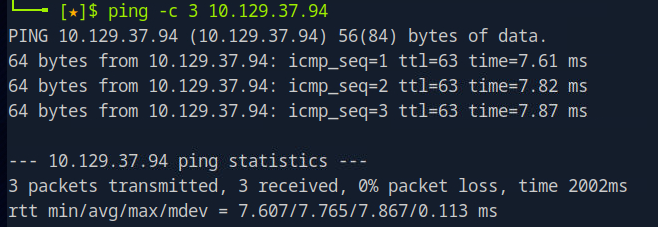

# Snapped Helped-Through

Name: Snapped
Date:  
Difficulty:  Hard
Goals:  
- Rewrite the 0xdf deobfuscated exploit in python to Golang with AI help, but not straight copy and paste-ing try building piece by piece to understand the parts in both python and golang more deeply 
Learnt:
- Subdomains exist
- There is reason python is used in exploit dev
- Pipes are more finickty with lower level language 
Beyond Root:

- [[Snapped-Notes.md]]
- [[Snapped-CMD-by-CMDs.md]]

The initial starting point was the Beyond Root, after watching [0xdf YouTube Copy Fail Explained CVE-2026-31431](https://www.youtube.com/watch?v=wQ914geKOcw). I have always wanted to write a linux kernel exploit. And because I am trying to push out my programming horizons like the zerodium-PoC I wanted to rewrite the 0xdf deobfuscated exploit in python to Golang. I going to wrestle with AI for help. Some stipulations not straight copy and paste. No no Any lessons learnt go into the Archive Useful Golang article. When I say wrestle I really do not like programming with AI most of the time. I lose my place, I get told off for standards that I did not know changed so I am then rewriting something that was acceptable and does work, which I would have test snippet by snippet. AI also gets the jist, but the weirdness that comes from the mismatched of normal not having 100% understanding of everything and the everything you need to actually do to make it successful creates weird programming rabbitholes. So trying building piece by piece in a linear way that represents some understanding of the exploit code in both python and golang, such that I can copy paste and generalise some one or couple liners into a cheatsheet for Archive is the goal.

[0xdf YouTube Copy Fail Explained CVE-2026-31431](https://www.youtube.com/watch?v=wQ914geKOcw) video description:
*Copy Fail is the latest Linux privesc CVE, and it's a relatively simply exploit that overwrites files in the in-memory cache. The exploit will abuse this by overwriting the cahce for a SetUID binary and then running it. In this video I'll walk though the author's POC, show my own deobfuscated POC, and show how the vulnerability works. To close, I'll run it on the HTB Snapped machine and show how to cleanup the exploit.*
 

## Recon

The time to live(ttl) indicates its OS. It is a decrementation from each hop back to original ping sender. Linux is < 64, Windows is < 128.



There is not much from enumerating, Gobuster, Nuclei and Gospider. Peaked at writeup and remembered that vhost exist.


`admin@example.com : changeme` did not work.


https://0xdf.gitlab.io/2026/04/01/htb-snapped.html
## Exploit

## Foothold

## Privilege Escalation


Clean up exploit
```bash
# As root
echo 3 > /proc/sys/vm/drop_caches
```

## Post-Root-Reflection  

I got to read and try out looks of very unfamiliar Golang. I have also never worked with unix piping properly

- Check for subdomains; subdomains exist
- Tech Stack get HTTP Headers
- Dork the tech stack
- 
## Beyond Root

For the beyond root I wanted to try to translate the copyfail exploit [writeup](https://xint.io/blog/copy-fail-linux-distributions) from python to Golang to expose myself to Golang I had not really played with before. I learnt more about the differences between python and Golang and specifically the ease of some the alignment issues I faced in Golang were not present in python. I explored the Sliver Armory documentation and consulted Gemini to learn more about how implants and exploit dev works. This was after I tried piece-by-piece translating the exploit to greater understand how to write Golang exploits. My intuition being that to learn new golang I need to take it slow and methodical. After a lot of failure, I requested a straight translation of the entire exploit code. I also choose Gemini, because google and golang AI model correctness is more likely. Given my physic interest of the last 2 years I decided to check maybe I am coding inappropriately with AI. [ForrestKnight Everything You Need to Know About Coding with AI // NOT vibe coding](https://www.youtube.com/watch?v=5fhcklZe-qE) general takeaways:
- Use my UltraPrompts but for each module specific
- Be specific
- Do tasks like testable spirits in Agile
- Question decisions of AI
- Use multiple agents (not sure how successful the information overhead for programmer is for that)

Comparison with how I was using AI
- Prompting task by task and mostly to snippet level rather than using an Agent
- I trusted AI's preference of unix initially, but now questioning that even with the above suggestions this would be lost 
- Also the AI is programmed to explain and rationalise decisions and save compute by giving you those rationalisation than computing more complex code.

I think the main problem with the video's approach is the potential junk work that leads to nowhere is not automated. You have read everything and you are creating potential exponential curve of more meta-project work that reduces the time to actually solve the problem. 

