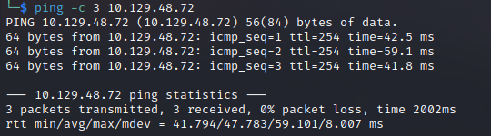

# Sunday Writeup
Name: Sunday
Date:  
Difficulty:  Easy
Goals:  OSCP Prep
Learnt:

It is a 1.4 Star box...

## Recon

The time to live(ttl) indicates its OS. It is a decrementation from each hop back to original ping sender. Linux is < 64, Windows is < 128.

Solaris 11.3 or .4

## Exploit

## Foothold

## PrivEsc

      
