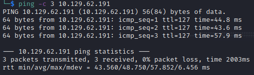

Name: Support
Date:  
Difficulty:  Easy
Goals:  OSCP Prep - Brutal 12 hour *examINATION* of ability
Learnt:
- Thinking fast and slow
- Past work must be a guide not a path

For a brutal self assessment after clearing my head I am returning to this box to simulate exam conditions for personally self assessment. Day One of Four, idea being the recon is mostly done, thus shave off 1-2 hours off that 14 hours. 2 - 2.5 hours per box.

## Recon

The time to live(ttl) indicates its OS. It is a decrementation from each hop back to original ping sender. Linux is < 64, Windows is < 128.



Noted researching a way to get crackmap output into a users.txt!! 


```
publicKeyToken="b03f5f7f11d50a3a"
```

There is function that gets a password


Fumbling around with Radare and Ghidra. False positive? Probably


Decided to brute force with userlist in the background

Confirmed false postive.

:(


Returning to this, I reviewed the information. Refreshed, I went back ghidra knowing that I certain there must be a password in here. Found in the debug data that there is 0xdf user on the box.

I remember think this was  weird it `$5a280d0b-9fd0-4701-8f96-82e2f1ea9dfb`. It is the 


Got Ilspy after melting my brain with "I" "L" "l" madness of naming C sharp decompilers. 

User and Password! 


But I cant list shares or RID Brute.
`armando : 0Nv32PTwgYjzg9/8j5TbmvPd3e7WhtWWyuPsyO76/Y+U193E`


Reenumeration continues, personal takeways:
- Ldapsearch notes need tuning
- Forums are good and bad 
	- I did not check for encryption as my decompilation attempts did not show any encrypting functions - except I did with `enc_password`

[No dpapi though](https://learn.microsoft.com/en-us/windows/win32/api/dpapi/nf-dpapi-cryptprotectdata?redirectedfrom=MSDN), custom encryption, because why would..

There is alot of ldap related activity in the UserInfo.exe decompile


Extracting and [learning some C sharp](https://learnxinyminutes.com/docs/csharp/)  and [compilation](https://learn.microsoft.com/en-us/visualstudio/get-started/csharp/run-program?view=vs-2022)


`nvEfEK16^1aM4$e7AclUf8x$tRWxPWO1%lmz`


Is the ldap user account's password


Spider_plus with ldap users, 
```bash
cat 10.129.227.255.json | grep Policies | awk -F\" '{print $2}'
```


```
ldapsearch -x -H ldap://10.129.227.255 -D "support\ldap" -w 'nvEfEK16^1aM4$e7AclUf8x$tRWxPWO1%lmz' -b "dc=support,dc=htb"  "(giveName=support)(&(givenName=support)(sn=))(sn=)" "(objectClass=*)"

```

https://docs.teradata.com/r/AhOAsYfub6iLoEGgDSmXOQ/ZRrv14mH6Kijem0tWlOZ0Q
https://devconnected.com/how-to-search-ldap-using-ldapsearch-examples/
https://github.com/ropnop/go-windapsearch

## Exploit

## Foothold

## PrivEsc

      
