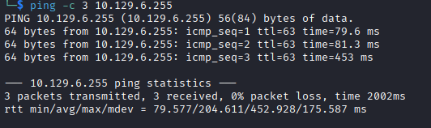

# Talkative Helped-through

Name: Talkative
Date:  24/02/2026
Difficulty:  Hard
Goals:  
- Restart the restarting of Hacking 
- Setup to do multiple machines at once 
Learnt:
Beyond Root:
- Test out my tmux log everything attempts, scraps and push for releasing it some point this week

- [[Talkative-Notes.md]]
- [[Talkative-CMD-by-CMDs.md]]

I started building a tmux logging script from this [baldung article](https://www.baeldung.com/linux/tmux-logging#bd-automatically-log-all-tmux-panes) while I was playing around with AI years ago. I really wanted a tmux logging setup that had the following features:
- Logged everything on every pane 
- Did not require hotkeys to activate - just logged everything
- Choose target directory upon new tmux session

Alternatively tmux-logging, but change the hotkeys.. ...but I want both, because patches come and go, but some software is where the heart is. And I would rather have the analogue backup for the sake of my brain than otherwise wait till disappointment.

Also I want to just be able to dump all data collected on pwnbox or attackbox from that box into this directory and other CTF directory. 

I tried tmux-logging on pwnbox and there are hotkeys bound to other applications that proceed it.
## Recon

The time to live(ttl) indicates its OS. It is a decrementation from each hop back to original ping sender. Linux is < 64, Windows is < 128.


IppSec `ssh 22 filtered` possibly firewall dropping packets.


talkative.htb, after adding the hostname to /etc/hosts I got the same output.

jamovi, 172.17.0.18

bolt cms in html source 80
/bolt for bolt CMSlogin - works 


- TalkZone
	- Talk-A-Stats
		- jamovi
	- Talk-For-Biz
		- rocketchat
- Sign up button non-functional


- Port 80 contains potential valuable information regard usernames and custom applications: 
	- Saul Goodman
	- Matt William
	- Janit Smith


This `Action!` leads to talkative:3000


Registered new account


Two admins accounts Saul and admin


My `nmap` scan did not enumerate 3000 port 


Port 8080


8082 and 8083 are probably API servers according Ippsec so gobustering these would be background recon task to complete

Pausing the video to find R reverse. But I am using the attack box

https://rlang.r-lib.org/reference/exec.html


Ippsec then comes in to save this run with `system()`, but my ctrl+shift+enter is not working. Checked parrot keybinds no conflicts.


I paused at https://www.youtube.com/watch?v=T0jebq1M_GY 8:08
## tmux logging detour

I had another test and fumble around with tmux logging no Kali this time and had little success.


## Exploit

## Foothold

## Privilege Escalation

## Post-Root-Reflection  

## Beyond Root

```bash
apt install ansifilter -y
```

Improve custom global tmux logging 
```bash
#!/usr/env bash

if [ -n "$TMUX_PANE" ] && [ "$TMUX_PANE_LOGGING" != "1" ]; then
  export TMUX_PANE_LOGGING=1
else
  exit 0
fi

LOGS=$HOME/.tmux/logs
LOG_PATH="$LOGS/$(date +%Y%m%d%H%M%S).pane${TMUX_PANE//[^0-9]/}.log"
mkdir -p $LOGS/$LOG_PATH
echo "$(date +%Y%m%d%H%M%S).pane${TMUX_PANE//[^0-9]/}" > $LOGS/$LOGS_PATH/$LOG_PATH.log
echo "" >> $LOGS/$LOGS_PATH/$LOG_PATH.log 

tmux pipe-pane -t "${TMUX_PANE}" "exec cat - | ansifilter >> $LOG_PATH"
```

```bash
#!/bin/bash

echo "" >> $HOME/.bashrc
echo "# Custom TMUX logging - Global" >> $HOME/.bashrc
mkdir $HOME/.tmux/logs -p
echo "$HOME/.tmux/custom-tmux-logging.sh" >> $HOME/.bashrc
#!/bin/bash
```

tmux-plugins/tmux-logging
```bash
mkdir ~/.tmux/logs -p
git clone https://github.com/tmux-plugins/tmux-logging.git .tmux/
wait
echo "" >>  .tmux.conf
echo '# tmux-logging' >> .tmux.conf
echo "run-shell ~/.tmux/logging.tmux" >> .tmux.conf
source .tmux.conf
wait
exit
```

Keybinds for memory
```bash
```

Keybinds for memory including tmux-logging plugin
```bash
```

```bash
# Thanks to ippsec for basics and template to start
# https://tmuxguide.readthedocs.io/en/latest/tmux/tmux.html
# https://thevaluable.dev/tmux-config-mouseless/

# Remap prefix
unbind C-b
unbind v
unbind h
unbind % # Split vertically
unbind '"' # Split horizontally
unbind n  #DEFAULT KEY: Move to next window
unbind w  #DEFAULT KEY: change current window interactively
unbind r

set -g prefix C-a
bind C-a send-prefix
bind v split-window -h -c "#{pane_current_path}" # v is keypath and -h is just emacs tmux
bind h split-window -v -c "#{pane_current_path}"
bind -n M-h select-pane -L
bind -n M-j select-pane -D
bind -n M-k select-pane -U
bind -n M-l select-pane -R
bind n command-prompt "rename-window '%%'"
bind w new-window -c "#{pane_current_path}"
bind r source-file ~/.tmux.conf \; display ".tmux.conf reloaded!"


# Quality of life
set -g history-limit 50000
set -g allow-rename off
set -g default-terminal "screen-256color"
setw -g xterm-keys on
set -sg escape-time 1 

# Mouse 
set -g mouse on
set -g mouse-select-window on
set -g mouse-select-pane on
set -g mouse-resize-pane on


# Join Windows
bind-key b command-prompt -p "join pane from:"  "join-pane -s '%%'"
bind-key s command-prompt -p "join pane to:"    "join-pane -t '%%'"


# Vim copy issue
setw -g mode-keys vi
# Search Mode VI (default is emacs)
set-window-option -g mode-keys vi 
# prefix key - >  [ to copy
# q to return to default mode
# ctrl-u scroll up
# ctrl-d scroll down
# / to search
unbind -T copy-mode-vi Space; #Default for begin-selection
unbind -T copy-mode-vi Enter; #Default for copy-selection
# v to select, y to copy
# 
bind -T copy-mode-vi v send-keys -X begin-selection
bind -T copy-mode-vi y send-keys -X copy-pipe-and-cancel "xsel --clipboard"


# Vim integration 
# Smart pane switching with awareness of Vim splits.
# See: https://github.com/christoomey/vim-tmux-navigator

is_vim="ps -o state= -o comm= -t '#{pane_tty}' \
    | grep -iqE '^[^TXZ ]+ +(\\S+\\/)?g?(view|n?vim?x?)(diff)?$'"
bind -n C-h if-shell "$is_vim" "send-keys C-h"  "select-pane -L"
bind -n C-j if-shell "$is_vim" "send-keys C-j"  "select-pane -D"
bind -n C-k if-shell "$is_vim" "send-keys C-k"  "select-pane -U"
bind -n C-l if-shell "$is_vim" "send-keys C-l"  "select-pane -R"
bind -n C-\\ if-shell "$is_vim" "send-keys C-\\" "select-pane -l"

# NoNord nicish colors
set -ga terminal-overrides ",*256col*:Tc"

set -g window-status-format '#[bg=colour237,fg=#f8f8f2] #I.#(pwd="#{pane_current_path}"; echo ${pwd####*/}): #W#F '
set -g window-status-current-format '#[bg=colour39,fg=black] #I.#(pwd="#{pane_current_path}"; echo ${pwd####*/}): #W#F '

set -g status-left-length 40
set -g status-right-length 60
set -g status-position bottom
set -g status-fg white
set -g status-bg "colour234"
set -g status-left '#[fg=colour235,bg=colour252,bold] #S » #I #P '
set -g status-right '#[bg=colour252,fg=colour235,bold] %Y-%m-%d %H:%M:%S #[default]'


```


Initial tmux configuration file
```bash
# Thanks to ippsec for basics and template to start
# https://tmuxguide.readthedocs.io/en/latest/tmux/tmux.html
# https://thevaluable.dev/tmux-config-mouseless/

# Remap prefix
unbind C-b
unbind v
unbind h
unbind % # Split vertically
unbind '"' # Split horizontally
unbind n  #DEFAULT KEY: Move to next window
unbind w  #DEFAULT KEY: change current window interactively
unbind r

set -g prefix C-a
bind C-a send-prefix
bind v split-window -h -c "#{pane_current_path}" # v is keypath and -h is just emacs tmux
bind h split-window -v -c "#{pane_current_path}"
bind -n M-h select-pane -L
bind -n M-j select-pane -D
bind -n M-k select-pane -U
bind -n M-l select-pane -R
bind n command-prompt "rename-window '%%'"
bind w new-window -c "#{pane_current_path}"
bind r source-file ~/.tmux.conf \; display ".tmux.conf reloaded!"


# Quality of life
set -g history-limit 10000
set -g allow-rename off
set -g default-terminal "screen-256color"
setw -g xterm-keys on
set -sg escape-time 1 

# Mouse 
set -g mouse on
set -g mouse-select-window on
set -g mouse-select-pane on
set -g mouse-resize-pane on


# Join Windows
bind-key b command-prompt -p "join pane from:"  "join-pane -s '%%'"
bind-key s command-prompt -p "join pane to:"    "join-pane -t '%%'"


# Vim copy issue
setw -g mode-keys vi
# Search Mode VI (default is emacs)
set-window-option -g mode-keys vi 
# prefix key - >  [ to copy
# q to return to default mode
# ctrl-u scroll up
# ctrl-d scroll down
# / to search
unbind -T copy-mode-vi Space; #Default for begin-selection
unbind -T copy-mode-vi Enter; #Default for copy-selection
# v to select, y to copy
# 
bind -T copy-mode-vi v send-keys -X begin-selection
bind -T copy-mode-vi y send-keys -X copy-pipe-and-cancel "xsel --clipboard"


# Vim integration 
# Smart pane switching with awareness of Vim splits.
# See: https://github.com/christoomey/vim-tmux-navigator

is_vim="ps -o state= -o comm= -t '#{pane_tty}' \
    | grep -iqE '^[^TXZ ]+ +(\\S+\\/)?g?(view|n?vim?x?)(diff)?$'"
bind -n C-h if-shell "$is_vim" "send-keys C-h"  "select-pane -L"
bind -n C-j if-shell "$is_vim" "send-keys C-j"  "select-pane -D"
bind -n C-k if-shell "$is_vim" "send-keys C-k"  "select-pane -U"
bind -n C-l if-shell "$is_vim" "send-keys C-l"  "select-pane -R"
bind -n C-\\ if-shell "$is_vim" "send-keys C-\\" "select-pane -l"

# NoNord nicish colors
set -ga terminal-overrides ",*256col*:Tc"

set -g window-status-format '#[bg=colour237,fg=#f8f8f2] #I.#(pwd="#{pane_current_path}"; echo ${pwd####*/}): #W#F '
set -g window-status-current-format '#[bg=colour39,fg=black] #I.#(pwd="#{pane_current_path}"; echo ${pwd####*/}): #W#F '

set -g status-left-length 40
set -g status-right-length 60
set -g status-position bottom
set -g status-fg white
set -g status-bg "colour234"
set -g status-left '#[fg=colour235,bg=colour252,bold] #S » #I #P '
set -g status-right '#[bg=colour252,fg=colour235,bold] %Y-%m-%d %H:%M:%S #[default]'


```

