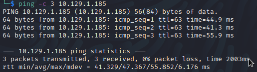

# TartarSauce
Name: TartarSauce
Date:  
Difficulty:  Medium
Description:  
Better Description:  
Goals:  
Learnt:
-  

## Recon

The time to live(ttl) indicates its OS. It is a decrementation from each hop back to original ping sender. Linux is < 64, Windows is < 128.

Apache 2.4.18 - exploit require server time being 6:25AM!
linux/local/46676.php

monstra cms exists
Its exploit require credentials

`admin:admin` works..

https://www.exploit-db.com/exploits/43348
https://www.exploit-db.com/exploits/49949
https://www.exploit-db.com/exploits/48479

## Exploit

## Foothold

## PrivEsc

      
