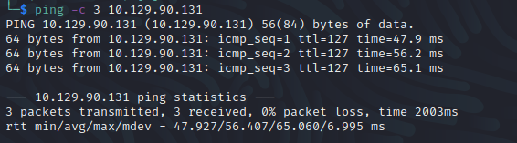

# Timelapse
Name: Timelapse
Date:  22/08/2022
Difficulty:  Easy 
Goals:  Finish and hopeful learn something new
Learnt: 
Pre-Ippsec
1. Improve my notetaking, a good hundred plus days ago because of this noting mistake
Post-Ippsec
1. pfx files
2. cracknig and extracting the key and cert
2. using evil-winrm with cert and keys
3. programdata is good place download files to
4. `exiftool *.docx | grep #name user admin` command to search documents
5. LAPS Group


I only had time to enumerate the machine, but extracted the zip hash the `zip2john`. This was a hopeful to completing a active box on the side of doing all the OSCP study and prep just to get points and learn more *new* tricks, techniques and building up capability so that after OSCP completion I do atleast one of these or multiple a week in 2023.

One issue I had with myself was doing the recon earlier and make some noting mistakes. Looking into a automate loggin solution this week

## PreRetired-Recon

The time to live(ttl) indicates its OS. It is a decrementation from each hop back to original ping sender. Linux is < 64, Windows is < 128.



From Enum4Linux I got the domain name:


From SMB Recon


We can go into the \\Shares Share


nmap ldap-search:
```
namingContexts: DC=timelapse,DC=htb
namingContexts: CN=Configuration,DC=timelapse,DC=htb
namingContexts: CN=Schema,CN=Configuration,DC=timelapse,DC=htb
namingContexts: DC=DomainDnsZones,DC=timelapse,DC=htb
namingContexts: DC=ForestDnsZones,DC=timelapse,DC=htb
```

I added the files `ldapsearch-*` files for more ease, but had and have yet to find user credentials so the more useful `ldapsearch` functionality is unavaliable.


## Ippsec Handholdery

Important insights
- put DC01 DC01.timelapse in /etc/hosts
- crackmap smb $ip for domainname


While talks laps


- Exiftooling documents! 
`exiftool *.docx | grep #name user admin`
- md5sum and virustotal a file to check if it is distributed by microsoft


Did not know what a pfx file is or why so I paused and researched

[pfx files](https://docs.microsoft.com/en-us/windows-hardware/drivers/install/personal-information-exchange---pfx--files) are used to store private and public keys for Software Publisher Certificates
Pvk2Pfx tool is used to perform CA issued .spc and its key to pfx file

Crack with `pfx2john`


```bash
openssl pkcs12 -in $file.pfx -info
# Extract keys without worrying about newlines, whitespace or carriage returns
openssl pkcs12 -in $file.pfx -nocert -out key.pem -nodes
openssl pkcs12 -in $file.pfx -nokeys -out key.cert
```

Amusingly it only took 14 secs and neither have anything like 4 x 1080 ti in Kraken rig..

```
supremelegacy
thuglegacy
```

We can use `evil-winrm` with ssl, cert and key to log in


Check the:
`C:\User\Username\APPDATA\roaming\microsoft\windows\powershell\psreadline\`

Roaming Profile Research:
[Roaming Profiles](https://docs.microsoft.com/en-us/windows-server/storage/folder-redirection/deploy-roaming-user-profiles)


Gets username
Creates new ps session
Creates credentials
Uses 5986 (winrm port ) with credentials to login
Cycled through CME, errored on winrm, not pwn on everything else


`programdata` - Windows Defender Block Ippsec from here probably, as I was able to upload via evil-winrm. I could not however download it with `evil-winrm`. So I pause and practiced some manual enumeration.


[LAPs](https://techcommunity.microsoft.com/t5/itops-talk-blog/step-by-step-guide-how-to-configure-microsoft-local/ba-p/2806185)

kadmin service changepw


```powershell
# LAPs group can read passwords
Get-ADComputer -Filter 'ObjectClass -eq "computer"' -Property *
# Password is in output or Kali lapsdumper
```

[Ippsec showcased this](https://github.com/n00py/LAPSDumper)
[Lapsdumper kali official](https://gitlab.com/kalilinux/packages/lapsdumper) 
[Ippsec Video](https://www.youtube.com/watch?v=gWTGGfl9ajQ)