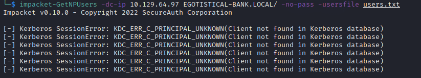

# Sauna 
Name: Sauna
Date:  
Difficulty:  Easy
Description:  
Better Description:  
Goals:  OSCP Prep
Learnt:

## Recon


```bash
smbclient -L 10.129.102.151 -U guest -p ""
Password for [WORKGROUP\guest]:
session setup failed: NT_STATUS_ACCOUNT_DISABLED
```

Discovery nmap script has an ldap enumeration script:
```
dnsHostName: SAUNA.EGOTISTICAL-BANK.LOCAL
defaultNamingContext: DC=EGOTISTICAL-BANK,DC=LOCAL

```

Potential usernames




## Exploit

## Foothold

## PrivEsc

      
