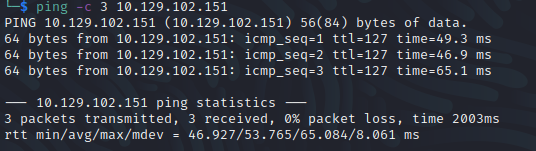

Name: Sauna
Date:  
Difficulty:  
Description:  
Better Description:  
Goals:  
Learnt:

## Recon




```bash
smbclient -L 10.129.102.151 -U guest -p ""
Password for [WORKGROUP\guest]:
session setup failed: NT_STATUS_ACCOUNT_DISABLED
```

	
## Exploit

## Foothold

## PrivEsc

      
