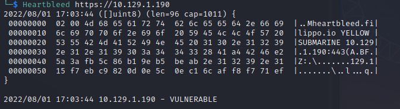
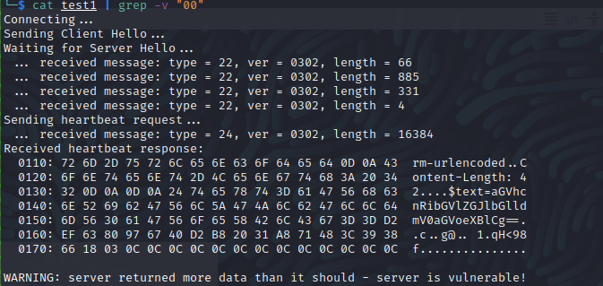

# Valentine 
Name: Valentine
Date:  
Difficulty:  Easy
Description:  
Better Description:  
Goals:  OSCP Prep
Learnt: Heartbleed, More Python

I bailed to check why sshing after using a golang tool that I thought was being feed the same leaked memory in credentials, but probably is not and check the Ippsec Video Writeup.

## Recon
The time to live(ttl) indicates its OS. It is a decrementation from each hop back to original ping sender. Linux is < 64, Windows is < 128.


This machine is vulnerable to [Heartbleed](https://heartbleed.com/) and a good tryhackme [room](https://tryhackme.com/room/heartbleed) that demos the vulnerablity and exploit.


Searchsploiting exploit and intial code review and modifications as it is a python2 script that only targets localhost.
```bash
searchsploit heartbleed
searchsploit -x multiple/remote/32764.py # it's another python2 script
searchsploit -m multiple/remote/32764.py
2to3-2.7 -f all -w  32764.py
```

Ran into issues with encoding and decoding. Remote IP for socket.connect too
 https://docs.python.org/3/library/socket.html
 https://duckduckgo.com/?q=hex+encoding+and+decoding+in+python3&t=newext&atb=v329-5&ia=web
https://duckduckgo.com/?q=openssl+bio.h&t=newext&atb=v329-5&ia=web

So fixing the exploit is a possiblity. - Note that I then used this exploit with python2 for the THM room demonstrating Heartbleed.

```
ssh - debian-5ubuntu1
apache2.2.22(ubuntu)
php/5.3.10-1ubuntu3.26
```

Walking the web app in `/dev/` directory:


## NOTE: hype_key is standard ssh naming and I checked because I got stuck on after the initial check with go Heartbleed tool as the output was always the same, so I assumed it was design to "leak" the extact same output  in CTF-y sense.


Decoding this hex is an RSA key

Possibly we have to try to disclose the username with Heartbleed to use the id_rsa key to login through ssh.

There is a golang application called [Heartbleed](https://github.com/FiloSottile/Heartbleed) for checking heartbleed, which I used to check for this



Found a fixed version of the exploit and added a refactored version of the hex to bin to my using hacking python in Archive Github. 
`python3 heartbleed.py 10.129.1.190 > test1`


```bash
echo aGVhcnRibGVlZGJlbGlldmV0aGVoeXBlCg== | base64 -d
heartbleedbelievethehype
```

## Exploit

## Foothold

## PrivEsc

      
