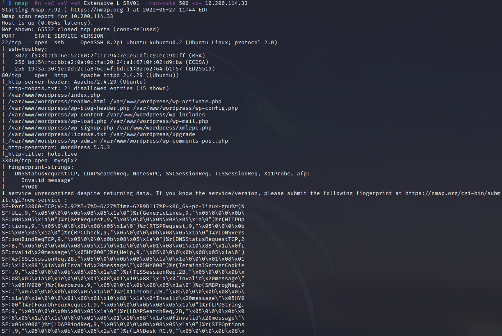
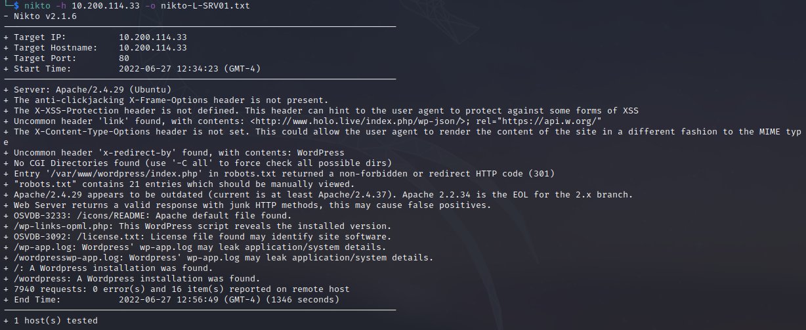

Name: Hololive
Date:  
Difficulty: Hard
Description: Holo is an Active Directory (AD) and Web-App attack lab that aims to teach core web attack vectors and more advanced AD attack techniques. This network simulates an external penetration test on a corporate network. 
Better Description:  
Goals: OSCP revision, demonstrate how far I have come since Throwback..
Learnt:

## Intial Recon

I ran a masscan and alarm so that the network did not shutdown.

The inital nmap:




#### Task 8 Answers

What is the last octet of the IP address of the public-facing web server?
```toggle
33
```
How many ports are open on the web server?
```toggle
3
```
What CME is running on port 80 of the web server?
```toggle
wordpress
```
What version of the CME is running on port 80 of the web server?
```toggle
5.5.3
```
What is the HTTP title of the web server?
```toggle
holo.live
```

## Exploit

## Foothold

## PrivEsc

      
