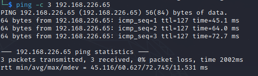

# Algernon Walkthrough
Name: Algernon
Date:  03/09/22
Difficulty:  Easy
Goals:  Upload properly
Learnt: I failed on the patience of the main 9998 page and not curling pages to grep for version I miss. This was my first machine so used hints to see and then ended up failed so used walkthrough.
Markdown sizes in the images!

## Recon

The time to live(ttl) indicates its OS. It is a decrementation from each hop back to original ping sender. Linux is < 64, Windows is < 128.

## Exploit

Build 6985 RCE works fine to which you get NT SYSTEM
