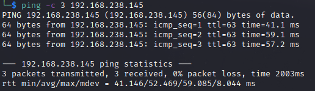

# Apex Writeup
Name: Apex
Date:  
Difficulty:  Intermediate
Goals:  OSCP Prep
Learnt:

## Recon

The time to live(ttl) indicates its OS. It is a decrementation from each hop back to original ping sender. Linux is < 64, Windows is < 128.


Samba 4.7.6 is safe.


The `docs` share contains two pdfs for Openemr, opensource health care records for multiple OSes including Linux. [OpenEMR Wiki](https://www.open-emr.org/wiki/index.php/OpenEMR_Wiki_Home_Page)


Adding the below to the openemr/ and it not executing the paylaod `version()` verifies that it not 5.0.2 for CVE-2019-16404. Therefore Openemr version is > 5.0.2
```
/interface/forms/eye/js/eye_base.php?providerID=1%27,%274%27,%27title%27
```

Exploit for 5.0.2.1 RCE needs the url changed as it gets redirected  

## Exploit

## Foothold

## PrivEsc

      
