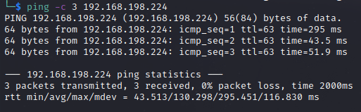

# Assignment Writeup
Name: Assignment
Date:  
Difficulty:  
Goals:  
Learnt:

## Recon

The time to live(ttl) indicates its OS. It is a decrementation from each hop back to original ping sender. Linux is < 64, Windows is < 128.


#### HTTP

weird gospider output

jane@notes.pg

rails web application
```
authenticity_token=oPR93X4UzlLdlPeg_Aek9v3XDDJLLoL3hXS8pHLwzOPz8ER61j8nzjESjr4Tsq-_VGRhZBVCZ9TSr9VZqIe5YQ&user[username]=forged_owner&user[role]=owner&user[password]=forged_owner&user[password_confirmation]=forged_owner&button=
```

#### HTTP 8000

i_love_gog : cb79616fef2e6485 = hexadecimal


## Exploit

## Foothold

## PrivEsc

      
