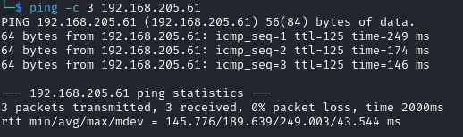

# BillyBoss Writeup

Name: BillyBoss
Date:  
Difficulty:  
Goals:  
Learnt:
Beyond Root:

- [[BillyBoss-Notes.md]]
- [[BillyBoss-CMD-by-CMDs.md]]


## Recon

The time to live(ttl) indicates its OS. It is a decrementation from each hop back to original ping sender. Linux is < 64, Windows is < 128.



[BaGet](https://github.com/loic-sharma/BaGet) Open sourced server for [NuGet](https://learn.microsoft.com/en-us/nuget/what-is-nuget), which is a sdk and .NET sharing tool that shares ZIPed files with .nupkg extension


Trying to be more thoughtful I summarised my paths to compromising the server (Pre-big nmap scan finished):
- BaGet Vuln
- Upload -> Execute | Host 

This changed


Given that we can upload sdks and .NET my assumption is that there will be strict Firewall and AV rules on the box that mean we have to use the BaGet to upload to the box to execute our PrivEsc.

After nmap we can cme for hostname and a domain name


One challenge of this box that I discovered is that we may have to manually enumerate the API as there is content discovery prevention. Nikto output is weird twice and feroxbuster is not finding anything. Indicating (with browser) it is not a IP blacklist, but a jsut a rate limiter. 

[Port 5040 is the SANS Storm Center](https://isc.sans.edu/data/port.html?port=5040), personally I really want this to be way in - I have watched a lot of SANS talks on YouTube.


[Default Administrator Password for Nexus](https://help.sonatype.com/repomanager2/installing-and-running/post-install-checklist)
`admin : admin123`


no `admin:admin` or `admin:adminadmin`

[[nexus-detect-http___192.168.205.61_8081_service_rest_swagger.json]] at the bottom discloses API for change password!

 Nexus 3.21.0-05, which has RCE Auth on 8081 - https://www.exploit-db.com/exploits/49385

Tried both these - `ffuf`-ed .nupkgs without any result.
```
Disallow: /repository/
Disallow: /service/
```

[Nexus repository Users documentation](https://help.sonatype.com/repomanager3/nexus-repository-administration/access-control/users)


Double checking outside of manual playing around with repeater - blind API enumeration...


 
 Obfuscated js is webpack dependecy bundler - according to [Phind](www.phind.com)
```js
function e(e) {
        for(var r, t, n = e[0], o = e[1], u = e[2], l = 0, a = [];
        l < n.length;
        l++)t = n[l], Object.prototype.hasOwnProperty.call(p, t)&&p[t]&&a.push(p[t][0]), p[t] = 0;
        for (r in o)Object.prototype.hasOwnProperty.call(o, r)&&(f[r] = o[r]);
        for (s&&s(e);
        a.length;
        )a.shift()();
        return c.push.apply(c, u||[]), i()
    }

    function i() {
        for(var e, r = 0;
        r < c.length;
        r++) {
            for(var t = c[r], n = !0, o = 1;
            o < t.length;
            o++) {
                var u = t[o];
                0 !=  = p[u]&&(n = !1)
            }

            n&&(c.splice(r--, 1), e = l(l.s = t[0]))
        }

        return e
    }

    var t = {}, p = {
        1:0
    }, c = [];
    function l(e) {
        if (t[e]) return t[e].exports;
        var r = t[e] = {
            i:e, l:!1, exports: {}

        };
        return f[e].call(r.exports, r, r.exports, l), r.l = !0, r.exports
    }

    l.m = f, l.c = t, l.d = function(e, r, t) {
        l.o(e, r)||Object.defineProperty(e, r, {
            enumerable:!0, get:t
        }

        )
    }, l.r = function(e) {
        "undefined" != typeof Symbol&&Symbol.toStringTag&&Object.defineProperty(e, Symbol.toStringTag, {
            value:"Module"
        }

        ), Object.defineProperty(e, "__esModule", {
            value:!0
        }

        )
    }, l.t = function(r, e) {
        if (1&e&&(r = l(r)), 8&e) return r;
        if (4&e&&"object" == typeof r&&r&&r.__esModule) return r;
        var t = Object.create(null);
        if (l.r(t) , Object.defineProperty(t, "default", {
            enumerable:!0, value:r
        }

        ), 2&e&&"string" != typeof r)for (var n in r)l.d(t, n, function(e)  {
            return r[e]
        }

        .bind(null, n));
        return t
    }, l.n = function(e) {
        var r = e&&e.__esModule?function() {
            return e.default
        }

        :function() {
            return e
        };
        return l.d(r, "a", r), r
    }, l.o = function(e, r) {
        return Object.prototype.hasOwnProperty.call(e, r)
    }, l.p = "/";
    var r = window.webpackJsonpbaget = window.webpackJsonpbaget||[], n = r.push.bind(r);
    r.push = e, r = r.slice();
    for(var o = 0;
    o < r.length;
    o++)e(r[o]);
    var s = n;
    i()
}

```

Key takeway is `window.webpackJsonpbaget = window.webpackJsonpbaget` 


There are is one v2 and five v3 in 0.X.0 versioning nomenclature.  

No ftp or ftps in. It is so weird to have the Web Authed RCE and probably Local PrivEsc, but no credentials or usernames. 


The hardcoded messages is lie


Same for /search

Almost went down a `/dependents?package=` injection rabbit hole - we already have RCE if we find credentials
## Exploit

## Foothold

## PrivEsc


## Beyond Root


https://thehackernews.com/2021/07/dozens-of-vulnerable-nuget-packages.html