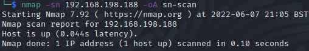

# Craft2 Walkthrough
Name: Craft2
Date:  30/09/2022
Difficulty:  Hard
Goals:  OSCP Prep - Find out what a hard box could be like, BUT...
- Enjoy insanely hard earned one time drink before 3 months of OSCP finalisation hopefully!
- Prepped Initial recon
- 30mins - Hack - 10 minutes exercise - 30 mins Read With Walkthrough(Only one section) - 10 minutes exercise ; anticipating 3 hours 
- Learn! Tryharder, figure out what that means at PG OSCP hard box level 
Learnt:

## Recon

The time to live(ttl) indicates its OS. It is a decrementation from each hop back to original ping sender. Linux is < 64, Windows is < 128. 100% packet loss so use nmap to check if it was up.

The only vector of attack is the upload 

Apache/2.4.48 (Win64) OpenSSL/1.1.1k PHP/8.0.7 Server at 192.168.141.188 Port 80

It maybe a scripted box that opens of the .odt file 

First thirty minutes are up! 100 situps 50 rowing, 10 Bicep curls, 1 minutes cobra stance.

Went for the first hint. It blew my tiny brain.
We need to use responder to catch a hash requested by using a file that contains a reference to attacker ip in an OFT file. Considering my next steps in this research I will put this box on hold. 

## Exploit

## Foothold

## PrivEsc

      
