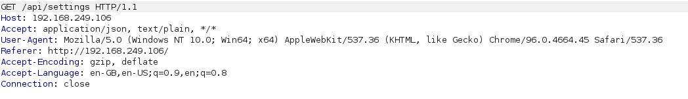

## Recon

```bash
ping -c 3 192.168.249.106                                                             
PING 192.168.249.106 (192.168.249.106) 56(84) bytes of data.
64 bytes from 192.168.249.106: icmp_seq=1 ttl=63 time=50.5 ms
64 bytes from 192.168.249.106: icmp_seq=2 ttl=63 time=44.0 ms
64 bytes from 192.168.249.106: icmp_seq=3 ttl=63 time=72.0 ms

--- 192.168.249.106 ping statistics ---
3 packets transmitted, 3 received, 0% packet loss, time 2002ms
rtt min/avg/max/mdev = 44.038/55.506/72.000/11.955 ms

```




## Web 

Login form, with a list of top users.

