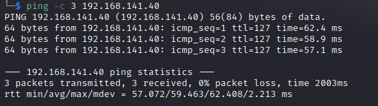

# Internal Writeup
Name: Internal
Date:  17/09/2022
Difficulty:  Easy
Goals:  OSCP Prep
Learnt: Get Old Python scripts is sometimes not worth it. 

## Recon

The time to live(ttl) indicates its OS. It is a decrementation from each hop back to original ping sender. Linux is < 64, Windows is < 128.

Nmap does most of the heavy lifting and this is mostly a box to check your basic enumeration. It is a Windows Server (R) 2008 Standard 6001 Service Pack 1; [Windows Server 2008](https://en.wikipedia.org/wiki/Windows_Server_2008) is Vista Era - that should already raise eyebrows. MS09-050 is an NSA guess you would call it a frontdoor to administrator, like eternal blue.

## Exploit && Foothold && PrivEsc
I ended  up autopwning this with metasploit, the python scripts would have done the same I could make them work, but old python scripts seem to be a like running in field full of rakes.

