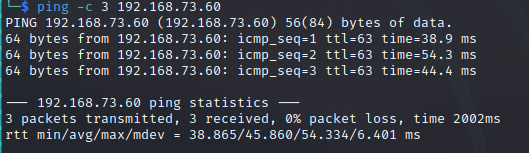

# Peppo Writeup
Name: Peppo
Date:  
Difficulty:  Hard
Goals:  OSCP Prep
Learnt:

## Recon

The time to live(ttl) indicates its OS. It is a decrementation from each hop back to original ping sender. Linux is < 64, Windows is < 128.

https://www.postgresql.org/docs/
https://webmin.com/

Potential [[xss-deprecated-header-detect-http___192.168.73.60_8080]]

## Exploit

## Foothold

## PrivEsc

      
