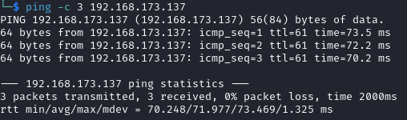

# Postfish Writeup

Name: Postfish
Date:  
Difficulty:  Intermediate
Goals:  
- TJNull box
- Is a phishing box, my first phishing box
- Departments have email accounts!?!
Learnt:
Beyond Root:

- [[Postfish-Notes.md]]
- [[Postfish-CMD-by-CMDs.md]]

## Recon

The time to live(ttl) indicates its OS. It is a decrementation from each hop back to original ping sender. Linux is < 64, Windows is < 128.

## Exploit

## Foothold

## PrivEsc

## Beyond Root

Finish the [[Attended-Helped-Through]]

https://github.com/HanzCoder/Offensive-Security-OSCP-Cheatsheets/blob/master/offensive-security/red-team-infrastructure/smtp.md