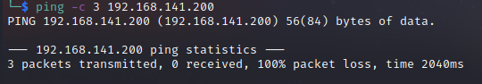

# Robust Writeup
Name: Robust
Date:  29/09/2022
Difficulty: Easy  
Goals: OSCP Prep  
Learnt:
- Fine tuning my personal web rabbit holing avoiding
- Burpsuite Match and Replace
- Getting fuzzed pages block by `Location`:
- I dont Fuzz enough
- Finish the ffuf HTB academy tutorial and fuzz everything more fuzz and fuzz
- I have to make a sql machine of all the sql databases in a Windows VM 
- Burnt hard by windows File system searching has had bad effect on my enumeration for if there is a app install misconfiguration or creds somewhere on the system. 

## Recon

The time to live(ttl) indicates its OS. It is a decrementation from each hop back to original ping sender. Linux is < 64, Windows is < 128.


7680 - https://www.speedguide.net/port.php?port=7680

#### Http manual enumeration


Add Burp `X-Forwarded-For: 10.10.10.69` as 69 is a good number.


/.DS_Store:
```
curl -H 'X-Forwarded-For: 10.10.10.69' http://192.168.141.200/.DS_Store --output robust.DS_Store
```

Directory structure is revealed


XSS comes up in Nikto, but there does not seem to be any JS: just in case polyglot from 
```javascript
jaVasCript:/*-/*`/*\`/*'/*"/**/(/* */oNcliCk=alert() )//%0D%0A%0d%0a//</stYle/</titLe/</teXtarEa/</scRipt/--!>\x3csVg/<sVg/oNloAd=alert()//>\x3e
```

Just to check - Web rabbit holing! 

Big fail. Did not fuzz. Changed to walkthrough!
```bash
ffuf -w /usr/share/seclists/Discovery/Web-Content/directory-list-2.3-small.txt:FUZZ -u http://192.168.141.200/FUZZ.php -H 'X-Forwarded-For: 10.10.10.10' -o fuffDALOGINdotPHP
```

Add a Replace Responder Header for login.php 


I already went for the second hint for Foothold and was confused that the login page did was not sqli vulnerable and waiting on nmap to check again if i had missed and sql port...

## Exploit


`Jeff Mathsisfun123` 

After following the walkthrough as know I am not that great with sql, then tried playing around with how I would normally enumerate from all the sql related material from THM, CTFs and was a bit disappointed. X database no way of finding out the language type and more here is problem: the Table is of `employees` just `' Union Select * from guesstablename` 

## Foothold && PrivEsc

`ssh` in with credentials. We have pretty limited user account:


Ran some scripts, learnt that %LocalAppData% installation is definately a misconfiguration. None of my script running helped there.


I did not like this room, but I still can my head slapped good by:
- Not Fuzzing pages
- Having to many bad experiences searching the file system. 