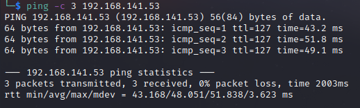

# Slort Helped-Through

Name: Slort
Date:  
Difficulty:  Intermediate
Goals:  
- TJNULL 
Learnt:
- I need the mental equivalent of a pause button 
- Brute forcing a proxy was not a mad idea apparently - I presume Ippsec said something at some point 
- If their is a http-proxy does not just mean it implements the correct access controls to the content it prohibits. As the hint being that `localhost:80` - which is why burpsuite is behaving weird as ssl is not actually implemented as the `localhost:80` => is proxied thought `IP:8080` to `IP:4443`.
- Check ALL THE DATA YOU HAVE before moving forward

Beyond Root:
- [[Slort-Notes.md]]
- [[Slort-CMD-by-CMDs.md]]

The time to live(ttl) indicates its OS. It is a decrementation from each hop back to original ping sender. Linux is < 64, Windows is < 128.


Rediff this in 2023 the differences are not versioning just infrascture


Returning to this machine connection issues even after reset.


Reping and it is up


Previously I had scanned and poke at the machine:


Due to improvements and previous enumeration issues I am not sure where this came from. The build number has actually changed in a year. 
```
System                     Windows NT SLORT 10.0 build 19042 (Windows 10) AMD64
3389 is mysql
Server Administrator       postmaster@localhost
Server Root                C:/xampp/apache
LOGONSERVER \\SLORT
HOMEPATH \Users\rupert
PHP/7.4.
```


Curling out an answer


#### And here is the localhost:80 of your life...

`curl`ed the 2023 version of this machine /dash/phpinfo.php added a .html 


all.js is the zurb!
```js
/*
 * Foundation Responsive Library
 * http://foundation.zurb.com
 * Copyright 2013, ZURB
 * Free to use under the MIT license.
 * http://www.opensource.org/licenses/mit-license.php
*/

// .....      truncated
  window.Foundation = {
    name : 'Foundation',

    version : '5.0.0',
```

Not sure how viable


Given my harsh time limits these days - look at the title of the hints and there is an RCE somewhere. As someone that hope to write that people use someday the idea that I could be responsible for a bug and people could look me up from the commit on GitHub seems funny, but interesting the `log4js` commit is not present in the snyk article about it so I seems weird. 

apache is xss-able potentially


There is potentially a bufferover on the FileZilla - both need the service port as it is the local admin port


I would also have to down that version and replicate even though normally with Buffer overflow CTFs the exact compiled version is provided or instruction to compile are. Just to check I then used the first hint. *brute force port 8080*... I now consider atleast I had the right idea in originally, but my hesitation to re-enum both after checking the phpinfo.php-s of each port and finding the same seemed a good way to narrow down the rabbitholes. Feels confusing given that I found various vulnerabilities that are potentially exploitable:
- I could just replicate the filezilla and the buffer these zillas on each service port like a idiot resetting the box till I got the correct 40k windows ports of the 5 ports
- Try reserch similar xss html.captions 

I decided to just get the write up for the machine. There is a /site/ directory on 8080. I cover some of my thoughts on this in reflection section. After ask [phind](https://www.phind.com/search?cache=qy1ctb6rksarh87a2o3d3iqz) 

>A proxy server can be different from the website it proxies on some other port due to a variety of reasons, including:
>1. **Anonymity and Security**: Proxy servers are often used to provide anonymity and security. They can hide the user's IP address, making it difficult for websites to track the user's activity. This is particularly useful when the user wants to bypass geo-restrictions or avoid being tracked [upguard.com](https://www.upguard.com/blog/proxy-server).
>2. **Caching**: Proxy servers can cache web content, which means they store a copy of the website's content locally. When a user requests a webpage, the proxy server can serve the cached content instead of forwarding the request to the website. This can improve the loading speed of the webpage and reduce the load on the website's server [upguard.com](https://www.upguard.com/blog/proxy-server).
> 3. **Load Balancing**: In some cases, a proxy server can distribute requests to multiple servers to balance the load. This can help to improve the performance and reliability of the website [developer.mozilla.org](https://developer.mozilla.org/en-US/docs/Web/HTTP/Proxy_servers_and_tunneling).
> 4. **Content Filtering**: Proxy servers can be used to filter out certain types of content. For example, a company might use a proxy server to block access to adult content or other inappropriate websites [upguard.com](https://www.upguard.com/blog/proxy-server).
> 5. **Data Compression**: Proxy servers can compress web content before sending it to the user, which can reduce the amount of data that needs to be transmitted and improve the loading speed of the webpage [upguard.com](https://www.upguard.com/blog/proxy-server).
> 6. **Access Control**: Proxy servers can be used to control access to certain websites. For example, a company might use a proxy server to allow or deny access to certain websites based on the user's role or location [upguard.com](https://www.upguard.com/blog/proxy-server).
> In conclusion, a proxy server can be different from the website it proxies on some other port due to its various functions and capabilities. These include providing anonymity and security, caching web content, load balancing, content filtering, data compression, and access control.

So lesson learnt - if their is a http-proxy does not just mean it implements the correct access controls to the content it prohibits. As the hint being that `localhost:80` - which is why burpsuite is behaving weird as ssl is not actually implemented as the `localhost:80` => is proxied thought `IP:8080` to `IP:4443`.

The big big clue was the `localhost:80` that I noted and just breezed thorough. I did ask the question why is phpinfo.php not reporting IP:4443 and IP:8080

run on return
```
feroxbuster --url 'http://192.168.232.53:8080/dashboard/' -w /usr/share/wordlists/seclists/Discovery/Web-Content/raft-medium-words-lowercase.txt -r -A -o feroxbuster/rmwl.txt
```

#### Oh dear past self did a very good job - future self not checking enough on past data.

## Exploit

## Foothold

## Privilege Escalation

## Post-Root-Reflection  

On the bleak positive side: I could may find real bugs in actually applications through enumeration of versioning and being persistent - not the same evidence of manually exploitation of weird new bugs


## Beyond Root


