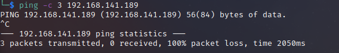

# Squid Writeup
Name: Squid
Date:  
Difficulty:  Easy
Goals:  OSCP Prep 3/5 machines a day testing (can use walkthrough)
Learnt:

## Recon

The time to live(ttl) indicates its OS. It is a decrementation from each hop back to original ping sender. Linux is < 64, Windows is < 128. Prep the `-Pn`


One port machine, ran UDP as I normally do - was none anyway , greeted with this webpage


host (squid/3.1.9)
nmap says 4.14...
source code on webpage say: Generated Thu, 22 Sep 2022 10:56:47 GMT by SQUID (squid/4.14)

Askes for email web

Nuclei
```
Copyright (C) 1996-2021 The Squid Software Foundation 
```

[Hacktrick Squid Protocol Page](https://book.hacktricks.xyz/network-services-pentesting/3128-pentesting-squid?q=3128)


It is windows machine

[4.14 exploit](https://packetstormsecurity.com/files/161563/Squid-4.14-5.0.5-Code-Execution-Double-Free.html) to consider


Used hint Foothold:
A phpMyAdmin web service can logged into with deafult credentials and "INTO OUTFILE" can be abused to gain a foothold.

proxychaining through I missed from the article; then should have masscan initially...


## Exploit

## Foothold

## PrivEsc

      
