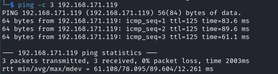

Name: Vector
Date:  
Difficulty:  
Description:  
Better Description:  
Goals:  
Learnt:

## Recon

The time to live(ttl) indicates its OS. It is a decrementation from each hop back to original ping sender. Linux is < 64, Windows is < 128.

FTP requires credentials
	
## Exploit

## Foothold

## PrivEsc

      
